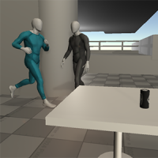
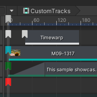
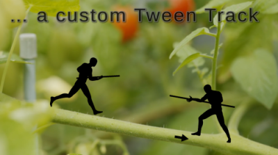

# Samples

## Gameplay Sequence Demo

This sample demonstrates how Timeline can be used to create a small in-game moment, using built-in tracks.

### Overview

In this example, we have a `Player` character jogging and then colliding with another character. The `Player` character represents our gameplay character and is using a looping jog animation. The Timeline then takes control of the player character, collides with the other character, then returns to his original gameplay animation (jog) once the Timeline has finished. Note that the gameplay animation is driven by an Animator and will only play at runtime. The character will be in a T-Stance pose for the runtime portion when using the Timeline preview.

### Timeline Structure

This sample uses the following tracks: Activation, Animation, Audio, Control and Marker track. The `GameplaySequence` timeline has been organized in the following groups: `Building`, `Lights`, `Cameras`, `Characters`, `Audio` and `Props`.

#### *Building group*

This group contains two Control tracks: `Building Spawn` which spawns the building prefab, and `Building Particles` that controls two particle systems in the scene (`ElectricalSparks` and `SandSwirlsEffect`).

#### *Lights group*

 This group contains two Animation tracks; one for the Sun light, and the other for the flickering light. Both tracks where animated in Unity and the curves can be seen by enabling the curves icon or double clicking on the track to open the Animation window. `Sun light` is animated in Rotation (sunrise) and the `Point light` has a spiked `Intensity` curve.

#### *Cameras group*

This group contains two cameras: `Main camera` using an Animation track, and `Follow camera` using an Activation track. `Main Camera` has an animation curve for the continuous movement (which can be seen by enabling the curves icon) and two override tracks, one for each character. The clips on the override tracks have static values for a fixed camera shot. `Follow camera` is simply parented child of the Player character's root and activated for the follow-cam shots.

#### *Characters group*

The first track is an Animation track for the `Player`character. Notice that clip pre and post extrapolations are set to `None`, meaning the character will not be influenced by the timeline during these gaps. At runtime, these gaps mean the `Player` character will be using his Animator state, jog. The second track is an Activation track for the second character, making his appear in the scene. The third and last track is an Animation track for the second character. On this track, the second character blends from one clip to another creating a cinematic sequence.

#### *Audio group*

This group contains four Audio tracks; `Player`, `crickets`, `neon-light` & `character2`. The `Player` track has a jog/breathing and bump clip. The `crickets` track has pan and volume animation curves (can be seen by enabling the curves icon). The `neon-light` sound is for the flickering `Point` light. The `Character2` tracks contains all audio clips for this second character.

#### *Props group*

This group animates `Table` and `Can`. The first Activation track makes `Table` appear in the scene. The second Activation track makes a static version of `Can` appear in the scene. The third track is an Animation track that animates the table bump animation. The last track is a Control track with a sub-timeline for the can animation. The static version of the can is disabled and replaced with the animated version when the Control clip starts. Double-clicking the Control track clip will enter the `Can` sub-timeline.

#### `Can` Sub-Timeline

This sub-timeline contains an Animation track for the can rolling off the table and bouncing on the ground, an Audio track for the sounds effects and a Control track for the liquid particles splashing out of the can.

#### Marker track

In the Timeline window, under the time ruler, there is a Marker track with one Signal at frame 1200. This is the Signal marker that triggers the jog audio clip on `Player` once the timeline finishes the gameplay jog.

## Customization samples

This sample includes tracks, clips, markers and actions that demonstrate how to extend and customize timeline in different ways.

* [Annotation](smpl_custom_annotation.md): provides a marker that can be used as a bookmark.
* [Video track](smpl_custom_video.md): provides a track capable of playing video clips.
* [Time dilation track](smpl_custom_time.md): provides a track that can be used to adjust Unity's global `Time.timeScale`.
* [Tween track](smpl_custom_tween.md): provides a track that can be used for simple transform movements.
* [Text track](smpl_custom_text.md): provides a track that can be used to display different messages to the screen using a TextMeshPro Text component.

### Demo

Included is a demo timeline that showcases all the of the above samples.
