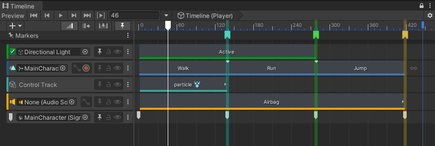
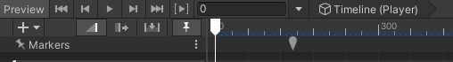
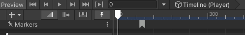
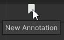
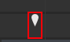
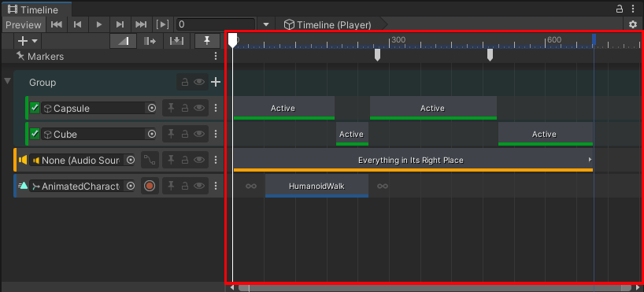

# Annotation marker sample

The Annotation sample provides a marker that can be used as a bookmark for your timeline.



Here are the options available on an annotation:
Field | Description
--- | ---
Title | The annotation's title. This will be displayed as a tooltip, when hovering the mouse on the annotation.
Color | The annotation's color in the Timeline window.
Show line overlay | Use this option to show a vertical line that spans the full height of the Timeline window.

## Custom marker workflow example

This example will demonstrate how to:

* create a custom marker;
* customize a marker with `MarkerEditor`;
* use a custom USS style to draw a marker;
* add additional commands with `Actions`;

### 1. Create an annotation marker

A marker is an item that can be added to a Timeline Asset and is used to represent a point in time.
Markers also have a specialization, just like clips (Activation clip, Audio clip, Animation clip, etc).

In order to add a new type of marker, all we need to do is to create a class that inherits the `Marker` class:

``` c#
public class AnnotationMarker : UnityEngine.Timeline.Marker {}
```

This custom marker can now be added to any track or on the timeline marker area:



We can add a title, description and color to the annotation:

``` c#
public class AnnotationMarker : Marker
{
    public string title;
    public Color color;
    public string description;
    public bool showLineOverlay;
}
```

The annotation marker itself is now complete. But the customization work is not done yet. Timeline offers many customization abilities.

## 2. Customize the marker's appearance

A marker's appearance can be customized using a USS style or with `MarkerEditor`. Both paths have their advantages and drawbacks.

### Custom USS style

A marker can use a USS style to specify its appearance. For more information on how to create custom USS styles, see [how to define custom USS styles](uss_styles.md).

The [CustomStyle](xref:UnityEngine.Timeline.CustomStyleAttribute) attribute can be used to specify a style for a given marker:

``` c#
[CustomStyle("AnnotationStyle")]
public class AnnotationMarker : Marker
{
    //...
}
```

`AnnotationStyle` is defined in a USS stylesheet and will be used when a marker is displayed on screen:



USS styles are useful if the desired appearance is simple (i.e. when only using a texture icon). For more complex stuff (i.e. dynamically changing a marker's color), a `MarkerEditor` will be needed.

### Custom editor

`MarkerEditor` can be used to augment the capabilities of a marker in the editor. It works like a custom [Inspector](https://docs.unity3d.com/ScriptReference/CustomEditor.html); the [CustomTimelineEditor attribute](xref:UnityEditor.Timeline.CustomTimelineEditorAttribute) is used to tell Timeline that a [MarkerEditor](xref:UnityEditor.Timeline.MarkerEditor) class should be associated to a given marker.

``` c#
[CustomTimelineEditor(typeof(AnnotationMarker))]
public class AnnotationMarkerEditor : MarkerEditor
{
   //...
}
```

#### Marker information

`MarkerEditor` lets us provide information about the marker by overriding the [GetMarkerOptions](xref:UnityEditor.Timeline.MarkerEditor#UnityEditor_Timeline_MarkerEditor_GetMarkerOptions_UnityEngine_Timeline_IMarker_) method.

``` c#
public override MarkerDrawOptions GetMarkerOptions(IMarker marker)
{
   var annotation = marker as AnnotationMarker;
   if (annotation != null)
   {
      return new MarkerDrawOptions { tooltip = annotation.title };
   }
   return base.GetMarkerOptions(marker);
}
```

Here the tooltip of an `Annotation` has been set to use the annotation's `title` variable.



[MarkerDrawOptions](xref:UnityEditor.Timeline.MarkerDrawOptions) can also set the error text on a marker, which can be useful if a variable has been incorrectly set and needs attention.

#### Overlay

An overlay can be drawn on top of a marker by overriding the [DrawOverlay](xref:UnityEditor.Timeline.MarkerEditor#UnityEditor_Timeline_MarkerEditor_DrawOverlay_UnityEngine_Timeline_IMarker_UnityEditor_Timeline_MarkerUIStates_UnityEditor_Timeline_MarkerOverlayRegion_) method:

``` c#
public override void DrawOverlay(IMarker marker, MarkerUIStates uiState, MarkerOverlayRegion region)
{
    var annotation = marker as AnnotationMarker;
    if (annotation != null)
    {
        //Draw overlay code...
    }
}
```

An overlay is drawn on top of the marker; the [USS style](uss_styles.md) is drawn first and `DrawOverlay` is called afterwards. For an `Annotation`, we can use `DrawOverlay` to change the color of the marker and to draw a line that spans the full Timeline window's height. To do this, we can use the information given in `region`. Along with the visible time range, [MarkerOverlayRegion](xref:UnityEditor.Timeline.MarkerOverlayRegion) provides two rectangles that can be used to know where to draw:

* `markerRegion`

`markerRegion` is the rectangle that encompasses the marker. This is useful to draw something directly on the marker itself. For `Annotation`, this rectangle is used to draw the color overlay.



* `timelineRegion`

`timelineRegion` is the rectangle that encompasses the clips and markers region of the timeline window. This is useful to draw something out of the marker's region, like the `Annotation`'s line overlay.



``` c#
const float k_LineOverlayWidth = 6.0f;
float markerRegionCenter = markerRegion.xMin + (markerRegion.width - k_LineOverlayWidth) / 2.0f;
Rect lineRect = new Rect(markerRegionCenter,
    timelineRegion.y,
    k_LineOverlayWidth,
    timelineRegion.height);
```

## 3. Create custom Actions

### Timeline Action

Actions can be used to add new menu entries in Timeline's context menus. For an Annotation, we want to add a menu item available in all context menus to create an `Annotation` with the clipboard's contents. To do this, a [TimelineAction](xref:UnityEditor.Timeline.Actions.TimelineAction) is needed, along with the [MenuEntry attribute](xref:UnityEditor.Timeline.Actions.MenuEntryAttribute).

``` c#
[MenuEntry("Create Annotation from clipboard contents")]
public class CreateAnnotationFromClipboardContents : TimelineAction
{
    //...
}
```

`MenuEntry` lets Timeline know that this action can be added in context menus. Classes inheriting from `TimelineAction` need to override two methods: `Execute` and `Validate`.

#### Validate

`Validate` is used to specify that the action's prerequisites are fulfilled. In the case of `CreateAnnotationFromClipboardContents`, the action is only valid if there actually is contents in the clipboard. `ActionValidity` is used to describe the validity state of an action:

``` c#
public override ActionValidity Validate(ActionContext context)
{
    if (!markers.All(marker => marker is AnnotationMarker))
        return ActionValidity.NotApplicable;

    string buffer = EditorGUIUtility.systemCopyBuffer;
    return buffer.Length == 0 ?  ActionValidity.Invalid : ActionValidity.Valid;
}
```

* `ActionValidity.Valid` : The action can be executed.
* `ActionValidity.Invalid` : The action cannot be executed given the current context and will appear grayed out in context menus.
* `ActionValidity.NotApplicable` : The action does not apply to the current context and will not show up in menus.

#### Execute

`Execute` should run the code necessary to execute the action's purpose.

``` c#
 public override bool Execute(ActionContext context)
{
    string buffer = EditorGUIUtility.systemCopyBuffer;
    TrackAsset track = context.tracks.FirstOrDefault();

    if (buffer.Length != 0)
    {
        // Create the new annotation and add it to the track
        //...
        return true;
    }

    return false;
}
```

The return value should specify if the execution succeeded or not.

### Marker Action

It is also possible to write custom actions that apply only to markers, instead of all Timeline items. This is the purpose of the `MarkerEditor` class. It works just like `TimelineAction`, except that action applies to a list of markers.

A shortcut can also be assigned to an action. A static method with the `TimelineShortcut` attribute is needed. `Invoker` can be used to easily execute a given action:

``` c#
[TimelineShortcut("Replace annotation description with clipboard", KeyCode.G)]
public static void InvokeAction()
{
    Invoker.InvokeWithSelectedMarkers<ReplaceAnnotationDescriptionAction>();
}
```

## Notes

## Runtime considerations

`AnnotationMarker` is available at runtime; it can be queried using, for example, `TrackAsset.GetMarkers()`. However, `AnnotationMarkerEditor` and custom actions are not available at runtime, since it depends on classes that are not part of the runtime assembly.
