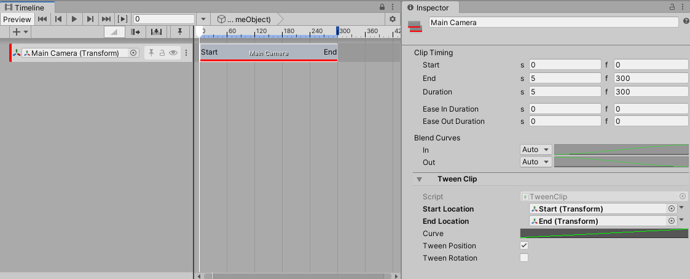
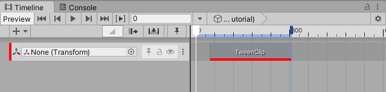
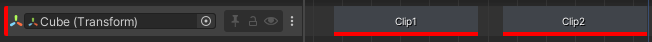
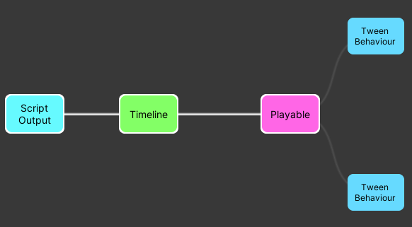
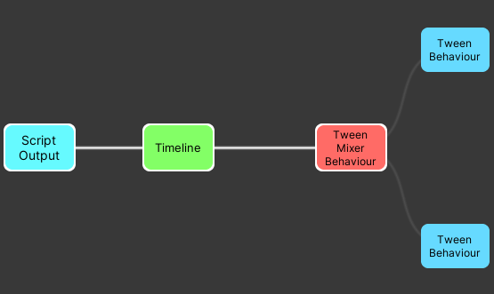

# Transform Tween track sample



This track can be used for simple transform movements between two points.

## Usage

This track can be used for simple transform movements. All translation happens in a straight line but the speed can be controlled with an animation curve. The Tween track binds to the scene `Transform` you wish to move.

Field | Description
---- | ---
Start Location | This is a reference to a Transform in the scene that marks the position and/or rotation of the moving Transform when the playable starts. If it is left null the position/rotation of the moving Transform when the playable starts will be used.|
End Location   | This is a reference to a Transform in the scene that marks the position and/or rotation of the moving Transform when the playable finishes.
Tween Position | Whether or not the position of the Transform should change.
Tween Rotation | Whether or not the rotation of the Transform should change.

## Custom clip workflow example

This example will demonstrate how to:

* create a custom clip, track and mixer;
* use the PlayableGraph API to animate an object's transform;
* customize a clip with `ClipEditor`;

### 1. Custom clip

when a Timeline begins playing, nodes called `Playable`s are created. They are organized in a tree-like structure called the `PlayableGraph`. For each frame, Timeline samples this graph to read and mix multiple data sources (animation, audio and more).

The first step to create a custom clip is to define a new `PlayableBehaviour` that will be added to a graph. It will need to store the data needed to implement the transform tween:

``` c#
public class TweenBehaviour : PlayableBehaviour
{
    public Transform startLocation;
    public Transform endLocation;

    public bool shouldTweenPosition;
    public bool shouldTweenRotation;

    public AnimationCurve curve;
}
```

The `PlayableBehaviour`'s data is not serialized and will be lost once its parent graph is destroyed. To save this data, the next step is to define a new `PlayableAsset`:

``` c#
[Serializable]
public class TweenClip : PlayableAsset
{
    public ExposedReference<Transform> startLocation;
    public ExposedReference<Transform> endLocation;

    public bool shouldTweenPosition = true;
    public bool shouldTweenRotation = true;

    public AnimationCurve curve;
    //...
}
```

_Note:_ The clip needs to store a start and an end location. Since an asset cannot directly reference a scene object, it cannot store a transform object directly. This is why an `ExposedReference<Transform>` is used.

A `PlayableAsset`'s main purpose is to build a `PlayableBehaviour`. This is done with the `CreatePlayable` method:

``` c#
public class TweenClip : PlayableAsset
{
    //...

    public override Playable CreatePlayable(PlayableGraph graph, GameObject owner)
    {
        // create a new TweenBehaviour
        ScriptPlayable<TweenBehaviour> playable = ScriptPlayable<TweenBehaviour>.Create(graph);
        TweenBehaviour tween = playable.GetBehaviour();

        // set the behaviour's data
        tween.startLocation = startLocation.Resolve(graph.GetResolver());
        tween.endLocation = endLocation.Resolve(graph.GetResolver());
        tween.curve = curve;
        tween.shouldTweenPosition = shouldTweenPosition;
        tween.shouldTweenRotation = shouldTweenRotation;

        return playable;
    }
}
```

`CreatePlayable` will initialize a new `TweenBehaviour` using `TweenClip`'s data.

### 2. Custom track

A custom track is created by defining a [TrackAsset](xref:UnityEngine.Timeline.TrackAsset) subclass. The following attributes can be added to a `TrackAsset`:

* [TrackBindingType](xref:UnityEngine.Timeline.TrackBindingTypeAttribute): defines which type of object should be bound to a track;
* [TrackClipType](xref:UnityEngine.Timeline.TrackClipTypeAttribute): defines which type of clip should be associated to a track.

For this example, the track needs a `Transform` object binding and can only accepts clips of type `TweenClip`, which was previously defined in step 1:

``` c#
[TrackBindingType(typeof(Transform))]
[TrackClipType(typeof(TweenClip))]
public class TweenTrack : TrackAsset
{
    // ...
}
```

The data setup is complete; `TweenTrack` and `TweenClip` can now be added to a timeline:



However, no transform tween has been implemented yet. To do this, a track mixer is needed.

### 3. Define a track mixer

To properly handle blending, or crossfading, between two clips, a track mixer is needed. A track mixer is a `PlayableBehaviour` that will have access to all clips data and will blend those together.

#### Track mixer setup

By default, when a track is added to a timeline, an empty playable is generated and is connected to each clip's playable.

For example, this track:



will generate the following playable graph:



* `Timeline`: this playable is the `root` playable; all playables related to tracks are connected to this node.
* `Playable`: this playable represents the track mixer. Since no track mixer is defined, an empty one is generated.
* `TweenBehaviour`: this playable represents a clip. One per clip is generated. All clip playables are connected to the track mixer.

In order to define a custom track mixer, a new `PlayableBehaviour` needs to be defined:

``` c#
public class TweenMixerBehaviour : PlayableBehaviour {}
```

then, in `TrackAsset`, the [CreateTrackMixer](xref:UnityEngine.Timeline.TrackAsset#UnityEngine_Timeline_TrackAsset_CreateTrackMixer_UnityEngine_Playables_PlayableGraph_UnityEngine_GameObject_System_Int32_) method can be used to specify a custom track mixer:

``` c#
public class TweenTrack : TrackAsset
{
    public override Playable CreateTrackMixer(PlayableGraph graph, GameObject go, int inputCount)
    {
        return ScriptPlayable<TweenMixerBehaviour>.Create(graph, inputCount);
    }
}

```

Now the playable graph looks like this:



The empty playable that used to connect clip playables together is now replaced by `TweenMixerBehaviour`.

#### Transform tween implementation

The implementation of the transform tween resides in the `ProcessFrame` method from `TweenMixerBehaviour`. Here are the main steps of that implementation:

* _Initialization_: When the timeline is first played, the initial transform of the track binding is fetched. If the start or end transform is `null`, the initial transform will be used instead.
* _Get clip behaviours & weights_: to appropriately blend, the mixer needs to ask information for all of its inputs (clips):

``` c#
// Iterate on all the playable's (mixer) inputs (ie each clip on the track)
int inputCount = playable.GetInputCount();
for (int i = 0; i < inputCount; i++)
{
    // get the input connected to the mixer
    Playable input = playable.GetInput(i);

    // get the weight of the connection
    float inputWeight = playable.GetInputWeight(i);

    // get the clip's behaviour
    TweenBehaviour tweenInput = GetTweenBehaviour(input);
}
```

* _Calculate and blend_: A linear interpolation is used to calculate a transform between two points.
* _Apply result_: Once the calculation is done, the transform is written in the track binding object:

``` c#
// Apply the final position and rotation values in the track binding
trackBinding.position = accumPosition + m_InitialPosition * (1.0f - totalPositionWeight);
trackBinding.rotation = accumRotation.Blend(m_InitialRotation, 1.0f - totalRotationWeight);

```

### 4. Customize a clip's appearance

`ClipEditor` can be used to augment the capabilities of a clip in the editor. It works like a custom [Inspector](https://docs.unity3d.com/ScriptReference/CustomEditor.html); the [CustomTimelineEditor attribute](xref:UnityEditor.Timeline.CustomTimelineEditorAttribute) is used to tell Timeline that a [ClipEditor](xref:UnityEditor.Timeline.ClipEditor) class should be associated to a given clip.

``` c#
[CustomTimelineEditor(typeof(TweenClip))]
public class TweenClipEditor : ClipEditor
{
   //...
}
```

It is possible to customize the appearance of a clip with the [DrawBackground](xref:UnityEditor.Timeline.ClipEditor#UnityEditor_Timeline_ClipEditor_DrawBackground_UnityEngine_Timeline_TimelineClip_UnityEditor_Timeline_ClipBackgroundRegion_) method:

``` c#
public override void DrawBackground(TimelineClip clip, ClipBackgroundRegion region)
{
    TweenClip asset = clip.asset as TweenClip;

    if (asset == null)
        return;

    // Drawing code here...
}
```

## Notes

* Only the portion between (0,1) of the curve will be used.
* When a clip ends, the object bound to the track will return to its original position.
