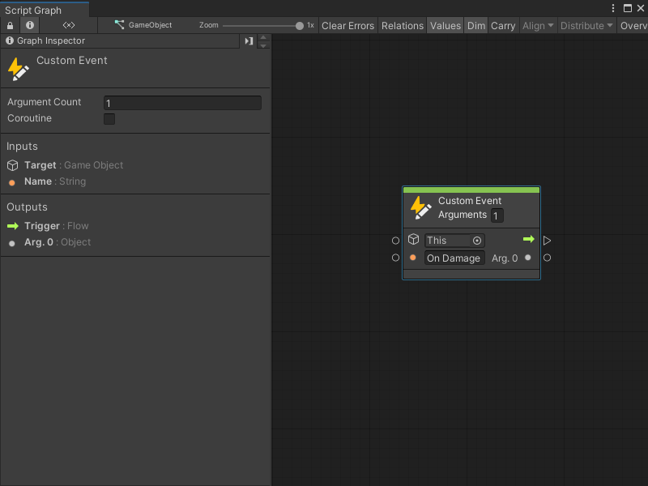

# Add a Custom Event node

You can add a Custom Event node to a Script Graph to trigger specific logic after an Event occurs. For more information about custom Events, see [Custom Events](vs-custom-events.md).

> [!NOTE]
> To use a Custom Event node, you must configure the node with the following instructions, then add a Custom Event Trigger node to your graph. For more information on how to add a Custom Event Trigger node, see [Add a Custom Event Trigger node](vs-add-custom-event-node-trigger.md)

To add a Custom Event node to a Script Graph: 

1. [Open the Script Graph](vs-open-graph-edit.md) where you want to add a Custom Event node. 

2. [!include[open-fuzzy-finder](./snippets/vs-open-fuzzy-finder.md)]. 
 
3. Go to **Events**.

4. Select the **Custom Event** node to add it to your graph.

5. In the **GameObject** field, indicated by the GameObject icon on the node, choose the GameObject where you want to create the Event. Do one of the following: 

    - Select the object picker (circle icon), and select a GameObject.
    - Attach a node to the field's data input port that outputs a GameObject. 
    - Leave the field as the default value of **This** to use the GameObject where you attached your Script Graph to a Script Machine.

6. In the **Arguments** field, enter the number of arguments you want the custom Event to receive and pass to other nodes in your graph. The default value is 0. If you enter a number greater than 0, Visual Scripting adds the corresponding number of Output ports to the Custom Event node.

    > [!NOTE]
    > Visual Scripting labels your first argument as `Arg. 0`.

7. Enter a unique name for the custom Event through one of the following methods: 

   - Enter a name in the field next to the **Name** input port. 
   - Attach a node that outputs a string value to the **Name** input port. 

In the following example, a custom Event called **On Damage** returns a single argument when it's triggered in a Script Graph. 

## Next steps 

After you add a Custom Event node to your graph, [add more nodes to your graph](vs-add-node-to-graph.md) or [connect nodes](vs-creating-connections.md) to specify what happens after your Event triggers. 

Then, [add a Custom Event Trigger node](vs-add-custom-event-node-trigger.md) to specify when to trigger the custom Event in your graph. 

To create more complex logic for your custom Event, you can also [create a Custom Scripting Event node](vs-create-own-custom-event-node.md).

