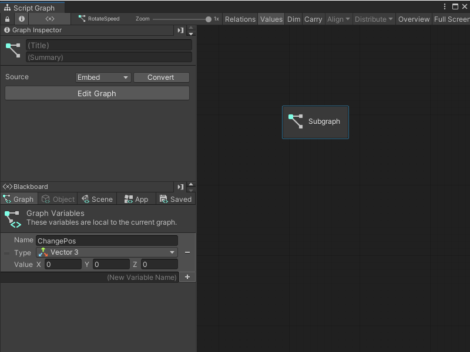
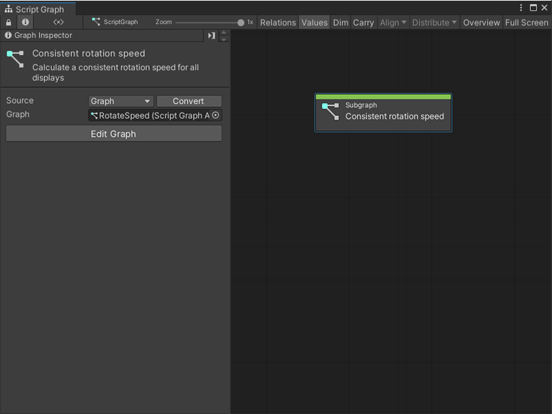

# Add a Subgraph to a Script Graph

A Subgraph is a Script Graph nested inside of another Script Graph. A Subgraph appears as a single node inside the parent Script Graph. 

You can add a Subgraph to a Script Graph in two ways: create an entirely new Script Graph, or add an existing Script Graph file.

## Add a new Subgraph to a Script Graph

To add a new blank Subgraph to an existing Script Graph: 

1. [!include[with-graph-open-ff](./snippets/vs-with-graph-open-ff.md)]. Go to **Nesting** and select **Subgraph**. 

2. In the Graph Inspector, choose the **Source** for your Subgraph: 

   - **Embed**: The Subgraph only exists on the Subgraph node. You can only modify the Subgraph from the node in its parent graph.
   - **Graph**: The Subgraph exists in a separate file. You can modify the Subgraph outside of its parent graph and reuse the graph in other areas of your application. 
    

   [!include[graph-inspector-tip.md](./snippets/vs-graph-inspector-tip.md)]

3. If you chose **Graph**, select **New**, enter a name for your graph file, and choose where you want to save it. Select **Save**. 

## Add an existing Script Graph as a Subgraph

To add an existing graph file as a Subgraph in a Script Graph: 

> [!NOTE]
> You can't nest a Script Graph as a Subgraph in its own graph file. 

1. [!include[with-graph-open-ff](./snippets/vs-with-graph-open-ff.md)]. Go to **Nesting** and select **Subgraph**. 

2. In the Graph Inspector, set your **Source** to **Graph**. 
    

   [!include[graph-inspector-tip.md](./snippets/vs-graph-inspector-tip.md)]

3. In the **Graph** field, select the object picker (circle icon) and choose a compatible Script Graph from your project. You can also click and drag a Script Graph file from your Project window and drop it into the **Graph** field. 

> [!TIP] 
> For a faster way to add a Script Graph as a Subgraph, click and drag the Script Graph from your Project window into the Graph Editor to automatically create a Subgraph node. 

## Next steps

To open your new Subgraph for editing, select **Edit Graph**. 

Once you've added a Subgraph to your Script Graph, define its Input and Output Triggers and Input and Output Data. For more information, see [Add a Trigger or Data port to a Script Graph](vs-add-triggers-data-graph.md).

