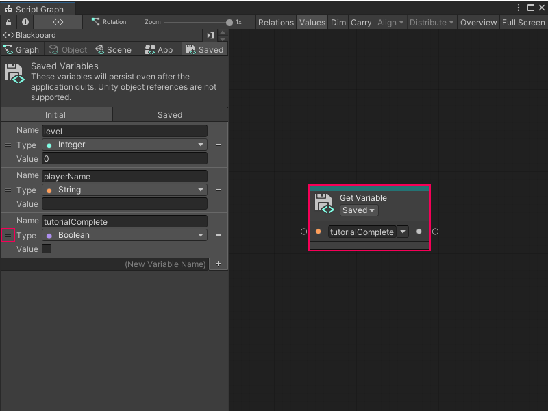
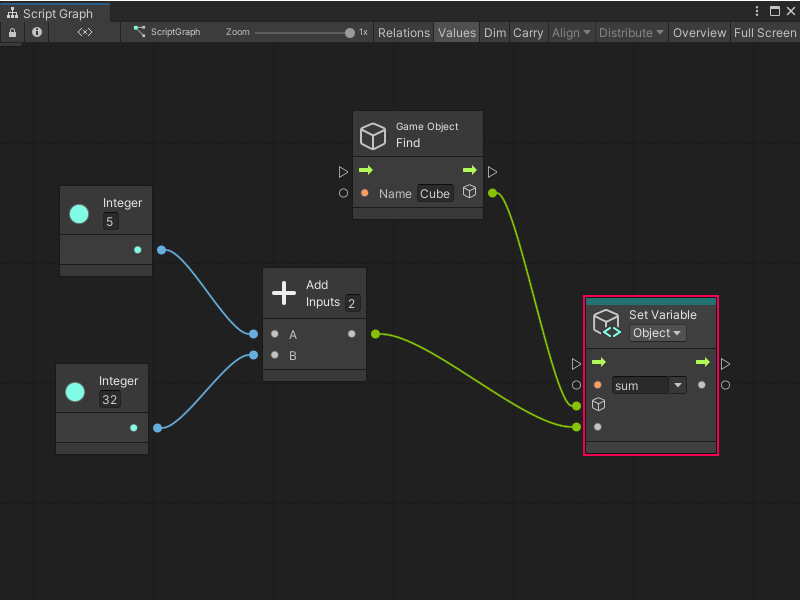

# Create and add a variable to a Script Graph

You can create and add a variable to a Script Graph in one of two ways: use the Graph window's Blackboard, or add a node to a graph.

> [!NOTE]
> You can't add a Flow variable to a graph from the Blackboard. For more information on Flow variables, see [Variables](vs-variables.md).

## Create and add a new variable through the Blackboard

To create a new variable in the Blackboard and add it to a graph: 

1. With a graph [open in the Graph window](vs-open-graph-edit.md), open [the Blackboard](vs-interface-overview.md#the-blackboard).

1. In the Blackboard, select the scope for the variable you want to add: **Graph**, **Object**, **Scene**, **App**, or **Saved**. 
    For more information on variable scopes and when you can use each scope in your graph, see [Variables](vs-variables.md).

3. In the **(New Variable Name)** field, enter a name for the new variable. 

1. Do one of the following: 
    - Press Enter.
    - Select the **Add Variable** (+) button. 

4. In the **Type** list, select the data type for your variable. For more information on types, see [Object types](vs-types.md).

5. In the **Value** field, enter or modify the default value for your variable. 

6. To add the node to your graph, click and drag from the Handle (=) on the variable's definition in the Blackboard into the Graph Editor. 

Visual Scripting adds a new Get Variable node for your variable to your graph.

## Create and add a new variable through the Graph Editor

To create a Flow variable or another new variable directly in a graph: 

1. [!include[with-graph-open-ff](./snippets/vs-with-graph-open-ff.md)]

2. Select the **Variables** category. 

1. Select the scope for the variable you want to add: **Flow**, **Graph**, **Object**, **Scene**, **Application**, or **Saved**. For more information on variable scopes and when you can use each scope in a graph, see [Variables](vs-variables.md).

3. Select the **Set `<Scope>` Variable** node, where `<Scope>` is the scope you selected in the previous step. 
    Visual Scripting adds a new Set Variable node to the graph.
    
4. In the **Name** field, enter a name for the new variable. 

5. (Object variables only) In the **GameObject** field, indicated by a GameObject icon on the node, specify the GameObject where you want to create the variable. Do one of the following: 
 
    - Select the object picker (circle icon) and select a GameObject.
    - Attach a node to the field's data input port that outputs a GameObject. 
    - Leave the field as the default value of **This** to use the GameObject where you attached the Script Graph to a Script Machine.

6. To set a default value for your variable, connect another node that outputs the value you want to the Set Variable node's data input port. 

## Next steps 

After you've added a variable to your graph, you can [add nodes](vs-add-node-to-graph.md), [create node groups](vs-groups.md), or [add a Subgraph](vs-nesting-add-subgraph.md).

You can also add a [Sticky Note](vs-sticky-notes.md) to add comments to a graph.