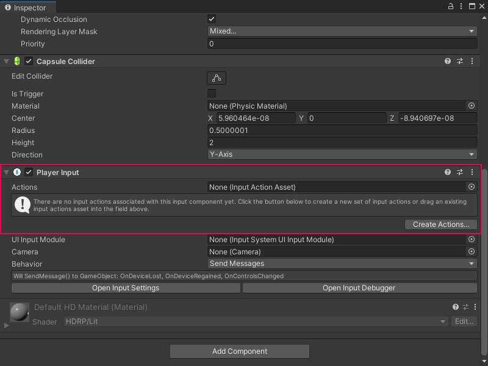

# Add and configure a Player Input component 

To use the Input System package with Visual Scripting, add a Player Input component to the same GameObject as the Script Graph and create an Input Actions asset. 

You must add the Player Input component and create the Input Actions asset before you create the Script Graph. 

> [!NOTE]
> If the Input System package isn't installed in your project, follow the Input System documentation's [Installation guide](https://docs.unity3d.com/Packages/com.unity.inputsystem@latest/index.html?subfolder=/manual/Installation.html) to install the package. Go to **Window** &gt; **Package Manager** to check your installed packages. 

To add a Player Input component to a GameObject:

1. [!include[open-hierarchy-window](./snippets/vs-open-hierarchy-window.md)]

2. In the Hierarchy window, select the GameObject that you want to move with the Script Graph.

3. [!include[open-inspector-window](./snippets/vs-open-inspector-window.md)]

4. Select **Add Component**. 
    The Components menu opens. 

5. In the Components menu, do one of the following: 
    - Go to **Input**.
    - In the Search bar, enter `Player Input`. 

6. Select the **Player Input** component to add it to the GameObject. 

1. Add an Input Actions asset to the Player Input component. Do one of the following: 
    - [Create a new Input Actions asset](#create-a-new-input-actions-asset).
    - [Use an existing Input Actions asset](#use-an-existing-input-actions-asset).

## Create a new Input Actions asset 

1. Select **Create Actions**. 

1. Choose a location in your project to save the Input Actions asset. 

1. Select **Save**. 

## Use an existing Input Actions asset 

1. Do one of the following: 
    - Click the **Actions** field's object picker (circle icon) and in the **SelectInputActionAsset** window, select the asset. 
    - Click and drag a file from your Project window and drop it into the **Actions** field. 

## Next steps 

To configure the available options on a Player Input component, see [GameObject components for input](https://docs.unity3d.com/Packages/com.unity.inputsystem@latest/index.html?subfolder=/manual/Components.html) in the Input System package documentation.  

To configure an Input Actions asset, see [Input Action Assets](https://docs.unity3d.com/Packages/com.unity.inputsystem@latest/index.html?subfolder=/manual/ActionAssets.html) in the Input System package documentation.

To create a simple Script Graph to capture input with Visual Scripting, see [Capture input with the Input System package](vs-capturing-player-inputs-new.md).

## Additional resources

- [Capture user input in an application](vs-capture-player-input.md)
- [Capture input with the Input System package](vs-capturing-player-inputs-new.md)
- [Input event nodes](vs-input-nodes.md)
