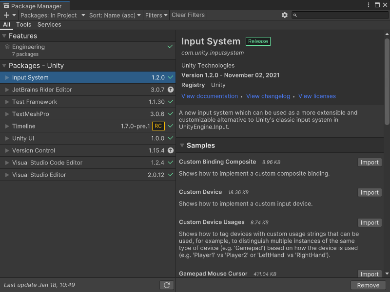
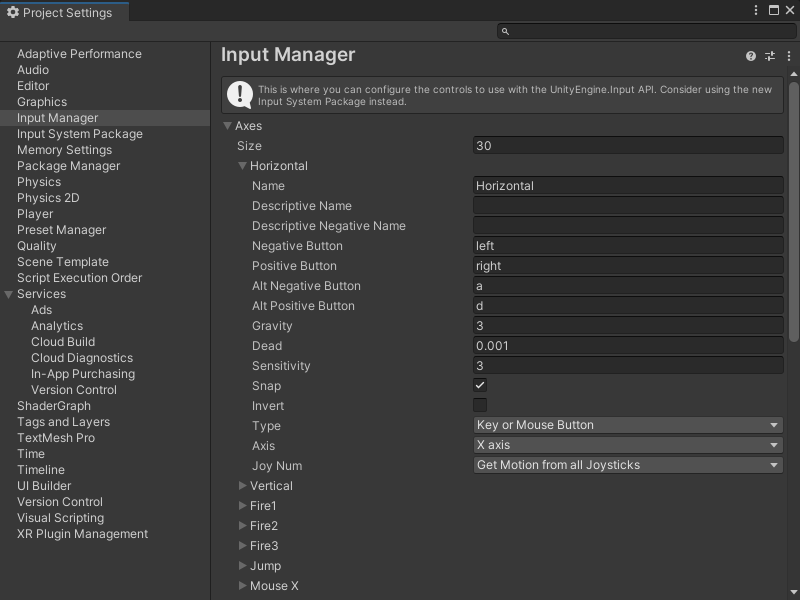

# Capture user input in an application

You can capture input from a user's input device to make your application interactive. Visual Scripting can use either the [Input Manager](https://docs.unity3d.com/Manual/class-InputManager.html) or the [Input System package](https://docs.unity3d.com/Packages/com.unity.inputsystem@latest) to capture input data in a Script Graph. 

## Use the Input System package 

The Input System package captures input in Unity applications. It uses any input device and replaces Unity's [Input Manager](#use-the-input-manager). 

To install the Input System package, see the [Installation guide](https://docs.unity3d.com/Packages/com.unity.inputsystem@latest/index.html?subfolder=/manual/Installation.html) in the Input System package documentation. 

To check if the Input System package is installed, go to **Window** &gt; **Package Manager**.

For more information on the Package Manager and managing packages in projects, see the [Packages](https://docs.unity3d.com/Manual/PackagesList.html) section in the Unity User Manual. 

### Input System package prerequisites

To use the Input System package in a project, do the following: 

1. Install the package. For more information, see the [Packages](https://docs.unity3d.com/Manual/PackagesList.html) section in the User Manual. 

2. Regenerate your Node Library to include the Input System package nodes. For more information, [Configure project settings](vs-configuration.md#Regen).

3. In your Player Project Settings, set **Active Input Handling** to **Input System Package (New)** or **Both**. For more information on this setting, see [Standalone Player settings](https://docs.unity3d.com/Manual/class-PlayerSettingsStandalone.html#Configuration) in the User Manual.

4. Create an Input System settings asset. Go to **Edit** &gt; **Project Settings** and select **Input System Package**, then select **Create Settings Asset**. For more information on the available input settings, see [Input Settings](https://docs.unity3d.com/Packages/com.unity.inputsystem@latest/index.html?subfolder=/manual/Settings.html) in the Input System package documentation.

5. Create a GameObject with a `PlayerInput` component and an Input Actions asset. For more information, see [Add and configure a PlayerInput component](vs-capture-player-input-add-component.md).

After you've configured your project, create a graph to [Capture input with the Input System package](vs-capturing-player-inputs-new.md).

## Use the Input Manager

The Input Manager is Unity's built-in system for input. 

Change the Input Manager's settings to change how a project receives input. Go to **Edit** &gt; **Project Settings** and select **Input Manager**. 

For more information on the available settings, see the [Input Manager documentation](https://docs.unity3d.com/Documentation/Manual/class-InputManager.html) in the User Manual.

### Input Manager prerequisites

To use the Input Manager in a project, in your Player Project Settings, set **Active Input Handling** to **Input Manager (Old)** or **Both**. For more information on this setting, see [Standalone Player settings](https://docs.unity3d.com/Manual/class-PlayerSettingsStandalone.html#Configuration) in the User Manual.

After you’ve configured your Player Project Settings, create a graph to [Capture input with the Input Manager](vs-capturing-player-inputs-old.md).

## Additional resources

- [Add and configure a Player Input component](vs-capture-player-input-add-component.md)
- [Capture input with the Input System package](vs-capturing-player-inputs-new.md)
- [Capture input with the Input Manager](vs-capturing-player-inputs-old.md)
- [Input event nodes](vs-input-nodes.md)
