# Control nodes

> [!NOTE]
> For versions 2019/2020 LTS, download the Visual Scripting package from the [Unity Asset Store](https://assetstore.unity.com/packages/tools/visual-bolt-163802).

Control nodes branch, loop and merge the flow.

## Branching

Branching nodes split the control flow based on a value.

### If
The common if node uses a boolean condition. Consider them as an "if the condition is true, do something, otherwise, do something else."

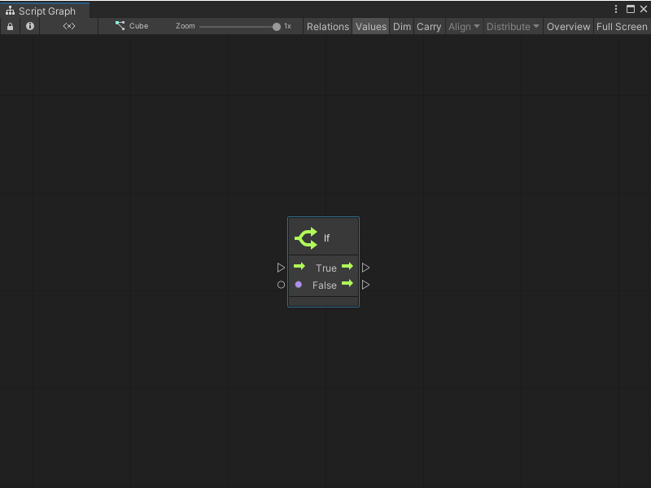

### Switch

Branch on the value of an enum, a string, or an integer. These nodes are called Switch nodes.

To switch on an enum, decide on the type of the enum. The branch output ports appears.

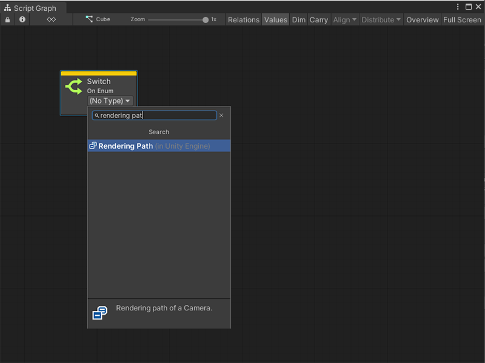

To switch on a string or number, create each branch option in the graph inspector.

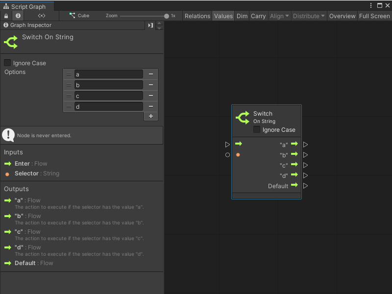

The node is updated with each output port.

For strings, optionally choose to ignore the case of the selector.

> [!NOTE]
> A Default port is always added. It is the path that the control flow should take if the input selector does not correspond to any other option.

### Select

Select nodes are the opposite of switch nodes. You can select a single value from a set of options based on a selector.

For example, a Select On Integer node that chooses a color based on a player number.

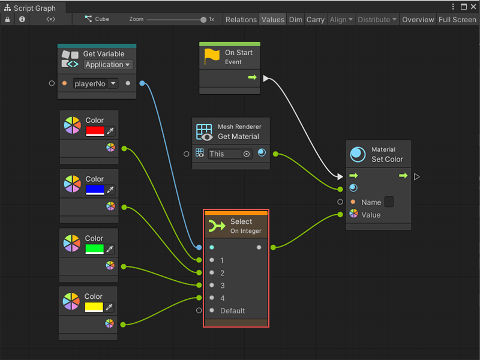

>[!NOTE]
> In the above example predictive debugging warns of a crash if playerNo is not within 1, 2, 3, or 4, because the Default port is not connected.

## Looping

Loops repeats logic for a certain number of iterations before moving on.

The logic to be repeated is called the body of the loop. After the loop is over, the exit port is called.

>[!NOTE]
> The body of every loop is called synchronously, not over the course of multiple frames. Co-routine-like behaviours are achieved by listening to the update event manually.

### While Loop

The while loop is the simplest form of loop. It repeats its body while its condition remains true. Only when the condition becomes false does the loop terminate.

For example, the following graph generates a new random name until the result isn't contained in the names application variable.

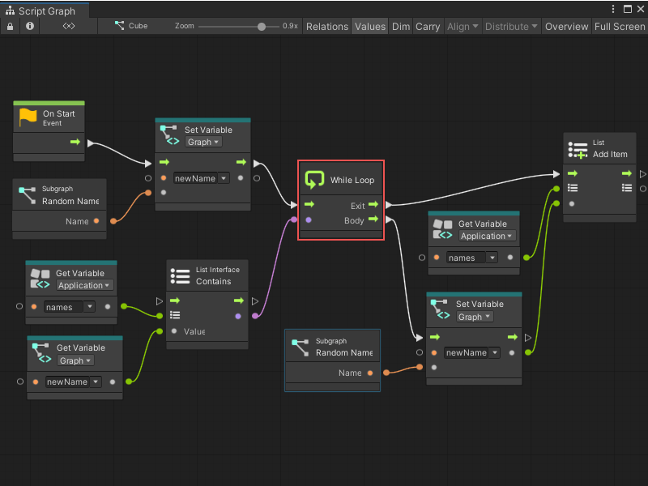

> [!WARNING]
> Do not create an infinite loop. If the condition is always true, the editor hangs. As loop bodies are synchronous, not parallel, there are few uses for while loops in visual scripting.

### For Each Loop

For Each iterates over every element of a collection. It outputs the current index and item that is being looped over.

For example, the following graph outputs three messages to the console:

*   *I like cats*
*   *I like dogs*
*   *I like birds*

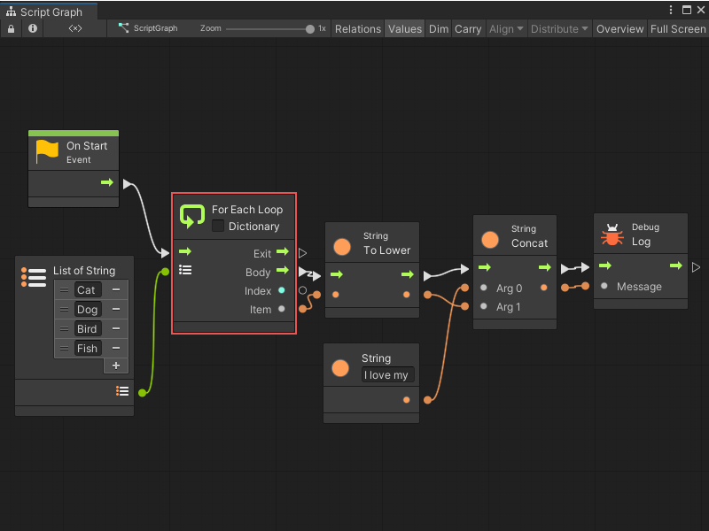

To access the key and value from dictionaries in the loop, check the Dictionary box.

### For Loop

For is a numeric loop and requires three integers: a start index, an end index, and a step. The loop starts at the first index, then increments towards the last index via increments of the step. It outputs the current index.

For example, this graph counts to ten by skipping odd numbers because of its step. In other words, its output is 0, 2, 4, 6, then 8.

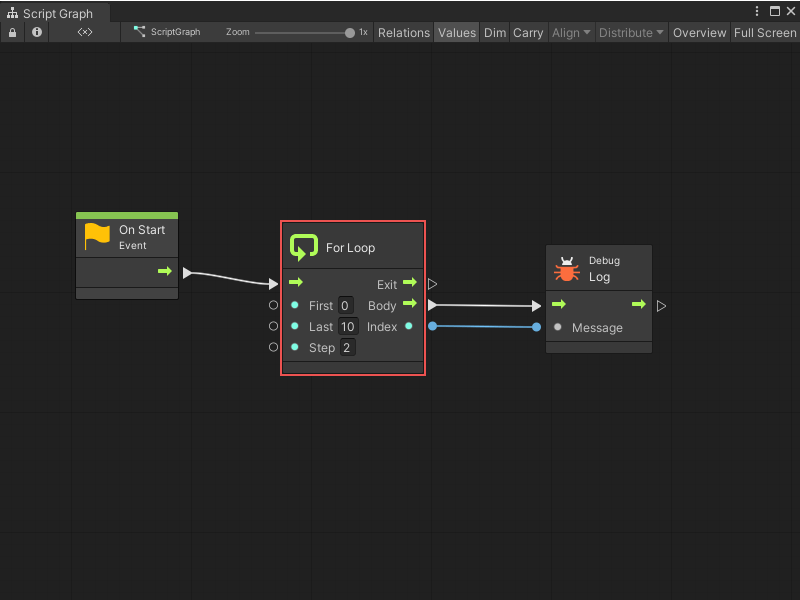

The for loop can also be very useful when combined to the Get List Item and Count Items nodes.

For example, the folllowing graph is very similar to the last graph as the output to the console is "I like {animal}s".

Instead of using the for each node that outputs each item, the graph outputs each item manually by its index in the list. This specifies a different increment (in this case 2) and skips some items. This graph  outputs two messages:

*   *I like cats*
*   *I like birds*

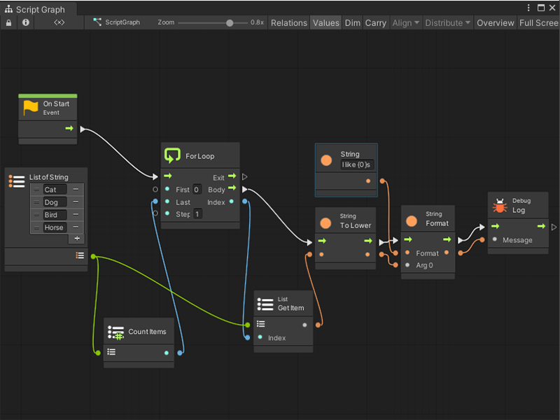

### Break Loop

A loop can finish early by using the Break Loop node. As soon as this node is entered, the exit port of the loop is called, no matter how many more iterations remain.

For example, even though this for loop is supposed to count to 10, it stops at 5 because of the break. Its output is 0, 1, 2, 3, then 4.

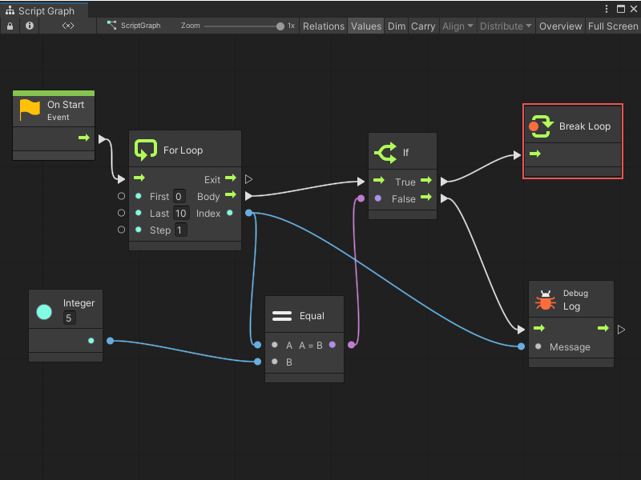

## Exception Handling

### Try Catch

The Try Catch node handles [Exceptions](https://docs.microsoft.com/en-us/dotnet/csharp/programming-guide/exceptions/) that occur. It prevents your game from crashing in case you suspect some code might fail.

Anything that gets executed in the Try branch is considered "safe": the script continues from the Catch branch instead if it fails. The Exception port captures information about the failure when that happens. A common way of handling this is to log a warning with the exception message.

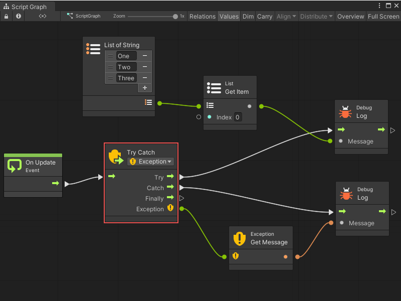

> [!NOTE] 
> By default, this node catches all exceptions. Be specific in your handling by changing the exception type in the dropdown.

The Finally branch is optional. It is always called after Try or Catch, regardless of whether the operation succeeded or not. It is usually used to dispose or destroy any resources that must be freed. This port can be disconnected if there is no need to destroy any resources.

### Throw

The Throw node allows you to raise your own exceptions that stop the flow. These are caught with Try Catch.

It is good practice to "fail early" by throwing as soon as something unexpected happens. It helps catch bugs early in the chain, instead of letting them trickle down and have unexpected side effects that are hard to debug.

For example, to ensure damage is positive before applying it:

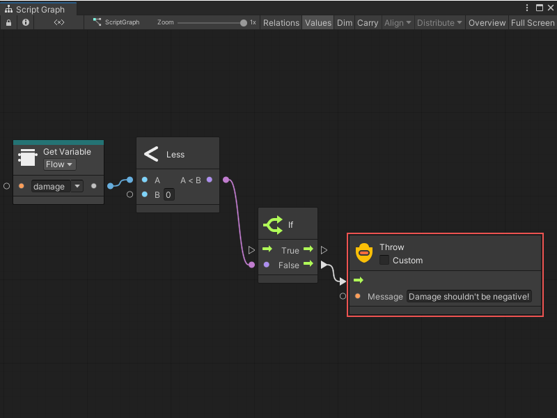

If the Custom checkbox is selected, you can pass a custom Exception object that contains more data than a simple message. Most often, this is not required. By default, the thrown exception is of type `System.Exception`.

## Toggles

Toggle nodes are similar in principle to light-switches: they can be turned on and off to impact either the script or values. Think of them as "gates" that can be opened and closed.

### Toggle Flow

The Toggle Flow node gates the flow of control. When on, the flow passes through; when off, the flow does  not.

There are many inputs and outputs that allow fine grain control over the logic. In the previous example, Toggle is used to show the same event (a keypress) turns the toggle on and off. This can be done by using On and Off through two different events.

There are many inputs and outputs that allow fine grain control over the logic. In a previous example, Toggle is used to show the same event (a keypress) turns the toggle on and off; for the same results using two different events, use On and Off instead.

On the output side, the Is On boolean port indicates the toggle status, that is turned on or off. The control outputs are triggered according to the table below:  

| Port       | Triggered When                                                                                                       |
|---|---|
| On| Flow enters the toggle via the unmarked input while it is on.|
| Off| Flow enters the toggle via the unmarked input while it is off.|
| Turned On  | The toggle gets turned on, either via the On or Toggle inputs.   |
| Turned Off | The toggle gets turned off, either via the Off or Toggle inputs. |

### Toggle Value

The Toggle Value node selects between two different input values depending on whether it is on or off. Its ports work exactly like the Toggle Flow node.

Another way of implementing the same logic as the previous example: clicking Space toggles the object to move up. This time a value of 1 or 0 is provided as the vertical velocity.

> [!NOTE]
> Turn on relations in the toolbar as a means to visualize the flow between the toggle ports.

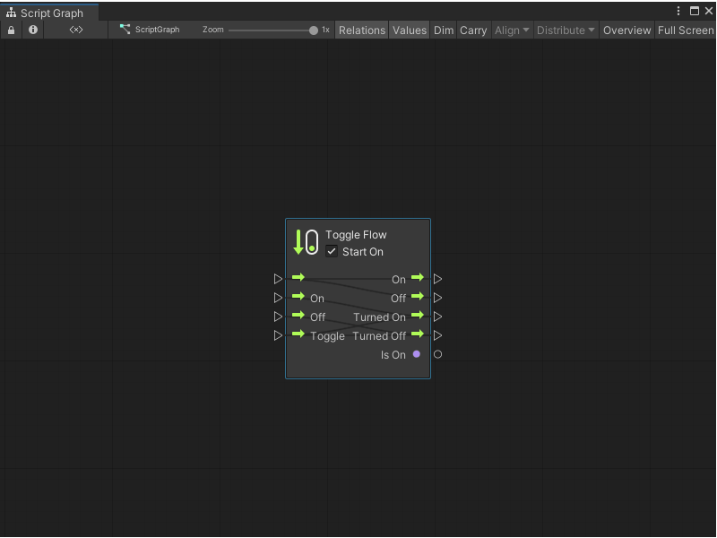

## Once

The Once node executes different logic the first time it is traversed from any subsequent times. 

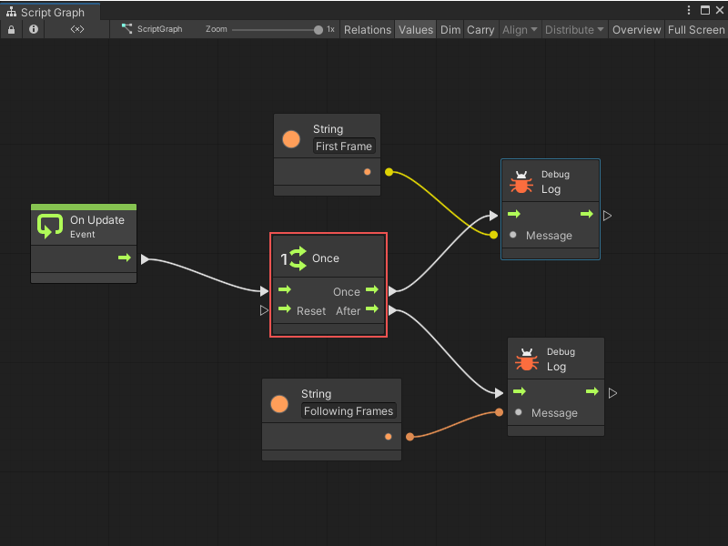

It can be reset by entering the Reset port.

## Cache

The Cache node saves the result of an expensive operating and reuses it instead of fetching it again each time you need it.

For example, using this graph, the formula is calculated twice:

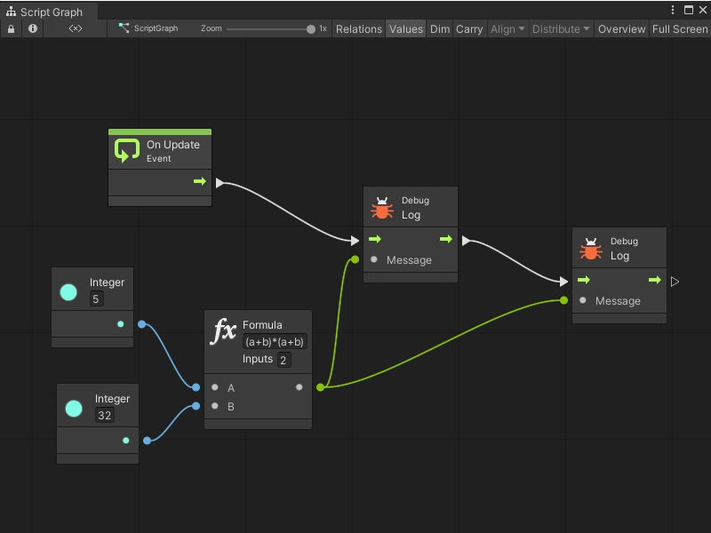

By using the Cache node, the result is saved and calculated only once, optimizing performance.

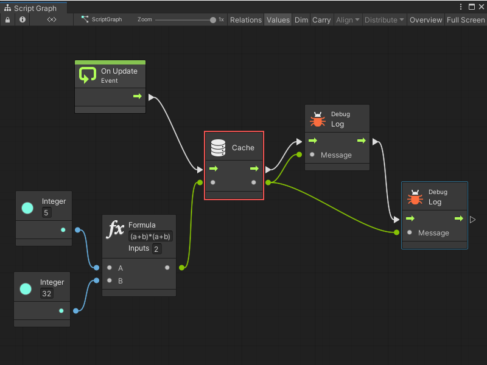

> [!NOTE] 
> It is important to note that caching only lasts within the scope of the current flow. The value of the cache is not shared or available from another event.
