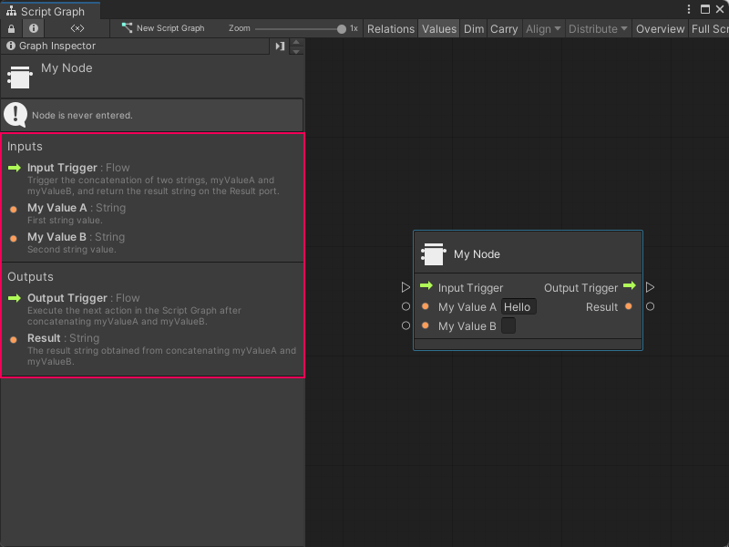

# Add documentation to a Custom C# node

You can also add [Graph Inspector](vs-interface-overview.md#the-graph-inspector) documentation to a Custom C# node. Visual Scripting displays the documentation in the Graph Inspector when you select a node in a Script Graph. The documentation isn't required to use the node, but can help your users understand the purpose and usage of a node. 

To add documentation to a node: 

1. [!include[open-project-window](./snippets/vs-open-project-window.md)]

    > [!NOTE]
    > If you already have an **Editor** folder in your project, you can skip Steps 2-3. 

2. Right-click your **Assets** folder or select **Add** (+), then select **Folder**. 

1. Name the folder **Editor**. 

3. Do one of the following: 

    - Right-click your **Editor** folder in the Project window's folder list. 
    - Right-click anywhere in the Project window's preview pane with your **Editor** folder selected.

4. [!include[create-c-script](./snippets/vs-create-c-script-project.md)]

5. Enter a name, such as `MyNodeDescriptor` for the new script file.

1.  Press Enter.

6. [!include[open-new-external-code](./snippets/vs-open-new-external-code.md)]

7. In your external editor, copy and paste the following code into the C# script: 

    ```C#
    using System;
    using Unity.VisualScripting;
    using UnityEngine;

    [Descriptor(typeof(MyNode))]
    public class MyNodeDescriptor : UnitDescriptor<MyNode>
    {
    public MyNodeDescriptor(MyNode unit) : base(unit) {}

    protected override void DefinedPort(IUnitPort port, UnitPortDescription description)
    {
        base.DefinedPort(port, description);
        switch (port.key)
        {
            case "inputTrigger":
                description.summary = "Trigger the concatenation of two strings, myValueA and myValueB, and return the result string on the Result port.";
                break;
            case "myValueA":
                description.summary = "First string value.";
                break;
            case "myValueB":
                description.summary = "Second string value.";
                break;
            case "outputTrigger":
                description.summary = "Execute the next action in the Script Graph after concatenating myValueA and myValueB.";
                break;
            case "result":
                description.summary = "The result string obtained from concatenating myValueA and myValueB.";
                break;
        }
    }
    }
    ```
    You can modify the script to suit the specifics of your own node.<br/>

8. [!include[save-script](./snippets/vs-save-script.md)]

1. [!include[return-unity](./snippets/vs-return-unity.md)]

9. Do one of the following: 

    - [!include[open-graph-w-node](./snippets/custom-c-nodes/vs-open-graph-w-node.md)].
    - [!include[ff-add-node](./snippets/custom-c-nodes/vs-ff-add-node.md)]

10. Select the node and open the [Graph Inspector](vs-interface-overview.md#the-graph-inspector) to view your documentation. 

    

## Next steps 

After you add documentation to a node, you can choose to further customize the node with [node class and port attributes](vs-create-custom-node-attributes-reference.md).
