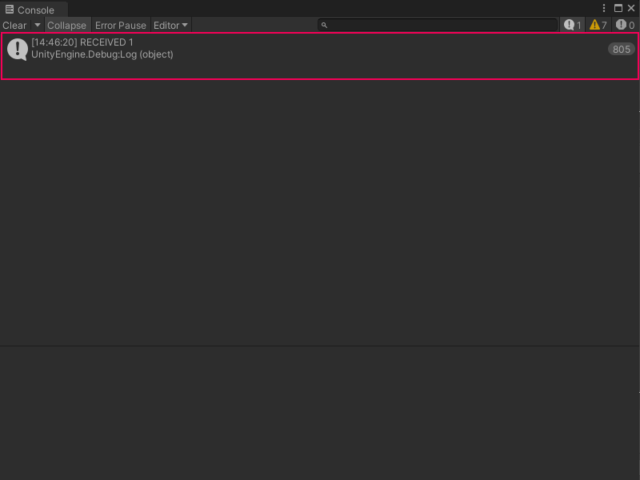

# Listen to a Custom Scripting Event from a C# script

You can use a C# script to listen for or receive a Custom Scripting Event from a Script Graph. You can use an Event receiver script to execute additional logic in your application. 

> [!NOTE]
> Before you can create a listener for a Custom Scripting Event node, you must create a Custom Scripting Event node and its trigger. [!include[tasks-note-end](./snippets/custom-events/vs-tasks-note-end.md)] and [Create a Custom Scripting Event Sender node](vs-create-own-custom-event-send-node.md).


To receive a Custom Scripting Event from a Script Graph: 

1. [!include[open-project-window](./snippets/vs-open-project-window.md)]
 
1. [!include[right-click-project](./snippets/custom-events/vs-right-click-project.md)]

1. [!include[create-c-script-project](./snippets/vs-create-c-script-project.md)]

1. Enter a name, such as `EventReceiver`, for the new script file.

1. Press Enter. 

1. [!include[open-new-external-code](./snippets/vs-open-new-external-code.md)] 

1. In your external editor, copy and paste the following code into your C# script: 

    ```csharp
    using Unity.VisualScripting;
   using UnityEngine;
   public class EventReceiver : MonoBehaviour
   {
      void Start()
      {
          EventBus.Register<int>(EventNames.MyCustomEvent, i =>
          {
              Debug.Log("RECEIVED " + i);
          });
      }
   }
    ```
1. [!include[save-script](./snippets/vs-save-script.md)] 

1. [!include[return-unity](./snippets/vs-return-unity.md)]

1. [!include[open-hierarchy-window](./snippets/vs-open-hierarchy-window.md)]

1. Do one of the following in the Hierarchy window:
    - Select an existing GameObject where you want to attach the new script.
    - Select **Add New** (+) and in the menu, select a new GameObject to add to your scene from any of the available options. You can also right-click anywhere in the Hierarchy window and select the same options in the context menu.

1. [!include[open-inspector-window](./snippets/vs-open-inspector-window.md)]

1. Select **Add Component**.

1. In the Component menu, enter the name of the script file. 

1. Select it to add it to the GameObject.

1. Select **Play** from [the Unity Editor's Toolbar](https://docs.unity3d.com/Manual/Toolbar.html) to enter Play mode. If you have [a Custom Scripting Event Sender node](vs-create-own-custom-event-send-node.md) or [a C# script to trigger your Event](vs-create-own-custom-event-node-trigger-code.md), you can trigger your Custom Scripting Event.

   The `EventReceiver` script logs the following message to the console every time the Event is triggered, as shown in the following image. 

   
 


