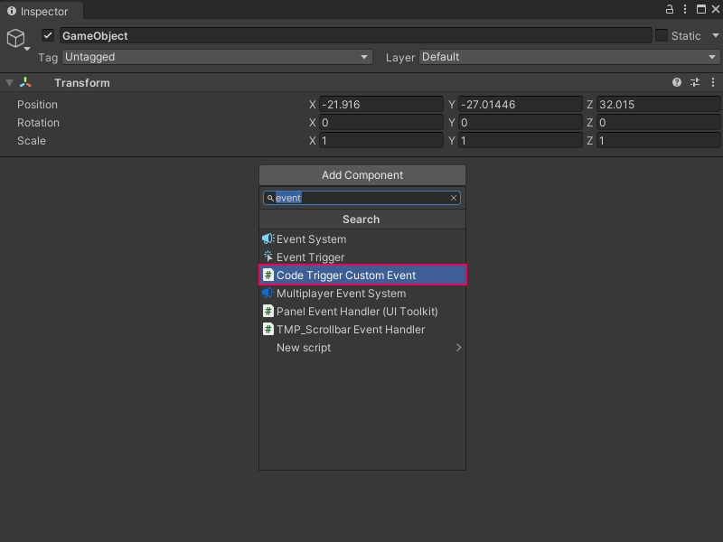

# Trigger a Custom Scripting Event from a C# script

You can send or trigger a Custom Scripting Event node in a Script Graph with a C# script instead of a Custom Scripting Event Sender node. For more information on how to create a Custom Scripting Event Sender node, see [Create a Custom Scripting Event Sender node](vs-create-own-custom-event-send-node.md).

> [!NOTE]
> Before you can trigger a Custom Scripting Event node, you must create your Custom Scripting Event node. [!include[tasks-note-end](./snippets/custom-events/vs-tasks-note-end.md)].

To trigger an Event from a C# script: 

1. [!include[open-project-window](./snippets/vs-open-project-window.md)]

1. [!include[right-click-project](./snippets/custom-events/vs-right-click-project.md)]

1. [!include[create-c-script-project](./snippets/vs-create-c-script-project.md)]

1. Enter a name, such as `CodeTriggerCustomEvent`, for the new script file. 
 
1. Press Enter.

1. [!include[open-new-external-code](./snippets/vs-open-new-external-code.md)]

1. In your external editor, copy and paste the following code into your C# script: 
    
    ```csharp 
    using Unity.VisualScripting;
    using UnityEngine;

        public class CodeTriggerCustomEvent : MonoBehaviour
        {
          void Update()
          {
             if (Input.anyKeyDown)
             {
                //Trigger the previously created Custom Scripting Event MyCustomEvent with the integer value 2.
                EventBus.Trigger(EventNames.MyCustomEvent, 2);
             }
          }
       }
    ```

1. [!include[save-script](./snippets/vs-save-script.md)] 

1. [!include[return-unity](./snippets/vs-return-unity.md)]
 
1. [!include[open-hierarchy-window](./snippets/vs-open-hierarchy-window.md)]

1. Do one of the following in the Hierarchy window:
    - Select an existing GameObject where you want to attach the new script.
    - Select **Add New** (+) and in the menu, select a new GameObject to add to your scene from any of the available options. You can also right-click anywhere in the Hierarchy window and select the same options in the context menu.

1. [!include[open-inspector-window](./snippets/vs-open-inspector-window.md)]

1. Select **Add Component**.

1. In the Component menu, enter the name of the script file. 

1. Select it to add it to the GameObject.

   

1. Select **Play** from [the Unity Editor's Toolbar](https://docs.unity3d.com/Manual/Toolbar.html) to enter Play mode.

1. Press any key on keyboard in the [Game view](https://docs.unity3d.com/Manual/GameView.html).

    Visual Scripting triggers your Event in any Script Graph in the current scene that contains the Custom Scripting Event node. 

## Next steps

After you create the script, you can [create a script to listen to your Event](vs-create-own-custom-event-listen-code.md). 

You can also [create an Event Sender node](vs-create-own-custom-event-send-node.md) to trigger the Event from another Script Graph or location in the same Script Graph.
