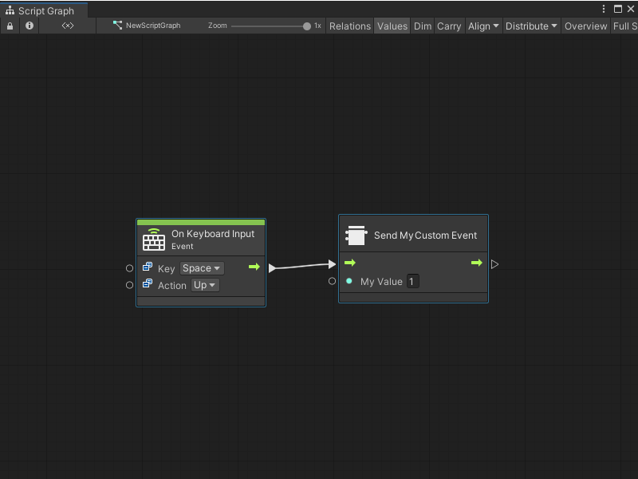

# Create a Custom Scripting Event Sender node

> [!NOTE] 
> Before you create a Custom Scripting Event Sender node, you must create a Custom Scripting Event node. [!include[tasks-note-end](./snippets/custom-events/vs-tasks-note-end.md)].

After you create a Custom Scripting Event node, you can create a Custom Scripting Event Sender node to trigger the Event from any other Script Graph in the same scene, or the same Script Graph. 

You can also choose to create a separate script to trigger the Event from code. For more information, see [Trigger a Custom Scripting Event from a C# script](vs-create-own-custom-event-node-trigger-code.md).

## Create a node and add it to the fuzzy finder 

To create a Custom Scripting Event Sender node and add it to the fuzzy finder:

1. [!include[open-project-window](./snippets/vs-open-project-window.md)]

1. [!include[right-click-project](./snippets/custom-events/vs-right-click-project.md)]

1. [!include[create-c-script-project](./snippets/vs-create-c-script-project.md)]

1. Enter a name, such as `SendMyEventNode`, for the new script file. 

1. Press Enter. 

1. [!include[open-new-external-code](./snippets/vs-open-new-external-code.md)]

1. In your external editor, copy and paste the following code into the C# script: 

    ```csharp
    using Unity.VisualScripting;
    using UnityEngine;
    
    //Custom node to send the Event
   [UnitTitle("Send My Custom Event")]
   [UnitCategory("Events\\MyEvents")]//Setting the path to find the node in the fuzzy finder as Events > My Events.
   public class SendMyEvent : Unit
   {
      [DoNotSerialize]// Mandatory attribute, to make sure we don’t serialize data that should never be serialized.
      [PortLabelHidden]// Hide the port label, as we normally hide the label for default Input and Output triggers.
      public ControlInput inputTrigger { get; private set; }
      [DoNotSerialize]
      public ValueInput myValue;
      [DoNotSerialize]
      [PortLabelHidden]// Hide the port label, as we normally hide the label for default Input and Output triggers.
      public ControlOutput outputTrigger { get; private set; }
   
      protected override void Definition()
      {
   
          inputTrigger = ControlInput(nameof(inputTrigger), Trigger);
          myValue = ValueInput<int>(nameof(myValue),1);
          outputTrigger = ControlOutput(nameof(outputTrigger));
          Succession(inputTrigger, outputTrigger);
      }
   
      //Send the Event MyCustomEvent with the integer value from the ValueInput port myValueA.
      private ControlOutput Trigger(Flow flow)
      {
          EventBus.Trigger(EventNames.MyCustomEvent, flow.GetValue<int>(myValue));
          return outputTrigger;
      }
   }
    ```
1. [!include[save-script](./snippets/vs-save-script.md)] 

1. [!include[return-unity](./snippets/vs-return-unity.md)]

1. [!include[regen-node-library](./snippets/vs-regen-node-library.md)]

After you regenerate your Node Library, the Custom Scripting Event Sender node appears in the fuzzy finder. If you didn't change the `[UnitCategory]` or `[UnitTitle]` from the sample code, then the fuzzy finder displays the node under **Events** &gt; **MyEvents**, as the **Send My Custom Event** node. For more information on the fuzzy finder, see [The interface](vs-interface-overview.md#the-fuzzy-finder).

## Trigger your Custom Scripting Event node

You might use your **Send My Custom Event** node to trigger your Event based on keyboard input: 

1. [Open a Script Graph](vs-open-graph-edit.md) where you want to add the new node. This can be the same or a different Script Graph from the one that contains your Custom Scripting Event node. 

2. [!include[open-fuzzy-finder](./snippets/vs-open-fuzzy-finder.md)]. 

1. Go to **Events** &gt; **Input**.

1. Select the **On Keyboard Input** node to add it to the graph.

3. Right-click again in the Graph Editor to open the fuzzy finder. 

1. Go to **Events** &gt; **My Events**. 

1. Select your **Send My Custom Event** node to add it to the graph.

4. Connect the **On Keyboard Input** node's Trigger output port to the **Send My Custom Event** node's Input Trigger input port, as shown in the following image. 

   

5. Select **Play** from [the Unity Editor's Toolbar](https://docs.unity3d.com/Manual/Toolbar.html) to enter Play mode. 

1. Press and release the Spacebar in the [Game view](https://docs.unity3d.com/Manual/GameView.html). 

The Custom Scripting Event Sender node triggers the Custom Scripting Event in your graph and sends the Event the value from **My Value A**. 


## Next steps

After you create a Custom Scripting Event Sender node, you can [create a script to trigger your Event from code](vs-create-own-custom-event-node-trigger-code.md) or [create a script to listen to your Event](vs-create-own-custom-event-listen-code.md).
