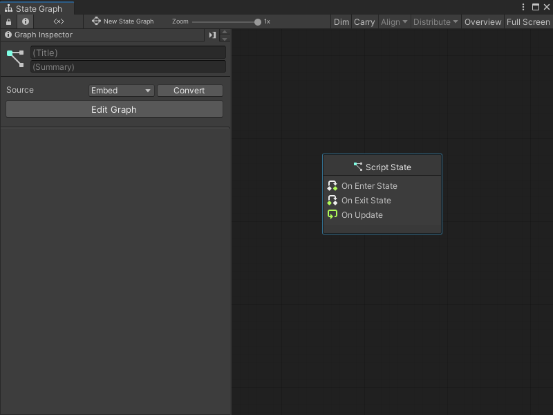
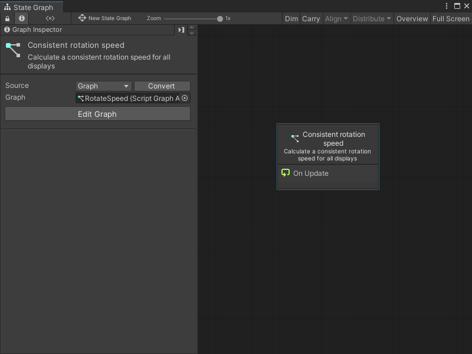
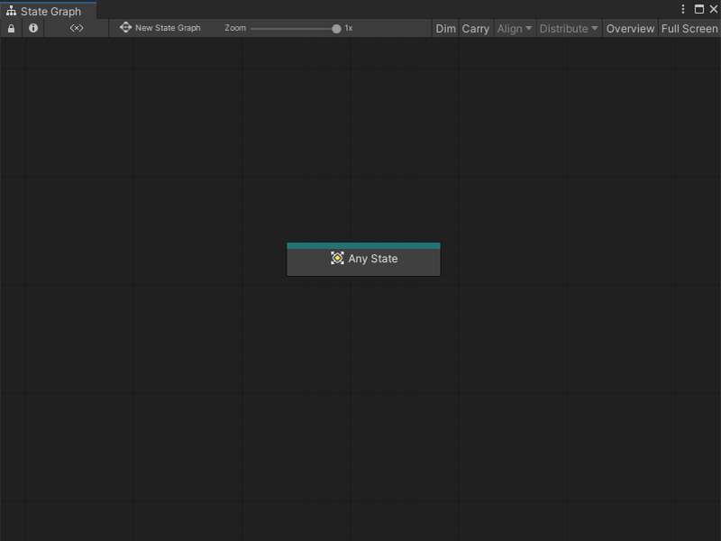
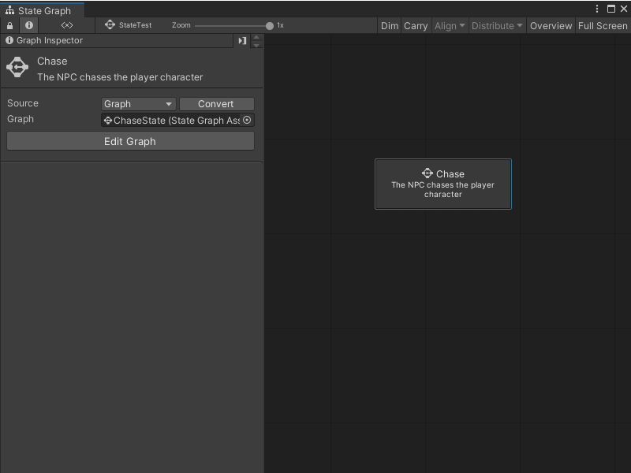

# Create a new state 

You can create three types of State nodes in a State Graph: [Script States](#create-a-script-state), [Any States](#create-an-any-state), and [Super States](#create-a-super-state). For more information on the types of State nodes, see State Graphs in [Graphs](vs-graph-types.md#state-graphs).

You can also add a [Sticky Note](vs-sticky-notes.md) to add comments to a graph.

## Create a Script State

To create a new blank Script State: 

<ol>
<li>
[!include[open-state-menu](./snippets/vs-open-state-menu.md)]
</li>
<li>
Select <strong>Create Script State</strong>.  Visual Scripting creates a new Script State node.
</li>
<li>
Open the <a href="vs-interface-overview.md#the-graph-inspector">Graph Inspector</a>.
</li>
<li>
In the Graph Inspector, choose a source for the Script State node:

<ul>
<li>
<strong>Embed</strong>: The graph only exists on the Script State node. You can only modify the graph from the node in its parent State Graph.
</li>
<li>
<strong>Graph</strong>: The graph exists in a separate file. You can modify the graph outside of its parent State Graph and reuse the graph in other areas of your application.
</li>
</ul>
</li>
<li>
If you chose <strong>Graph</strong>:

<ol type="a">
<li>
Select <strong>New</strong>.
</li>
<li>
Enter a name for the graph file.
</li>
<li>
Choose where you want to save the new graph.
</li>
<li>
Select <strong>Save</strong>.
</li>
</ol></li>
</ol>

To create a Script State from an existing Script Graph: 

<ol>
<li>
[!include[open-state-menu](./snippets/vs-open-state-menu.md)]
</li>
<li>
Select <strong>Create Script State</strong>.  Visual Scripting creates a new Script State node.
</li>
<li>
Open the <a href="vs-interface-overview.md#the-graph-inspector">Graph Inspector</a>.
</li>
<li>
In the Graph Inspector, set the source for the Script State node to <strong>Graph</strong>.
</li>
<li>
Do one of the following:

<ul>
<li>
Select the object picker (circle icon) and choose a compatible Script Graph from your project.
</li>
<li>
Click and drag a Script Graph file from your Project window and release on the <strong>Graph</strong> field.
</li>
</ul></li>
</ol>

> [!TIP]
> Click and drag the Script Graph from your Project window into the Graph Editor to automatically create a Script State node. 

## Create an Any State 

To create a new Any State node: 

1. [!include[open-state-menu](./snippets/vs-open-state-menu.md)] 

2. Select **Create Any State**. 

## Create a Super State 

To create a new blank Super State: 

<ol>
<li>
[!include[open-state-menu](./snippets/vs-open-state-menu.md)]
</li>
<li>
Select <strong>Create Super State</strong>.  Visual Scripting creates a new Super State node.
</li>
<li>
Open the <a href="vs-interface-overview.md#the-graph-inspector">Graph Inspector</a>.
</li>
<li>
In the Graph Inspector, choose a source for the Super State node:

<ul>
<li>
<strong>Embed</strong>: The graph only exists on the Super State node. You can only modify the graph from the node in its parent State Graph.
</li>
<li>
<strong>Graph</strong>: The graph exists in a separate file. You can modify the graph outside of its parent State Graph and reuse the graph in other areas of your application.
</li>
</ul>
</li>
<li>
If you chose <strong>Graph</strong>:

<ol type="a">
<li>
Select <strong>New</strong>.
</li>
<li>
Enter a name for the graph file.
</li>
<li>
Choose where you want to save the new graph.
</li>
<li>
Select <strong>Save</strong>.
</li>
</ol></li>
</ol>

To create a Super State from an existing State Graph: 

<ol>
<li>
[!include[open-state-menu](./snippets/vs-open-state-menu.md)]
</li>
<li>
Select <strong>Create Super State</strong>.  Visual Scripting creates a new Super State node.
</li>
<li>
Open the <a href="vs-interface-overview.md#the-graph-inspector">Graph Inspector</a>.
</li>
<li>
In the Graph Inspector, set the source for the Super State node to <strong>Graph</strong>.
</li>
<li>
Do one of the following:

<ul>
<li>
Select the object picker (circle icon) and choose a compatible State Graph from your project.
</li>
<li>
Click and drag a State Graph file from your Project window and release on the <strong>Graph</strong> field.
</li>
</ul></li>
</ol>

> [!TIP]
> Click and drag the State Graph from your Project window into the Graph Editor to automatically create a Super State node. 
