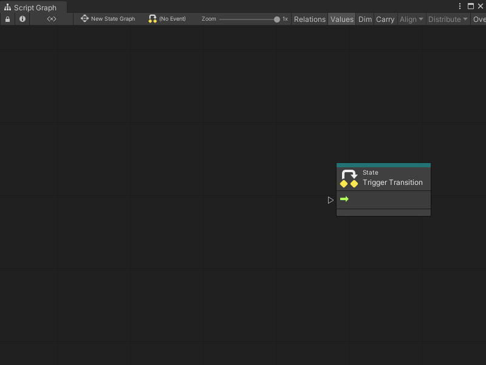
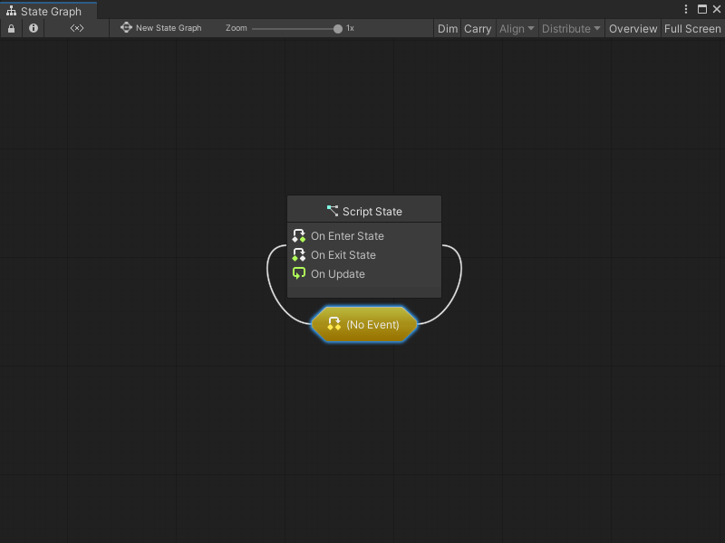

# Create a transition between states

To switch between states in a State Graph, you must use a Script Graph called a transition.  

For more information on State Graphs, see [State Graphs](vs-graph-types.md#state-graphs).

## Create a transition with an embedded Script Graph

To create a new transition to another state with an embedded graph in a State Graph:

1. With a State Graph [open in the Graph window](vs-open-graph-edit.md), do one of the following:

  - Right-click on the state where you want to make a transition, then in the context menu, select **Make Transition**.

  - Select the state where you want to make a transition, then press Ctrl+click and drag away from your selected state. 

2. Do one of the following: 

  - Select or release while on an existing state in your State Graph to connect the states with a transition. 

  - Select or release while on an empty space in the Graph Editor to automatically create a new blank Script State at the end of your transition. 

3. Select your transition node. 

1. Open the [Graph Inspector](vs-interface-overview.md#the-graph-inspector). 

1. In the Graph Inspector, set the **Source** to **Embed**. 

1. In the **(Title)** field, enter a title for your transition's Script Graph. 

1. In the **(Summary)** field, enter a brief descriptive summary of your transition's Script Graph. 

> [!NOTE]
> If you choose to use an embedded transition Script Graph, Visual Scripting automatically provides the Trigger Transition node you need for the graph.

## Create a transition with an external Script Graph file

To create a new transition with a graph asset file in a State Graph: 

1. With a State Graph [open in the Graph window](vs-open-graph-edit.md), do one of the following:

  - Right-click on the state where you want to make a transition, then in the context menu, select **Make Transition**.

  - Select the state where you want to make a transition, then press Ctrl+click and drag away from your selected state. 

2. Do one of the following: 

  - Select or release while on an existing state in your State Graph to connect the states with a transition. 

  - Select or release while on an empty space in the Graph Editor to automatically create a new blank Script State at the end of your transition. 

3. Select your transition node. 

1. Open the [Graph Inspector](vs-interface-overview.md#the-graph-inspector). 

1. In the Graph Inspector, set the **Source** to **Graph**. 

1. Do one of the following: 

    - Select the object picker (circle icon). Select a Script Graph from your project.
    
    - Click and drag a Script Graph file from your Project window and release on the **Graph** field. 
    
    - Select **New** and [create a new Script Graph](vs-create-graph.md).

4. Double-click the new transition node to open the transition Script Graph. 

## Create a self transition with an embedded Script Graph

To create a new self transition for a state in a State Graph: 

1. With a State Graph [open in the Graph window](vs-open-graph-edit.md), right-click on the state where you want to make the transition.

2. In the context menu, select **Make Self Transition**. 
  Visual Scripting attaches a new Self Transition node to the state in the State Graph automatically. 

3. Select your transition node. 

1. Open the [Graph Inspector](vs-interface-overview.md#the-graph-inspector). 

1. In the Graph Inspector, set the **Source** to **Embed**.

1. In the **(Title)** field, enter a title for your transition's Script Graph. 

1. In the **(Summary)** field, enter a brief descriptive summary of your transition's Script Graph.  

4. Double-click the new self transition to open the transition Script Graph. 

> [!NOTE]
> If you choose to use an embedded transition Script Graph, Visual Scripting automatically provides the Trigger Transition node you need for your graph.

## Create a transition with an external Script Graph file

To create a new transition with a graph asset file in a State Graph: 

1. With a State Graph [open in the Graph window](vs-open-graph-edit.md), right-click on the state where you want to make the transition.

2. In the context menu, select **Make Self Transition**. 
  Visual Scripting attaches a new Self Transition node to the state in the State Graph automatically. 

1. Open the [Graph Inspector](vs-interface-overview.md#the-graph-inspector). 

1. In the Graph Inspector, set the **Source** to **Graph**.  

1. Do one of the following: 

    - Select the object picker (circle icon). Select a Script Graph from your project.
    
    - Click and drag a Script Graph file from your Project window and release on the **Graph** field.
    
    - Select **New** and [create a new Script Graph](vs-create-graph.md).

4. Double-click the new transition node to open the transition Script Graph. 
