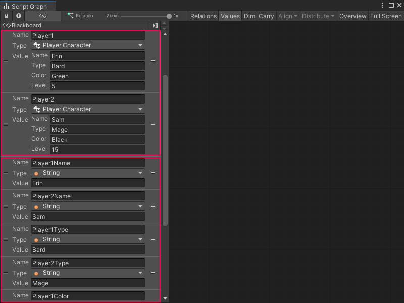

# Custom types

Use a C# script file to create your own object types in Unity. These types are called classes. 

Classes are a blueprint for objects in your code. They decide what kind of data an object holds and what your code can do with that object. A class can hold multiple variables with different data types in a single object. 

Create a custom class to use it as a type for variables and other objects in a Visual Scripting Script graph. For more information on how to add and use your own custom types in Visual Scripting, see [Use a custom type](vs-using-custom-types.md). The code you include in a C# script can also create new nodes to manipulate the data in your class. 

For example, you might write code to keep track of the characteristics of different player characters in your application. You can create a class, `Player`, and have different variables in that class for name, character type, favorite color, or player level:

```csharp
using System;
using UnityEngine;
using Unity.VisualScripting;

[Serializable, Inspectable]
public class PlayerCharacter
{
    [Inspectable]
    public string name; 
    [Inspectable]
    public string type;
    [Inspectable]
    public string color;
    [Inspectable]
    public int level;
}

```
> [!TIP]
> The variables in the example script above use the `[Inspectable]` attribute so they can display in Unity's [Inspector window](https://docs.unity3d.com/Manual/UsingTheInspector.html) and the Visual Scripting [Graph Inspector](vs-interface-overview.md#the-graph-inspector). Without the attribute, you can't assign a value to any variables that use the `PlayerCharacter` class in a Script Graph. For more information about the `[Inspectable]` attribute, see [Use a custom type](vs-using-custom-types.md).

These values can be different across different instances of `Player` objects in your code. `Player1` can be Erin, a bard, who loves green and is level 5, and `Player2` can be Sam, a mage, who loves black and is level 15. 



If you tried to represent the same data with basic variables, you must create a lot of nodes, as in the following example. With a custom class, you can create a single node to represent a player character's information, instead of four separate nodes. 


