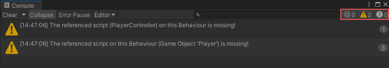

# Working with debug messages

You can use debug nodes to see the result of a code segment inside the Unity console. For example, attaching a Debug node to a Variable node outputs the value of the variable.

> [!TIP]
> Debugs are a useful tool when prototyping.

## To create a debug message 

> [!IMPORTANT]
> Remove or disconnect the debugs from the graphs before producing the final executable.

1. Add a Script Machine component to the GameObject. 
2. Select **Edit Graph**.
3. Do one of the following:
   - Use the starting events that are created with the script machine.
   - Add an event node to the graph.
4. Drag and release from the node port. 
   The fuzzy finder appears. 
5. In the finder field, enter “Log”. 
   A list of Debug nodes appears.
6. Select the relevant debug message type you want to use (for example **Log(Message)**, **Log Error(Message)** or **Log Warning(Message)**). 
   The select Debug node is placed in the graph and linked to the event.
7. Drag and release from the Debug green (output) port. 
   The fuzzy finder appears.
8. In the list, select the String node. 
   A String node appears on the graph, connected to the Debug node.v
   Enter the debug message in the string node**.**

> [!TIP]
> You can link variables or GameObjects other than a string to the port to see the value in the console.

Whenever the graph is run and the Event is fired, the debug node executes and the text in the String appears in the console.

> [!NOTE]
> The debug bar indicates the number of messages of each debug type (in the following order Message, Error, Warning).

