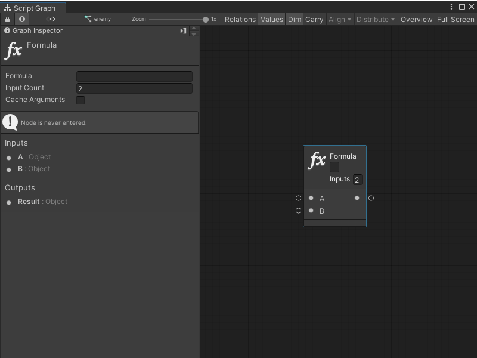
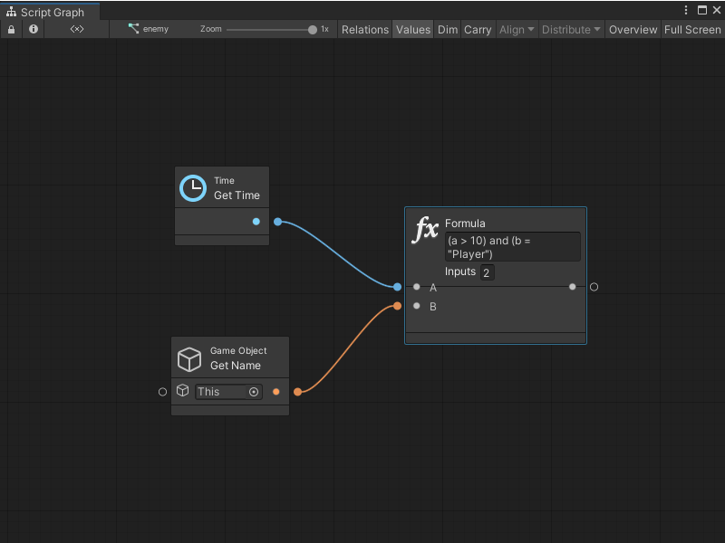

# Formula node

> [!NOTE] 
> For versions 2019/2020 LTS, download the Visual Scripting package from the [Unity Asset Store](https://assetstore.unity.com/packages/tools/visual-bolt-163802).

Formula is a powerful node that evaluates logical and mathematical expressions directly via a textual Formula and a list of Arguments.

> [!IMPORTANT]
> Due to the binary tree traversal overhead (despite caching attempts), performance in using the formula node is significantly slower than using the operator nodes individually. It is preferable to avoid using this node at every frame.

Although a formula can return either a boolean for logic, or a number for math, formulas can return any type of value.

The first text field in the header is the formula itself.

The second text field is the number of arguments. It's set to 2 by default, giving us A and B as inputs. Formulas can have up to 10 arguments, which are always ordered alphabetically. If more are required,  they are called B, C, D, E, and so forth.

For example, this formula returns a boolean indicating:

- whether, at a minimum, 10 seconds have elapsed since the start of the game and 
- the current object's name is Player.

## Arguments

### Variable Names

Variable names can be directly used in the formula. For example, a graph variable named health can return a boolean just by typing the formula health &gt; 50. The argument names are evaluated in the following order of priority:

1.  Alphabetical argument names (a - z)
2.  Graph variable names
3.  Object variable names
4.  Scene variable names
5.  Application variable names
6.  Saved variable names

### Properties and Methods

Retrieve the value of a property on an argument or variable by using the \[arg.prop\] notation. For example, if position is a Vector 3 object variable, check if it is equal to zero with: \[position.x\] = 0. Get the return value of parameterless methods with the \[arg.Method()\] notation.

Note: Accessing properties and methods is not guaranteed to be compatible with AOT platforms, because the AOT pre-build cannot generate stubs for members that are only accessed by name.

### Literals

Use the following literals for assigning fixed values.

| Literal           | Description                          | Example        |
|-------------------|--------------------------------------|----------------|
| Number            | An integer or float.                 | 3.5            |
| String            | A piece of text between apostrophes. | "Hello World!" |
| Boolean           | A boolean value.                     | true, false    |
| Null              | The null constant.                   | a != null      |
| Delta Time        | The Unity frame delta time.          | 30 \* dt       |
| Invert Delta Time | The inverse of the delta time.       | 30 / second    |

### Operators

Every common logical and mathematical operator can be used in formulas, as well as the ones defined through custom operator overloading in script.

| Operator         | Operation          | Rank    | Result                                                                  | Example                          |
|------------------|--------------------|---------|-------------------------------------------------------------------------|----------------------------------|
| not, !           | Logical Negation   | Unary   | The opposite of the operand.                                            | not true                         |
| \-               | Numerical Negation | Unary   | The negative of the operand.                                            | -5                               |
| and, &&          | Logical And        | Binary  | True if both operands are true.                                         | (a \< 5) and (b \> 3)            |
| or, \|\|         | Logical Or         | Binary  | True if either operand is true                                          | (a \< 5) or (b \> 3)             |
| =, ==            | Equality           | Binary  | True if the two operands are equal.                                     | a = b                            |
| !=, \<\>         | Inequality         | Binary  | True if the two operands are not equal.                                 | a != b                           |
| \<, \<=, \>, \>= | Numeric Comparison | Binary  | The result of a numeric comparison                                      | a \>= 10                         |
| \+               | Addition           | Binary  | The sum of the two operands.                                            | a + 5                            |
| \-               | Subtraction        | Binary  | The difference between the two operands.                                | b - 3                            |
| \*               | Multiplication     | Binary  | The product of the two operands.                                        | 12 \* a                          |
| /                | Division           | Binary  | The quotient of the two operands.                                       | b / 2                            |
| %                | Modulo             | Binary  | The remainder of the division of the two operands.                      | a % 2                            |
| ?:               | If                 | Ternary | The left operand if the condition is true, otherwise the right operand. | (health \> 0) ? "Alive" : "Dead" |

All common bitwise operators like \~ and &gt;&gt; are also supported.

### Functions

You can also use any function from the following table.

| Name     | Result                                                                       | Example         |
|----------|------------------------------------------------------------------------------|-----------------|
| abs      | The absolute value of a specified number.                                    | abs(-1)         |
| acos     | The angle whose cosine is the specified number.                              | acos(1)         |
| asin     | The angle whose sine is the specified number.                                | asin(0)         |
| atan     | The angle whose tangent is the specified number.                             | atan(0)         |
| ceiling  | The smallest integer greater than or equal to the specified number.          | ceiling(1.5)    |
| cos      | The cosine of the specified angle.                                           | cos(0)          |
| exp      | e raised to the specified power.                                             | exp(0)          |
| floor    | The largest integer less than or equal to the specified number.              | floor(1.5)      |
| log      | The logarithm of a specified number.                                         | log(1, 10)      |
| log10    | The base 10 logarithm of a specified number.                                 | log10(1)        |
| max      | The larger of two specified numbers.                                         | max(1, 2)       |
| min      | The smaller of two numbers.                                                  | min(1, 2)       |
| pow      | A specified number raised to the specified power.                            | pow(3, 2)       |
| round    | Rounds a value to the nearest integer or specified number of decimal places. | round(3.222, 2) |
| sign     | 1 if the number is positive, -1 is if it negative.                           | sign(-10)       |
| sin      | The sine of the specified angle.                                             | sin(0)          |
| sqrt     | The square root of a specified number.                                       | sqrt(4)         |
| tan      | The tangent of the specified angle.                                          | tan(0)          |
| truncate | The integral part of a number.                                               | truncate(1.7)   |
| v2       | Creates a 2D vector.                                                         | v2(0, 0)        |
| v3       | Creates a 3D vector.                                                         | v3(0, 0, 0)     |
| v4       | Creates a 4D vector.                                                         | v4(0, 0, 0, 0)  |
