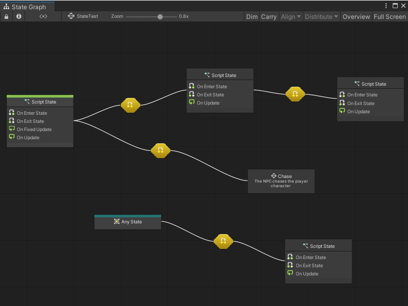
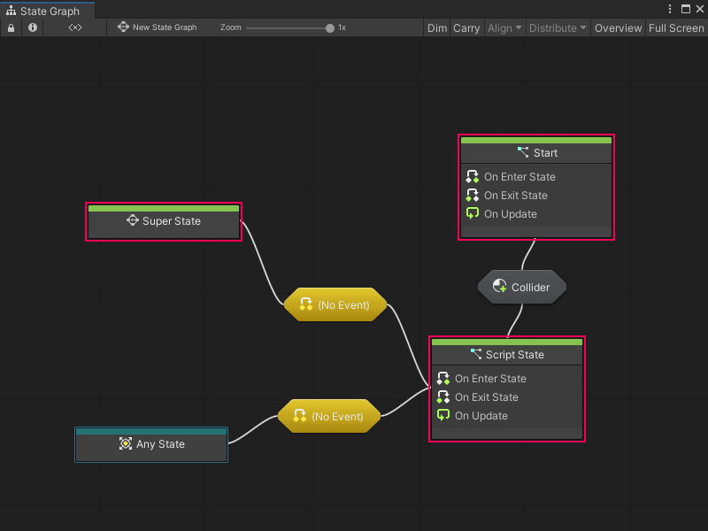

# Graphs 

A graph is a Visual Scripting asset that contains a visual representation of logic in an application. 

Visual Scripting has two different types of graphs: Script Graphs and State Graphs. You can use either graph type in specific situations to define and change how GameObjects in an application behave. Script Graphs and State Graphs must be attached to a Script Machine or State Machine to be used in a project. For more information on Script Machines and State Machines, see [Script Machines and State Machines](vs-graph-machine-types.md).

## Script Graphs

Script Graphs control and connect specific actions and values. The actions in a Script Graph happen in a specific order. Actions can happen every frame, or when a specific event occurs. 

![An example of a Script Graph opened in the Graph window. The output trigger port from an On Update Event node connects to the input trigger port on a Set Variable node, set to Flow. A Float Literal node with a value of 2.5 connects its output port to the data input port on the Set Variable node, which sets the value of the variable Count. The output trigger port on the Set Variable node connects to the input trigger port on a Debug Log node. The data output port on the Set Variable node connects to the A input port on a generic Add Inputs node. An Integer Literal node with a value of 1 connects its output port to the B input port on the Add Inputs node. The data output port on the Add Inputs node connects to the Message input port on the Debug Log node.](images/vs-understanding-nodes-example.png)

Visual Scripting represents the actions in a Script Graph through [nodes](vs-nodes.md). Connect nodes together with edges to tell your application what to do, and in what order. 

Script Graphs can access a large collection of nodes, which correspond to different features and functionality in the Unity Editor. Access these nodes through [the fuzzy finder](vs-interface-overview.md#the-fuzzy-finder).

Script Graphs define the specifics of what a GameObject does while your application runs. 

## State Graphs

A State Graph has states and gives the logic for when your application moves between states, through connections called transitions. Use State Graphs to design AI behavior or define scene and level structures. 

A state is any set of behaviors that you want a GameObject to perform, represented as a Script Graph. Visual Scripting represents states in State Graphs through State nodes. A State node can link to a Script Graph with logic for your application to follow, or give another State Graph with additional transitions and State nodes.

States and transitions in a State Graph tell your application when to change its behavior, based on an event or after it fulfills a condition. 

For example, you might have an enemy character with Patrol and Chase states. The enemy character's actions can change from the actions in the Script Graph for the Patrol state to the actions for the Chase state after it detects the player character. The detection event for the enemy character triggers the transition between the two states. 

State Graphs don't use the fuzzy finder. They use a specific set of State nodes, which are in the Visual Scripting context menu: 

- Script States contain a Script Graph. When an application triggers a Script State, Visual Scripting runs the logic in a Script State's attached Script Graph. Script States use On Enter State Event, On Update Event, and On Exit State Event nodes to control logic based on the current state.

- Super States contain another, nested State Graph. A Super State can help you better organize a State Graph, and reuse states and transitions across multiple graphs.

- Any States serve as a placeholder for any other state in a State Graph. You can use an Any State node and create a single transition to a new state, rather than create multiple transitions from other states. 

- Transitions connect Script States, Any States, and Super States. Transitions contain Script Graphs that tell your application when to switch from one state to the next. For more information, see [Transitions](vs-transitions.md).

You can set any Script State node or Super State node as a Start State. Any state marked as a Start State is automatically active when Visual Scripting runs a State Graph. You can also have multiple Start States in a single graph. The Super State, Start, and Script State nodes in the following example are all Start States. 

