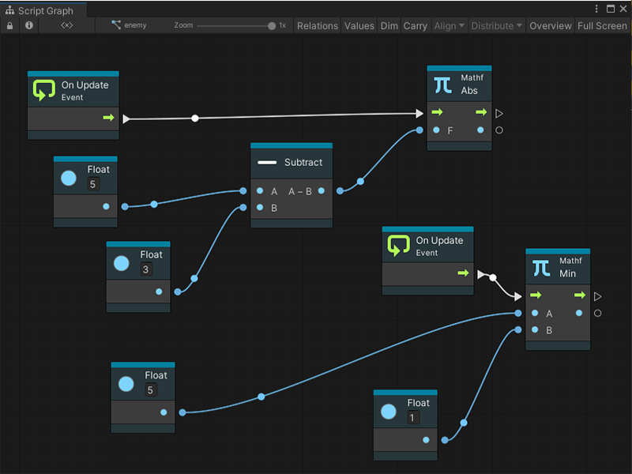

# Live edit

> [!NOTE]
> For versions 2019/2020 LTS, download the Visual Scripting package from the [Unity Asset Store](https://assetstore.unity.com/packages/tools/visual-bolt-163802).

Visual Scripting supports live editing. In live editing you can create and edit graphs while in play mode and see the Visual Scripting updates in real time. This provides a fast way to iterate and test ideas without the need to recompile project changes.

## Working in live edit

Live editing is not limited to tweaking values — you can add and remove nodes, connections (edges), etc while live. Anything that can be done in a normal edit, can be done in a live edit.

In accordance with the Unity convention:

 *  Changes made to embeds are reverted when you exit play mode - the changes live inside components.
 * Changes made to graphs are saved when you exit play mode - the changes live inside assets

> [!TIP]
> To preserve the changes made to a component graph, copy the modified nodes before exiting play mode. You'll then be able to paste back while in edit mode.

When in live mode, Visual Scripting is displayed the flow as droplets on connections.

To disable these animations on either the value connections, the control connections, or both,  uncheck the **Animate Control Connections** or the **Animate Value Connections** from the editor preferences window (**Unity** > **Preferences** > **Visual Scripting** > **Script Graphs**).

## Saving changes through persistence

Visual Scripting graphs automatically saves the changes made during play mode.

## Propagation across graphs

Changes made to graphs are instantly shared across all instances of that graph.
