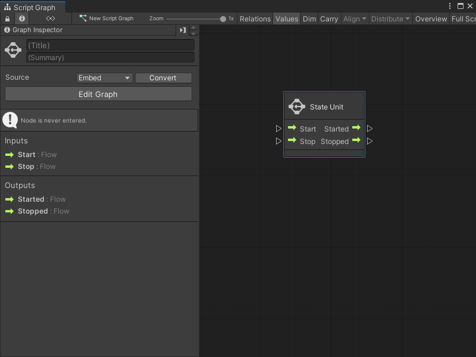
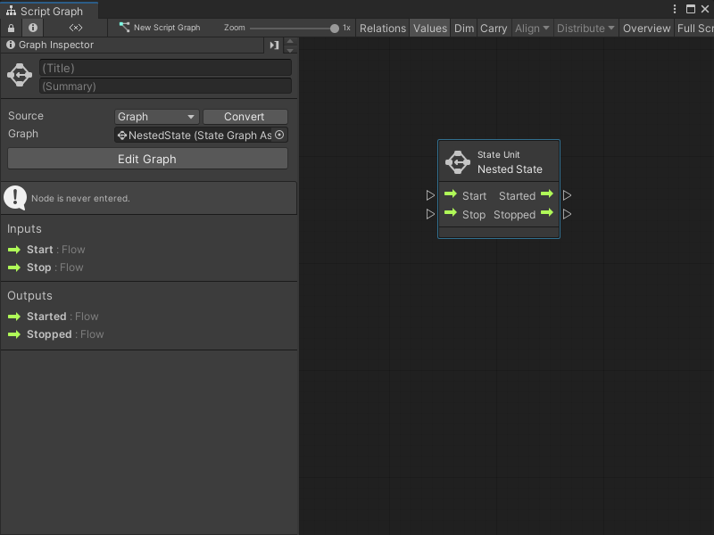

# Add a State Unit to a Script Graph 

Add a State Unit to a Script Graph to trigger a change of state. A state is any set of behaviors that you want a GameObject to perform. For more information on state in Visual Scripting, see [Graphs](vs-graph-types.md).

You can add a new State Graph to a State Unit node, or use an existing State Graph from the project. For more information on the State Unit node, see [State Unit node](vs-nesting-state-unit-node.md).

## Add a new State Graph as a State Unit node 

To add a new blank State Graph as a State Unit node to a Script Graph: 

<ol>
<li>
[!include[with-graph-open-ff](./snippets/vs-with-graph-open-ff.md)]
</li>
<li>
Go to <strong>Nesting</strong>.
</li>
<li>
Select <strong>State Unit</strong> to add a State Unit node to the graph.
</li>
<li>
Open the <a href="vs-interface-overview.md#the-graph-inspector">Graph Inspector</a>.
</li>
<li>
In the Graph Inspector, choose the source for the State Unit:

<ul>
    <li>
<strong>Embed</strong>: The State Graph only exists on the State Unit node. You can only change the State Graph from the node in its parent graph.
</li>
    <li>
<strong>Graph</strong>: The State Graph exists in a separate file. You can change the State Graph outside of its parent graph and reuse the graph in other areas of an application.
</li>
</ul>
</li>
<li>
If you chose <strong>Graph</strong>:

<ol type="a">
    <li>
In the Graph Inspector, select <strong>New</strong>.
</li>
    <li>
Enter a name for the graph file.
</li>
    <li>
Choose where you want to save the graph file in the project.
</li>
    <li>
Select <strong>Save</strong>.
</li>
</ol>
</li>
</ol>

## Add an existing State Graph as a State Unit node

To add an existing State Graph file as a State Unit node in a Script Graph: 

1. [!include[with-graph-open-ff](./snippets/vs-with-graph-open-ff.md)] 

2. Go to **Nesting**.

1. Select **State Unit** to add a State Unit node to the graph. 

3. Open the [Graph Inspector](vs-interface-overview.md#the-graph-inspector).

1. In the Graph Inspector, set the **Source** to **Graph**. 

4. Do one of the following: 
    - In the **Graph** field, select the object picker (circle icon) and choose a compatible State Graph from the project. 
    - Click and drag a State Graph file from the Project window and release on the **Graph** field. 

> [!TIP] 
> For a faster way to add a State Graph as a State Unit node:
> - Click and drag a State Graph asset from the Project window into the Graph Editor to automatically create a State Unit node.
> - Right-click to open the fuzzy finder. Go to **Graphs** and select a graph file.

## Next steps 

Select **Edit Graph** in the Graph Inspector to edit the graph. For more information on how to create a State Graph, see [Develop logic transitions with State Graphs](vs-state-graphs-intro.md).

