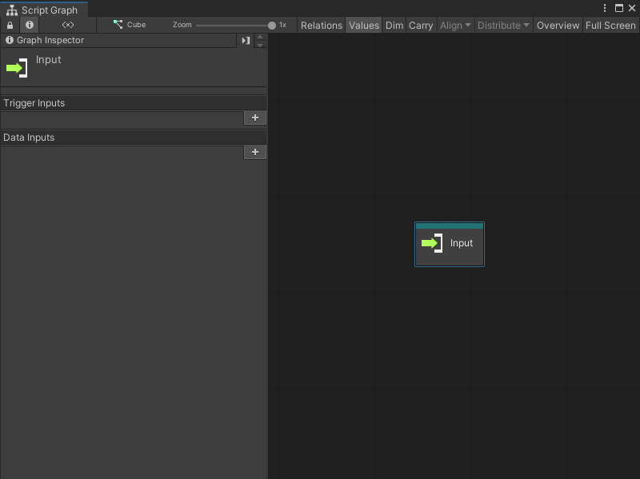

# Input node

Use an Input node to control the flow of logic and data from a Script Graph's Subgraph node. An Input node takes data from a parent graph and makes it available to a Subgraph.

For more information on Subgraphs, see [Subgraphs and State Units](vs-nesting-subgraphs-state-units.md) and [Subgraph node](vs-nesting-subgraph-node.md). For more information on Script Graphs, see [Graphs](vs-graph-types.md).

## Fuzzy finder category 

The Input node is in the **Nesting** category in the fuzzy finder. 

## Available outputs

By default, an Input node has no ports.

An Input node can only have output ports. Define the number and specific data type for the output ports with the [Graph Inspector](vs-interface-overview.md#the-graph-inspector). For more information on how to define ports on a Script Graph, see [Add a Trigger or Data port to a Script Graph](vs-nesting-add-triggers-data-graph.md).

| **Port Type**      | **Description**       |
| :-------------     | :-------------------- |
| **Trigger Input**  | A control port. Make a connection to this port to tell Visual Scripting what node to run next in the graph. Visual Scripting triggers any node to this port after the matching Trigger Input port triggers on the Subgraph node in the parent Script Graph. |
| **Data Input**     | A data port. Make a connection to this port to send a value or other data to another node in the graph. The data source is the matching Data Input port on the Subgraph node in a parent Script Graph. |

## Example graph usage 

In the following example, the **Character Move** Subgraph uses an Input node to receive data from a parent graph. The Input node has one Trigger Input port and three Data Input ports. It uses the values from the parent graph and the values from two Input Get Axis nodes to create a new Vector 3 value that it sends back to its parent graph. 

![An image of the Graph window. The trigger output port on an Input node connects to the Input Trigger port on an Input Get Axis node. The Input Get Axis node has its Axis Name set to Horizontal. The output float port on the Get Axis node connects to the A input port on an Add Inputs node. The B input port on the Add Inputs node gets its value from the X output port on the Input node. The Add Inputs node connects its output port to the X input port on a Vector 3 Create node. The trigger output port on the Input Get Axis node connects to another Input Get Axis node with its Axis Name set to Vertical. The Vertical Input Get Axis node sends its output float value to the A input port on a second Add Inputs node. The Add Inputs node gets its B value from the Y output port on the Input node. The Add Inputs node sends its output value to the Y input port on the Vector 3 Create node. The Input node connects its Z output port directly to the Z input port on the Vector 3 Create node. The Output Trigger port on the Vector 3 Create node connects to the Input trigger on an Output node. The Vector 3 output port on the Vector 3 Create node connects to the Vector 3 input port on the Output node.](images/vs-nesting-input-node-example.png)

The parent graph sends three values from the current GameObject's Transform component to the Input node. The Subgraph reduces the number of nodes in the parent graph. 

![An image of the Graph window. The trigger output port on an On Update Event node connects to the Input Trigger port on a Subgraph node called Character Move. A Transform Get Position node gets the position of the current GameObject's Transform component in a Vector 3. The Transform Get Position node connects its Vector 3 output port to a Vector 3 Get X, Vector 3 Get Y, and Vector 3 Get Z node. The Get X, Get Y, and Get Z nodes connect to the X, Y, and Z data input ports on the Character Move Subgraph node, respectively. The Character Move Subgraph node's trigger output port connects to the Input Trigger on a Transform Set Position node, set to the current GameObject's Transform component. The Character Move Subgraph connects its Vector 3 output port to the Vector 3 input port on the Set Position node.](images/vs-subgraph-node-use-example.png)

## Related nodes 

Use an Input node with the following nodes: 

- [Subgraph node](vs-nesting-subgraph-node.md)
- [Output node](vs-nesting-output-node.md)