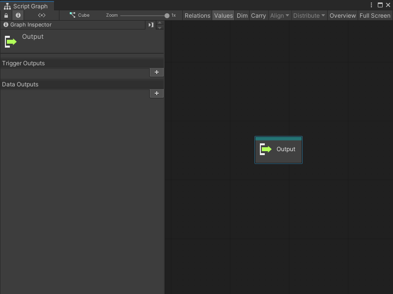

# Output node

Use an Output node to control the flow of logic and data from a Script Graph's Subgraph node. An Output node sends data from a Subgraph and makes it available to a parent graph.

For more information on Subgraphs, see [Subgraphs and State Units](vs-nesting-subgraphs-state-units.md) and [Subgraph node](vs-nesting-subgraph-node.md). For more information on Script Graphs, see [Graphs](vs-graph-types.md).

## Fuzzy finder category 

The Output node is in the **Nesting** category in the fuzzy finder. 

## Available inputs

By default, an Output node has no ports.

The Output node can only have input ports. Define the number and specific data type for the input ports with the [Graph Inspector](vs-interface-overview.md#the-graph-inspector). For more information on how to define ports on a Script Graph, see [Add a Trigger or Data port to a Script Graph](vs-nesting-add-triggers-data-graph.md).

| **Port Type**      | **Description**       |
| :-------------     | :-------------------- |
| **Trigger Output** | A control port. Make a connection to this port to tell Visual Scripting which node triggers its exit from the Subgraph and the return to the logic in a parent graph. After the Output node runs, Visual Scripting starts any connections made to the matching Trigger Output port on the Subgraph node. |
| **Data Output**    | A data port. Make a connection to this port to send data from a Subgraph to its parent graph. Visual Scripting returns any value from a node connected to this port to any node connected to the matching Data Output port on the Subgraph node. |

## Example graph usage 

In the following example, the **Character Move** Subgraph uses an Input node to receive data from a parent graph. The Subgraph uses three values from the parent graph and the values from two Input Get Axis nodes to create a new Vector 3 value. The graph sends the new Vector 3 value to the Output node and back to the parent Script Graph. The Subgraph reduces the number of nodes in the parent graph.

![An image of the Graph window. The trigger output port on an Input node connects to the trigger input port on an Input Get Axis node. The Input Get Axis node has its Axis Name set to Horizontal. The output float port on the Get Axis node connects to the A input port on an Add Inputs node. The B input port on the Add Inputs node gets its value from the X output port on the Input node. The Add Inputs node connects its output port to the X input port on a Vector 3 Create node. The trigger output port on the Input Get Axis node connects to another Input Get Axis node with its Axis Name set to Vertical. The Vertical Input Get Axis node sends its output float value to the A input port on a second Add Inputs node. The Add Inputs node gets its B value from the Y output port on the Input node. The Add Inputs node sends its output value to the Y input port on the Vector 3 Create node. The Input node connects its Z output port directly to the Z input port on the Vector 3 Create node. The Output Trigger port on the Vector 3 Create node connects to the Input trigger on an Output node. The Vector 3 output port on the Vector 3 Create node connects to the Vector 3 input port on the Output node.](images/vs-nesting-output-node-example.png)

The parent graph receives the Vector 3 value from the Output node. The parent graph uses that value to set a new position on the current GameObject's Transform component.  

![An image of the Graph window. The trigger output port on an On Update Event node connects to the trigger input port on a Subgraph node called Character Move. A Transform Get Position node gets the position of the current GameObject's Transform component in a Vector 3. The Transform Get Position node connects its Vector 3 output port to a Vector 3 Get X, Vector 3 Get Y, and Vector 3 Get Z node. The Get X, Get Y, and Get Z nodes connect to the X, Y, and Z data input ports on the Character Move Subgraph node, respectively. The Character Move Subgraph node's trigger output port connects to the trigger input on a Transform Set Position node, set to the current GameObject's Transform component. The Character Move Subgraph connects its Vector 3 output port to the Vector 3 input port on the Set Position node.](images/vs-subgraph-node-use-example.png)

## Related nodes 

Use an Output node with the following nodes: 

- [Subgraph node](vs-nesting-subgraph-node.md)
- [Input node](vs-nesting-input-node.md)