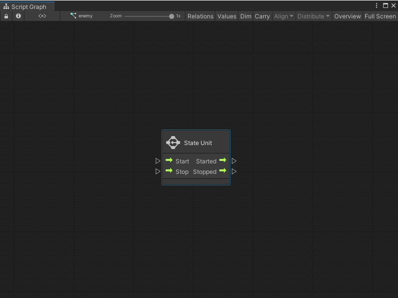

# Subgraphs and State Units

In a Script Graph, you can add a node that links directly to another Script Graph or State Graph. 

- A nested Script Graph is a Subgraph. 
- A nested State Graph is a State Unit. 

A nested Script Graph or State Graph helps you to organize and reuse logic across an application. A Subgraph or State Unit can exist as the node that adds it to a graph, or it can link to an external graph file. 

## Subgraphs

A Subgraph nests a Script Graph inside another Script Graph. Use a Subgraph node to reuse a set of logic across Script Graphs in an application.

A Subgraph node can take inputs or send outputs back to its parent graph. Add ports to configure what data a Subgraph and its parent graph send to each other. 

### Subgraph inputs and outputs

With the Graph Inspector, you can choose and define the ports that appear when you use a Script Graph as a Subgraph. The port definitions for a Script Graph appear in the [Graph Inspector](vs-interface-overview.md#the-graph-inspector) when you have no other items selected in a graph.  

Defined ports appear on any Subgraph node that uses that Script Graph. In the following image, the Subgraph **Rotate the Cube** has: 

- A Trigger Input port.
- An Data Input port.
- An Trigger Output port.
- An Data Output port.

A port definition also changes the **Input** and **Output** nodes for a Subgraph. These nodes control the execution and flow between a Subgraph and its parent graph. In the following image, the Input and Output nodes have the same ports as the **Rotate the Cube** Subgraph node from the previous example.  

![An image of the Graph window that displays the Rotate the Cube Script Graph. The Input and Output nodes are highlighted with a red box. A Get Graph variable node, with the Variable name XRotate, connects to the B input port on an Add Inputs node. The Add Inputs node has only 2 inputs, and receives its second input from the var port on the Input node. The Start port on the Input node connects to the Input Trigger port on a Transform Rotate node. The Transform Rotate node rotates the transform from the current GameObject by the same amount on the X, Y, and Z axis. It takes its X Angle, Y Angle, and Z Angle inputs from the result of the Add Inputs node. The Output Trigger port on the Transform Rotate node connects to the Input Trigger port on a String Concat node. The String Concat node takes the string from a String literal node, "Rotated by" and appends the result of the Add Inputs node. The Output Trigger port on the String Concat node connects to the Input Trigger port, Finish, on the Output node. The string output port on the String Concat node connects to the string input port on the Output node.](images/vs-subgraph-ports-example-2.png)

> [!NOTE]
> You can only use a single **Input** node and a single **Output** node in a Script Graph. If you add more **Input** or **Output** nodes, Visual Scripting only uses the first **Input** and **Output** nodes you added to the graph. 

For more information on how to add ports to a Script Graph, see [Add a Trigger or Data port to a Script Graph](vs-nesting-add-triggers-data-graph.md). For more information on the different types of ports, see [Subgraph node](vs-nesting-subgraph-node.md). For more information on how to use a Subgraph, see [Add a Subgraph to a Script Graph](vs-nesting-add-subgraph.md).

## State Units

A State Unit starts a State Graph from a Script Graph. You can't change the ports that appear on a State Unit node or send data between the State Graph and its parent Script Graph. 

The State Unit node starts different logic in a Script Graph, at different times in code execution: 

- When the nested State Graph starts to run. 
- While the nested State Graph runs. 
- When the nested State Graph stops.
- After the nested State Graph stops. 

When you start a State Unit node's Start and Started ports in a parent graph, Visual Scripting marks all Start states inside the node's State Graph as active. When you start the Stop and Stopped ports, Visual Scripting marks all Start states as inactive. 

For more information on State Graphs and Start states, see [State Graphs](vs-graph-types.md#state-graphs). For more information on the State Unit node, see [State Unit node](vs-nesting-state-unit-node.md) and [Add a State Unit to a Script Graph](vs-nesting-add-state-unit.md).