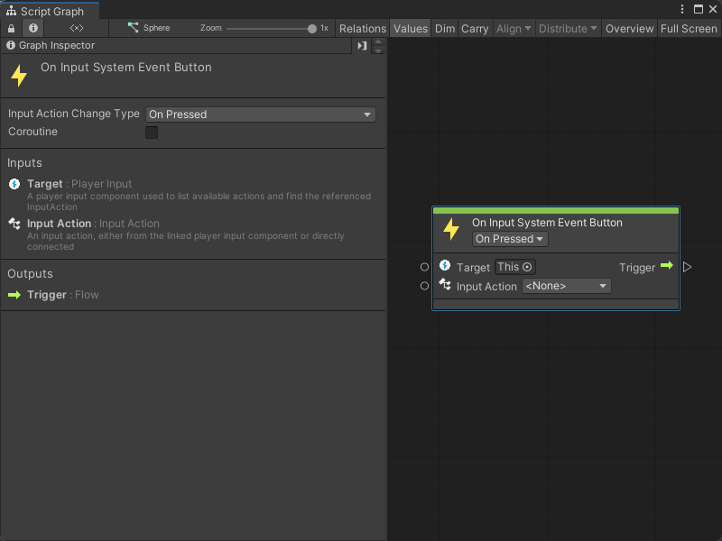

# On Input System Event Button node

> [!NOTE]
> The On Input System Event Button node [!include[nodes-note-package](./snippets/input-system/nodes-note-package.md)]

The On Input System Event Button node listens for a specific Input Action from a Player Input component. It doesn't send or read any other data. 

Use this node when you want to read user input but don't require any other data from an Input Action. 

## Fuzzy finder category 

The On Input System Event Button node is in the **Events** &gt; **Input** category in the fuzzy finder.

## Inputs 

The On Input System Event Button [!include[nodes-inputs](./snippets/nodes-inputs.md)]

[!include[nodes-input-system-ports](./snippets/input-system/nodes-input-system-ports.md)]

## Controls

The On Input System Event Button [!include[nodes-controls](./snippets/nodes-controls.md)]

[!include[nodes-input-action-change](./snippets/input-system/nodes-input-action-change.md)]

You can also set this control from the [Graph Inspector](vs-interface-overview.md#the-graph-inspector).

## Additional node settings 

The On Input System Event Button [!include[nodes-additional-settings](./snippets/nodes-additional-settings.md)]

<table>
<thead>
<tr>
<th><strong>Name</strong></th>
<th><strong>Type</strong></th>
<th><strong>Description</strong></th>
</tr>
</thead>
<tbody>
[!include[nodes-coroutine](./snippets/nodes-coroutine.md)]
</tbody>
</table>

## Outputs 

The On Input System Event Button [!include[nodes-single-output](./snippets/nodes-single-output.md)]

<table>
<thead>
<tr>
<th><strong>Name</strong></th>
<th><strong>Type</strong></th>
<th><strong>Description</strong></th>
</tr>
</thead>
<tbody>
[!include[nodes-input-system-output-trigger-port](./snippets/input-system/nodes-input-system-output-trigger-port.md)]
</tbody>
</table>

## Example graph usage 

In the following example, an On Input System Event Button node counts how many times the user has pressed a button from the **Fire** Input Action and logs the result to the console. 

When a user presses a button associated with the **Fire** Input Action, Visual Scripting gets the current value of the `Count` Object variable with a Get Variable node. The Get Variable node sends `Count`'s current value to an Add Inputs node's **A** port. Then, the Float literal node sends a value of `1` to the Add Inputs node's **B** port. 

The On Input System Event Button node triggers the Set Variable node and assigns the value from the Add Inputs node's **Sum** port as the **New Value** of **Count**. The Set Variable node logs the value of **Count** to the console with the Debug Log node: 

## Related nodes 

[!include[vs-nodes-related](./snippets/nodes-related.md)] On Input System Event Button node:

- [On Input System Event Float node](vs-nodes-events-input-system-float.md)
- [On Input System Event Vector 2 node](vs-nodes-events-input-system-vector2.md)