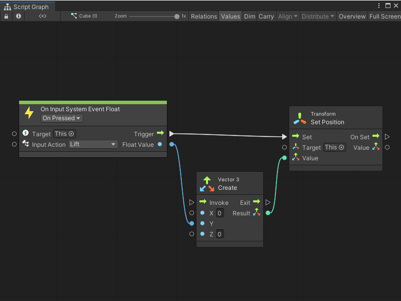

# On Input System Event Float node

> [!NOTE]
> The On Input System Event Float node [!include[nodes-note-package](./snippets/input-system/nodes-note-package.md)]

The On Input System Event Float node lists for a specific Input Action from a Player Input component. The node can output a single float value. 

Use this node when you want to read user input and return a single value, such as an axis value or input from a trigger on a controller.

 

## Fuzzy finder category 

The On Input System Event Float node is in the **Events** &gt; **Input** category in the fuzzy finder.

## Inputs 

The On Input System Event Float [!include[nodes-inputs](./snippets/nodes-inputs.md)]

[!include[nodes-input-system-ports](./snippets/input-system/nodes-input-system-ports.md)]

## Controls

The On Input System Event Float [!include[nodes-controls](./snippets/nodes-controls.md)]

[!include[nodes-input-action-change](./snippets/input-system/nodes-input-action-change.md)]

You can also set this control from the [Graph Inspector](vs-interface-overview.md#the-graph-inspector).

## Additional node settings 

The On Input System Event Float [!include[nodes-additional-settings](./snippets/nodes-additional-settings.md)]

<table>
<thead>
<tr>
<th><strong>Name</strong></th>
<th><strong>Type</strong></th>
<th><strong>Description</strong></th>
</tr>
</thead>
<tbody>
[!include[nodes-coroutine](./snippets/nodes-coroutine.md)]
</tbody>
</table>

## Outputs 

The On Input System Event Float [!include[nodes-outputs](./snippets/nodes-outputs.md)]

<table>
<thead>
<tr>
<th><strong>Name</strong></th>
<th><strong>Type</strong></th>
<th><strong>Description</strong></th>
</tr>
</thead>
<tbody>
[!include[nodes-input-system-output-trigger-port](./snippets/input-system/nodes-input-system-output-trigger-port.md)]
<tr>
<td><strong>Float Value</strong></td>
<td>Float</td>
<td>A float output port.  Visual Scripting uses your chosen Input Action and its configuration in your Input Actions asset to determine the float value returned by this port. See the <a href="#example-graph-usage">Example graph usage</a> section for an example.  For more information about how to configure Input Action settings and use an Input Action asset, see <a href="(https://docs.unity3d.com/Packages/com.unity.inputsystem@latest/index.html?subfolder=/manual/ActionAssets.html)">Input Action Assets</a> in the Input System package documentation.</td>
</tr>
</tbody>
</table>

## Example graph usage 

In the following example, an On Input System Event Float node uses the bindings assigned to the **Lift** Input Action. When a user presses any key from the **Lift** binding, Visual Scripting takes the float value it receives from the Input System and sends it as an input to the Vector 3 Create node's **Y** input port. At the same time, Visual Scripting triggers the Transform Set Position node and uses the output from the Vector 3 Create node to set a new position for the Script Machine's GameObject.

For this example, **Lift** uses a Right Trigger from a Gamepad input device as a binding. When a user presses the Right Trigger, the **Y** value of the GameObject's transform increases, which makes the GameObject move upwards in the scene. 

## Related nodes 

[!include[vs-nodes-related](./snippets/nodes-related.md)] On Input System Event Float node:

- [On Input System Event Button node](vs-nodes-events-input-system-button.md)
- [On Input System Event Vector 2 node](vs-nodes-events-input-system-vector2.md)