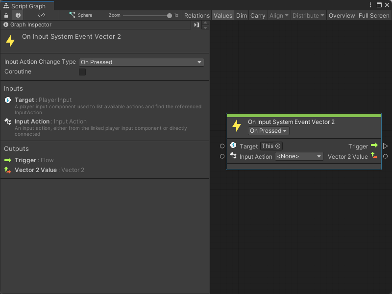
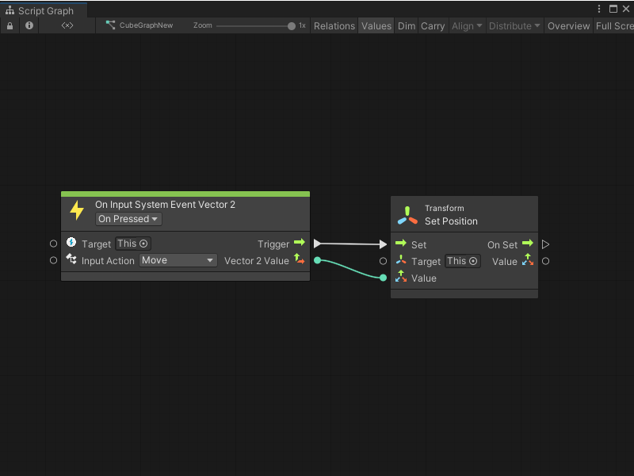

# On Input System Event Vector 2 node

> [!NOTE]
> The On Input System Event Vector 2 node [!include[nodes-note-package](./snippets/input-system/nodes-note-package.md)]

The On Input System Event Vector 2 node listens for a specific Input Action from a Player Input component. The node can output two values as a Vector 2.

Use this node when you want to read input and return two values, such as a joystick or mouse position. 

## Fuzzy finder category 

The On Input System Event Vector 2 node is in the **Events** &gt; **Input** category in the fuzzy finder.

## Inputs 

The On Input System Event Vector 2 [!include[nodes-inputs](./snippets/nodes-inputs.md)]

[!include[nodes-input-system-ports](./snippets/input-system/nodes-input-system-ports.md)]

## Controls

The On Input System Event Vector 2 [!include[nodes-controls](./snippets/nodes-controls.md)]

[!include[nodes-input-action-change](./snippets/input-system/nodes-input-action-change.md)]

You can also set this control from the [Graph Inspector](vs-interface-overview.md#the-graph-inspector).

## Additional node settings 

The On Input System Event Vector 2 [!include[nodes-additional-settings](./snippets/nodes-additional-settings.md)]

<table>
<thead>
<tr>
<th><strong>Name</strong></th>
<th><strong>Type</strong></th>
<th><strong>Description</strong></th>
</tr>
</thead>
<tbody>
[!include[nodes-coroutine](./snippets/nodes-coroutine.md)]
</tbody>
</table>

## Outputs 

The On Input System Event Vector 2 [!include[nodes-outputs](./snippets/nodes-outputs.md)]

<table>
<thead>
<tr>
<th><strong>Name</strong></th>
<th><strong>Type</strong></th>
<th><strong>Description</strong></th>
</tr>
</thead>
<tbody>
[!include[nodes-input-system-output-trigger-port](./snippets/input-system/nodes-input-system-output-trigger-port.md)]
<tr>
<td><strong>Vector 2 Value</strong></td>
<td>Vector 2</td>
<td>A Vector 2 output port.  Visual Scripting uses your chosen Input Action and its configuration in your Input Actions asset to determine the Vector 2 value returned by this port. See the <a href="#example-graph-usage">Example graph usage</a> section for an example.  For more information about how to configure Input Action settings and use an Input Action asset, see <a href="(https://docs.unity3d.com/Packages/com.unity.inputsystem@latest/index.html?subfolder=/manual/ActionAssets.html)">Input Action Assets</a> in the Input System package documentation.</td>
</tr>
</tbody>
</table>

## Example graph usage 

In the following example, an On Input System Event Vector 2 node uses the bindings assigned to the **Move** Input Action. When a user presses a button from the **Move** binding, Visual Scripting takes the Vector 2 value it receives from the Input System and sends it as an input to the Transform Set Position node's **Value** input port. The Vector 2 value changes the position of the GameObject associated with the **Target** transform. 

For this example, **Move** uses the W, A, S, and D keys. The GameObject moves up in the scene when the user presses W, moves down when the user presses S, and moves left or right when the user presses A or D. 

## Related nodes 

[!include[vs-nodes-related](./snippets/nodes-related.md)] On Input System Event Vector 2 node:

- [On Input System Event Button node](vs-nodes-events-input-system-button.md)
- [On Input System Event Float node](vs-nodes-events-input-system-float.md)