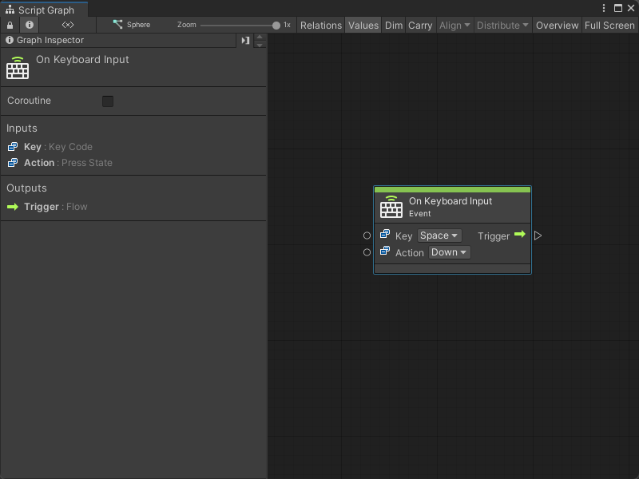
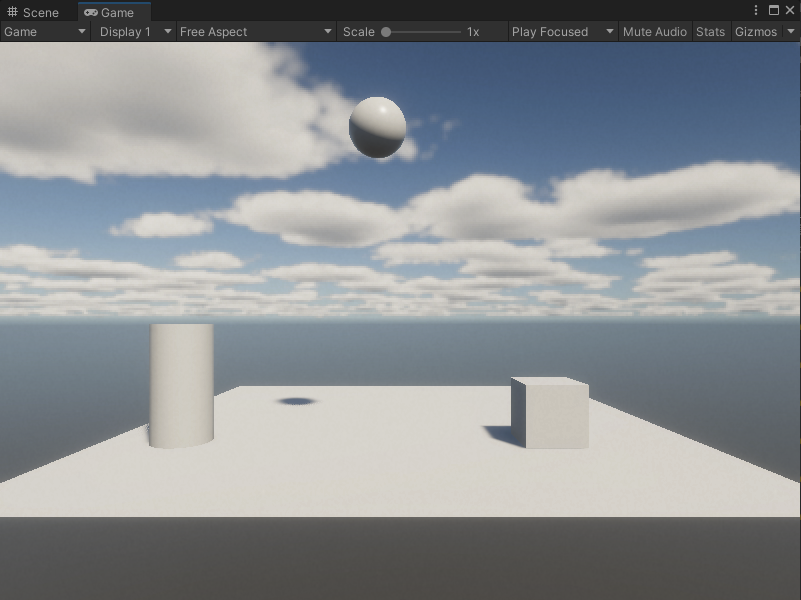

# On Keyboard Input node 

> [!NOTE]
> The On Keyboard Input [!include[nodes-note-manual](./snippets/input-manager/nodes-note-manual.md)]

The On Keyboard Input node listens for a specified action on a keyboard key. [!include[nodes-desc-end](./snippets/input-manager/nodes-desc-end.md)]

## Fuzzy finder category

The On Keyboard Input node is in the **Events** &gt; **Input** category in the fuzzy finder.

## Inputs 

The On Keyboard Input [!include[nodes-inputs](./snippets/nodes-inputs.md)] 

<table>
<thead>
<tr>
<th><strong>Name</strong></th>
<th><strong>Type</strong></th>
<th colspan="2"><strong>Description</strong></th>
</tr>
</thead>
<tbody>
<tr>
<td><strong>Key</strong></td>
<td>Key Code</td>
<td colspan="2">The name of the keyboard key the node listens to for an Input event. For a list of all available keys, see the <a href="https://docs.unity3d.com/2019.1/Documentation/ScriptReference/KeyCode.html">KeyCode</a> page's Properties section in the Unity User manual.</td>
</tr>
<tr>
<td rowspan="4"><strong>Action</strong></td>
<td rowspan="4">Press State</td>
<td colspan="2">The specific press state of the key that the node listens for.</td>
</tr>
<tr>
<td><strong>Hold</strong></td>
<td>The user holds down the key.</td>
</tr>
<tr>
<td><strong>Down</strong></td>
<td>The user presses the key.</td>
</tr>
<tr>
<td><strong>Up</strong></td>
<td>The user releases the key.</td>
</tr>
</tbody>
</table>

## Additional node settings 

The On Keyboard Input [!include[nodes-additional-settings](./snippets/nodes-additional-settings.md)]

<table>
<thead>
<tr>
<th><strong>Name</strong></th>
<th><strong>Type</strong></th>
<th><strong>Description</strong></th>
</tr>
</thead>
<tbody>
[!include[nodes-coroutine](./snippets/nodes-coroutine.md)]
</tbody>
</table>

## Outputs

The On Keyboard Input [!include[nodes-single-output](./snippets/nodes-single-output.md)] 

<table>
<thead>
<tr>
<th><strong>Name</strong></th>
<th><strong>Type</strong></th>
<th><strong>Description</strong></th>
</tr>
</thead>
<tbody>
[!include[nodes-input-output-trigger](./snippets/input-manager/nodes-input-output-trigger.md)]
</tbody>
</table>

## Example graph usage 

In the following example, the On Keyboard Input node listens for when the user presses the **Space** key. When the user presses **Space**, the On Keyboard Input triggers the Transform Translate node and lifts the GameObject along its `Y` coordinate by `5` units. This makes the GameObject jump. 

## Related nodes 

[!include[nodes-related](./snippets/nodes-related.md)] the On Keyboard Input node:

- [On Button Input node](vs-nodes-events-on-button-input.md)
- [On Mouse Down node](vs-nodes-events-on-mouse-down.md)
- [On Mouse Drag node](vs-nodes-events-on-mouse-drag.md)
- [On Mouse Enter node](vs-nodes-events-on-mouse-enter.md)
- [On Mouse Exit node](vs-nodes-events-on-mouse-exit.md)
- [On Mouse Input node](vs-nodes-events-on-mouse-input.md)
- [On Mouse Over node](vs-nodes-events-on-mouse-over.md)
- [On Mouse Up node](vs-nodes-events-on-mouse-up.md)
- [On Mouse Up As Button node](vs-nodes-events-on-mouse-up-button.md)