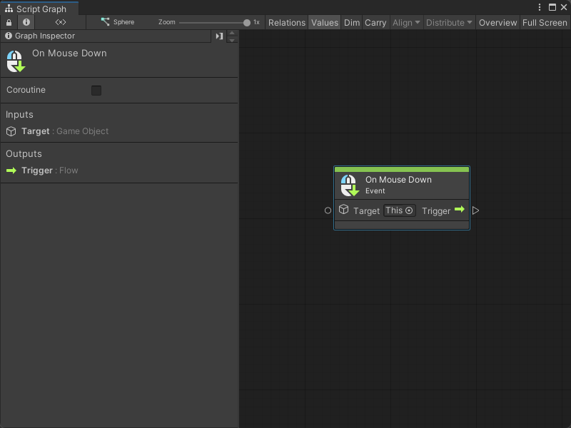
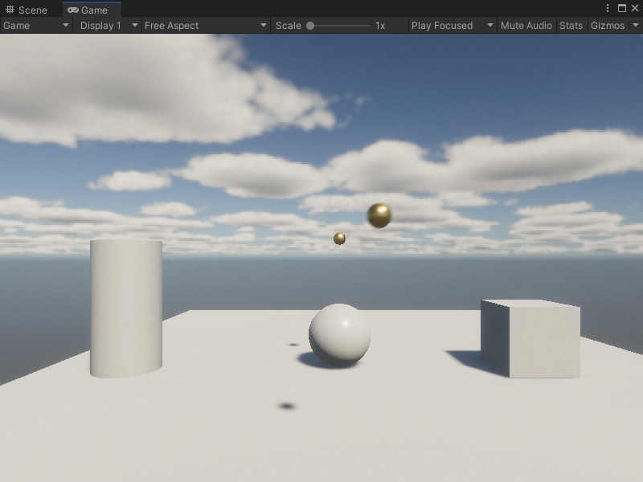

# On Mouse Down node

> [!NOTE]
> The On Mouse Down [!include[nodes-note-manual](./snippets/input-manager/nodes-note-manual.md)]

The On Mouse Down node listens for a mouse click action on a specific GameObject in your application. [!include[nodes-desc-end](./snippets/input-manager/nodes-desc-end.md)]

## Fuzzy finder category 

The On Mouse Down node is in the **Events** &gt; **Input** category in the fuzzy finder.

## Inputs 

The On Mouse Down [!include[nodes-single-input](./snippets/nodes-single-input.md)]

| **Name**   | **Type**    | **Description** |
| :------    | :---------- | :-------------  |
| **Target** |  GameObject | The GameObject that the user needs to click with their mouse to trigger the On Mouse Down node. |

## Additional node settings 

The On Mouse Down [!include[nodes-additional-settings](./snippets/nodes-additional-settings.md)]

<table>
<thead>
<tr>
<th><strong>Name</strong></th>
<th><strong>Type</strong></th>
<th><strong>Description</strong></th>
</tr>
</thead>
<tbody>
[!include[nodes-coroutine](./snippets/nodes-coroutine.md)]
</tbody>
</table>

## Outputs

The On Mouse Down [!include[nodes-single-output](./snippets/nodes-single-output.md)] 

<table>
<thead>
<tr>
<th><strong>Name</strong></th>
<th><strong>Type</strong></th>
<th><strong>Description</strong></th>
</tr>
</thead>
<tbody>
[!include[nodes-input-output-trigger](./snippets/input-manager/nodes-input-output-trigger.md)]
</tbody>
</table>

## Example graph usage 

In the following example, the On Mouse Down node listens for a click action on the GameObject where the graph runs. When a user clicks the GameObject, the On Mouse Down node triggers the GameObject Instantiate node. The Instantiate node creates a new GameObject, based on the **Ball** Prefab. It creates the Ball at a specific **Position**. It uses the Transform Get Local Rotation to match the new GameObject's **Rotation** to the GameObject where the Script Graph runs. Then, the graph adds a Rigidbody component to the new GameObject, and uses a Rigidbody Add Force node to add an **Impulse** force.

![An image of the Graph window, that displays an On Mouse Down node connected to the Invoke trigger input port on a GameObject Instantiate node. The Instantiate node uses inline values for its Original and Position, and takes its Rotation input from a Transform Get Local Rotation node targeting the parent GameObject of the Script Graph. The Instantiate node triggers a GameObject Add Component node, which adds a Rigidbody component to the newly-created GameObject. The Add Component node triggers a Rigidbody Add Force node, which uses the new Rigidbody component as its Target and inline values to apply an Impulse force.](images/vs-nodes-events-on-mouse-down-example.png)

When the user clicks the mouse button, the Script Graph creates a new **Ball** GameObject and sends it towards the camera.

## Related nodes 

[!include[nodes-related](./snippets/nodes-related.md)] On Mouse Down node:

- [On Button Input node](vs-nodes-events-on-button-input.md)
- [On Keyboard Input node](vs-nodes-events-on-keyboard-input.md)
- [On Mouse Drag node](vs-nodes-events-on-mouse-drag.md)
- [On Mouse Enter node](vs-nodes-events-on-mouse-enter.md)
- [On Mouse Exit node](vs-nodes-events-on-mouse-exit.md)
- [On Mouse Input node](vs-nodes-events-on-mouse-input.md)
- [On Mouse Over node](vs-nodes-events-on-mouse-over.md)
- [On Mouse Up node](vs-nodes-events-on-mouse-up.md)
- [On Mouse Up As Button node](vs-nodes-events-on-mouse-up-button.md)