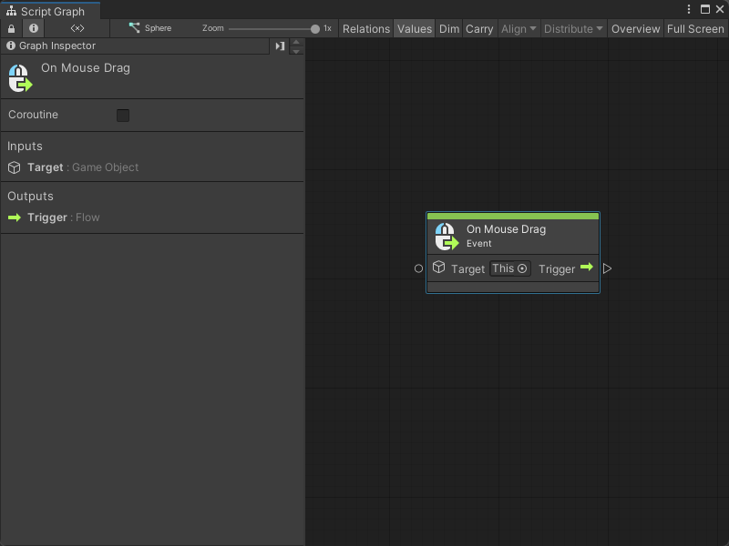
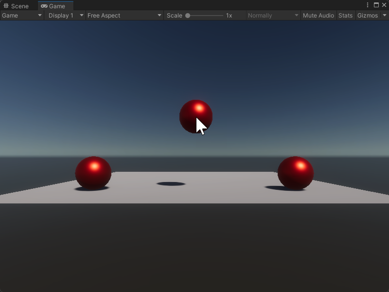

# On Mouse Drag node

> [!NOTE]
> The On Mouse Drag [!include[nodes-note-manual](./snippets/input-manager/nodes-note-manual.md)]

The On Mouse Drag node listens for a mouse click and hold on a specific GameObject in your application. It triggers the next node connected to it as long as the mouse button is held down on that GameObject. It doesn't send or receive any other data.

## Fuzzy finder category 

The On Mouse Drag node is in the **Events** &gt; **Input** category in the fuzzy finder.

## Inputs 

The On Mouse Drag [!include[nodes-single-input](./snippets/nodes-single-input.md)] 

| **Name**   | **Type**    | **Description** |
| :------    | :---------- | :-------------  |
| **Target** |  GameObject | The GameObject the user needs to click and hold with their mouse to trigger the On Mouse Drag node. |

## Additional node settings 

The On Mouse Drag [!include[nodes-additional-settings](./snippets/nodes-additional-settings.md)]

<table>
<thead>
<tr>
<th><strong>Name</strong></th>
<th><strong>Type</strong></th>
<th><strong>Description</strong></th>
</tr>
</thead>
<tbody>
[!include[nodes-coroutine](./snippets/nodes-coroutine.md)]
</tbody>
</table>

## Outputs

The On Mouse Drag [!include[nodes-single-output](./snippets/nodes-single-output.md)] 

<table>
<thead>
<tr>
<th><strong>Name</strong></th>
<th><strong>Type</strong></th>
<th><strong>Description</strong></th>
</tr>
</thead>
<tbody>
[!include[nodes-input-output-trigger](./snippets/input-manager/nodes-input-output-trigger.md)]
</tbody>
</table>

## Example graph usage 

In the following example, the On Mouse Drag node triggers a Camera Screen To World Point node. When the user clicks and holds their mouse button over the **Target** GameObject from the On Mouse Drag node, the Script Graph gets the user's current mouse position with an Input Get Mouse Position node. The graph uses the X and Y values from the Get Mouse Position node's Vector 3 result to create a new Vector 3 value, with a fixed Z value. The Screen To World Point node uses the new Vector 3 and the camera saved in the **Main Camera** Scene variable to set the position of the **Target** GameObject's transform.

![An image of the Graph window. An On Mouse Drag node with its Target set to This connects its Trigger output port to the Invoke input port on a Camera Screen To World Point node. The Camera Screen To World Point node receives its Target from a Get Scene Variable node, which sends the value of the MainCamera variable. The Camera Screen To World Point node receives its Position from a Create Vector 3 node. The Create Vector 3 node receives an X value from a Vector 3 Get X node connected to an Input Mouse Position node. The Create Vector 3 node receives a Y value from a Vector 3 Get Y node connected to the same Input Mouse Position node. The Create Vector 3 node uses an inline value for its Z value. The Camera Screen To World Point's Exit output port connects to the Set input port on a Transform Set Position node. The Transform Set Position node has its Target set to This, and uses the Vector 3 Result from the Screen To World Point node to set a new position for its transform.](images/vs-nodes-events-on-mouse-drag-example.png)

The Script Graph allows the user to drag the **Target** GameObject around the scene when hold down their mouse button.

## Related nodes 

[!include[nodes-related](./snippets/nodes-related.md)] On Mouse Drag node:

- [On Button Input node](vs-nodes-events-on-button-input.md)
- [On Keyboard Input node](vs-nodes-events-on-keyboard-input.md)
- [On Mouse Down node](vs-nodes-events-on-mouse-down.md)
- [On Mouse Enter node](vs-nodes-events-on-mouse-enter.md)
- [On Mouse Exit node](vs-nodes-events-on-mouse-exit.md)
- [On Mouse Input node](vs-nodes-events-on-mouse-input.md)
- [On Mouse Over node](vs-nodes-events-on-mouse-over.md)
- [On Mouse Up node](vs-nodes-events-on-mouse-up.md)
- [On Mouse Up As Button node](vs-nodes-events-on-mouse-up-button.md)

