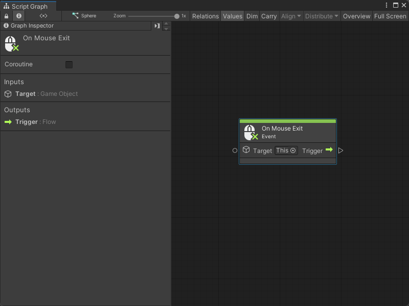
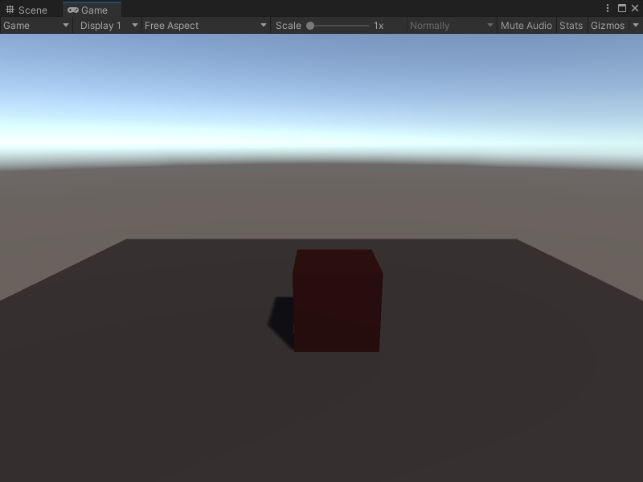

# On Mouse Exit node

> [!NOTE]
> The On Mouse Exit [!include[nodes-note-manual](./snippets/input-manager/nodes-note-manual.md)]

The On Mouse Exit node listens for the user's mouse pointer location to exit the Collider of a specified GameObject. When the mouse exits the Collider or GUI element, the node triggers the next node connected to it. It doesn't send or receive any other data. 

## Fuzzy finder category 

The On Mouse Exit node is in the **Events** &gt; **Input** category in the fuzzy finder.

## Inputs 

The On Mouse Exit [!include[nodes-single-input](./snippets/nodes-single-input.md)] 

| **Name**   | **Type**    | **Description** |
| :------    | :---------- | :-------------  |
| **Target** |  GameObject | The GameObject with the Collider that triggers the On Mouse Exit node.  |

## Additional node settings 

The On Mouse Exit [!include[nodes-additional-settings](./snippets/nodes-additional-settings.md)]

<table>
<thead>
<tr>
<th><strong>Name</strong></th>
<th><strong>Type</strong></th>
<th><strong>Description</strong></th>
</tr>
</thead>
<tbody>
[!include[nodes-coroutine](./snippets/nodes-coroutine.md)]
</tbody>
</table>

## Outputs

The On Mouse Exit [!include[nodes-single-output](./snippets/nodes-single-output.md)] 

<table>
<thead>
<tr>
<th><strong>Name</strong></th>
<th><strong>Type</strong></th>
<th><strong>Description</strong></th>
</tr>
</thead>
<tbody>
[!include[nodes-input-output-trigger](./snippets/input-manager/nodes-input-output-trigger.md)]
</tbody>
</table>

## Example graph usage 

In the following example, continued from the example from the [On Mouse Enter node](vs-nodes-events-on-mouse-enter.md), the On Mouse Exit node triggers a Destroy GameObject node when the user's mouse exits the Collider on the Script Machine's GameObject. The Destroy GameObject node destroys the GameObject assigned to the Spotlight Scene variable. The GameObject was created and assigned to the variable elsewhere in the graph. 

![An image of the Graph window. An On Mouse Exit node's Trigger output port connects to the Invoke input port on a Destroy GameObject node. A Get Variable node sends the value of the Spotlight Scene variable to the Destroy GameObject node to tell it which GameObject to destroy. Above the three nodes, there is part of the example graph from the On Mouse Enter node example, where an Instantiate GameObject node assigns its new GameObject as the value for the Spotlight Scene variable with a Set Variable node.](images/vs-nodes-events-on-mouse-exit-example.png)

When the user's mouse leaves the Collider, the **Target** GameObject no longer has a spotlight.

## Related nodes 

[!include[nodes-related](./snippets/nodes-related.md)] On Mouse Exit node:

- [On Button Input node](vs-nodes-events-on-button-input.md)
- [On Keyboard Input node](vs-nodes-events-on-keyboard-input.md)
- [On Mouse Down node](vs-nodes-events-on-mouse-down.md)
- [On Mouse Drag node](vs-nodes-events-on-mouse-drag.md)
- [On Mouse Enter node](vs-nodes-events-on-mouse-enter.md)
- [On Mouse Input node](vs-nodes-events-on-mouse-input.md)
- [On Mouse Over node](vs-nodes-events-on-mouse-over.md)
- [On Mouse Up node](vs-nodes-events-on-mouse-up.md)
- [On Mouse Up As Button node](vs-nodes-events-on-mouse-up-button.md)
