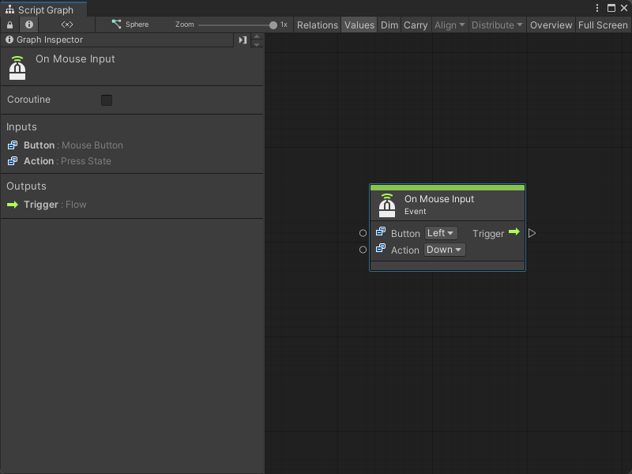
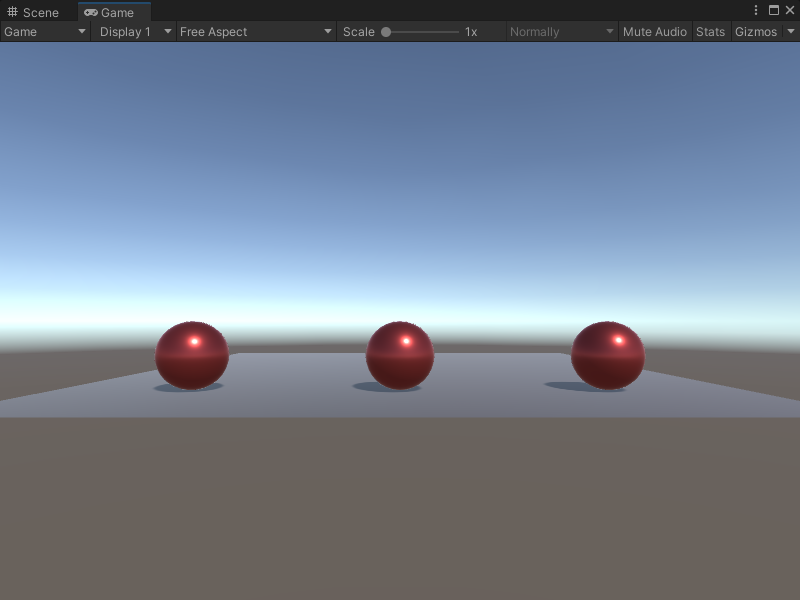

# On Mouse Input node

> [!NOTE]
> The On Mouse Input [!include[nodes-note-manual](./snippets/input-manager/nodes-note-manual.md)]

The On Mouse Input node listens for a specific action on a user's mouse. The action doesn't need to happen on a specific GameObject's Collider. [!include[nodes-desc-end](./snippets/input-manager/nodes-desc-end.md)]

## Fuzzy finder category 

The On Mouse Input node is in the **Events** &gt; **Input** category in the fuzzy finder.

## Inputs 

The On Mouse Input [!include[nodes-inputs](./snippets/nodes-inputs.md)] 

<table>
<thead>
<tr>
<th><strong>Name</strong></th>
<th><strong>Type</strong></th>
<th colspan="2"><strong>Description</strong></th>
</tr>
</thead>
<tbody>
<tr>
<td><strong>Button</strong></td>
<td>Mouse Button</td>
<td colspan="2">The name of the mouse button that triggers the On Mouse Input node.</td>
</tr>
<tr>
<td rowspan="4"><strong>Action</strong></td>
<td rowspan="4">Press State</td>
<td colspan="2">The specific state of the mouse button that the node listens for.</td>
</tr>
<tr>
<td><strong>Hold</strong></td>
<td>The user holds down the mouse button.</td>
</tr>
<tr>
<td><strong>Down</strong></td>
<td>The user presses the mouse button.</td>
</tr>
<tr>
<td><strong>Up</strong></td>
<td>The user releases the mouse button.</td>
</tr>
</tbody>
</table>

## Additional node settings 

The On Mouse Input [!include[nodes-additional-settings](./snippets/nodes-additional-settings.md)]

<table>
<thead>
<tr>
<th><strong>Name</strong></th>
<th><strong>Type</strong></th>
<th><strong>Description</strong></th>
</tr>
</thead>
<tbody>
[!include[nodes-coroutine](./snippets/nodes-coroutine.md)]
</tbody>
</table>

## Outputs

The On Mouse Input [!include[nodes-single-output](./snippets/nodes-single-output.md)] 

<table>
<thead>
<tr>
<th><strong>Name</strong></th>
<th><strong>Type</strong></th>
<th><strong>Description</strong></th>
</tr>
</thead>
<tbody>
[!include[nodes-input-output-trigger](./snippets/input-manager/nodes-input-output-trigger.md)]
</tbody>
</table>

## Example graph usage 

In the following example, the On Mouse Input node listens for the user to hold the right mouse button and triggers an Instantiate Camera node. The Instantiate node clones the camera saved as the **Camera1** Scene variable and assigns it to the **NewCamera** Scene variable. It sets a new position for the cloned camera with a Transform Set Position node, before it switches which camera renders in the Game view with the Camera Render node.

![An image of the Graph window. An On Mouse Input node with its Button and Action inputs set to Right and Hold connects its Trigger output port to the Invoke input port on an Instantiate Camera node. The Instantiate Camera node's Original input port connects to a Get Variable node's Value output port to decide which camera to clone, and gets the value for the Camera1 Scene variable. The Instantiate Camera node connects its Exit output port and its Result output port to a Set Variable node's Assign input port and New Value input port, respectively. The Set Variable node uses an inline value for its Name input to set the input from New Value as the NewCamera Scene variable. The Set Variable node connects its Assigned output port and its Value output port to a Transform Set Position node's Set input port and Target input port. It uses inline values to set the Value of the new position, then connects its On Set output port to a Camera Render node's Invoke input port. A Get Variable node, which gets the value of New Camera, connects its Value output port to the Render Camera node's Target input port.](images/vs-nodes-events-on-mouse-input-example.png)

When the application runs, the default view in the Game view displays all three spheres in the scene. 

When the user holds the right mouse button and triggers the On Mouse Input node, the Game view changes to focus on the middle sphere. 

## Related nodes 

[!include[nodes-related](./snippets/nodes-related.md)] On Mouse Input node: 

- [On Button Input node](vs-nodes-events-on-button-input.md)
- [On Keyboard Input node](vs-nodes-events-on-keyboard-input.md)
- [On Mouse Down node](vs-nodes-events-on-mouse-down.md)
- [On Mouse Drag node](vs-nodes-events-on-mouse-drag.md)
- [On Mouse Enter node](vs-nodes-events-on-mouse-enter.md)
- [On Mouse Exit node](vs-nodes-events-on-mouse-exit.md)
- [On Mouse Over node](vs-nodes-events-on-mouse-over.md)
- [On Mouse Up node](vs-nodes-events-on-mouse-up.md)
- [On Mouse Up As Button node](vs-nodes-events-on-mouse-up-button.md)
