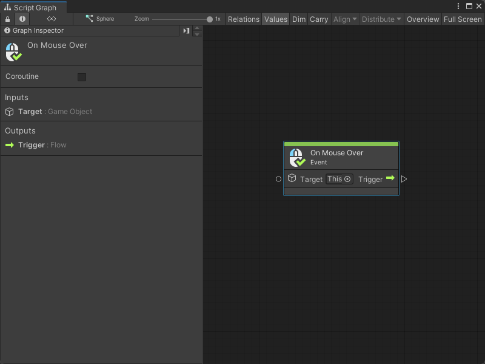
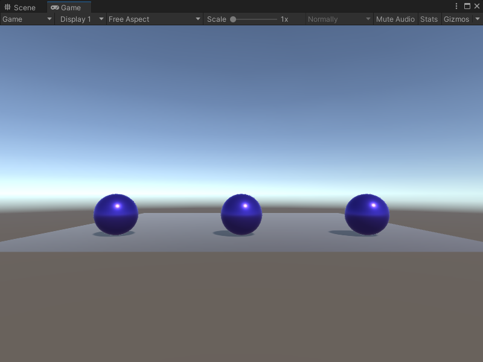

# On Mouse Over node

> [!NOTE]
> The On Mouse Over [!include[nodes-note-manual](./snippets/input-manager/nodes-note-manual.md)]

The On Mouse Over node listens for a user's mouse to land over a specified GameObject's Collider. While the user's mouse is over the Collider, it triggers the next node connected to it once every frame. It doesn't send or receive any other data.

## Fuzzy finder category 

The On Mouse Over node is in the **Events** &gt; **Input** category in the fuzzy finder.

## Inputs 

The On Mouse Over [!include[nodes-single-input](./snippets/nodes-single-input.md)] 

| **Name**   | **Type**    | **Description** |
| :------    | :---------- | :-------------  |
| **Target** |  GameObject | The GameObject with the Collider that triggers the On Mouse Over node. |

## Additional node settings 

The On Mouse Over [!include[nodes-additional-settings](./snippets/nodes-additional-settings.md)]

<table>
<thead>
<tr>
<th><strong>Name</strong></th>
<th><strong>Type</strong></th>
<th><strong>Description</strong></th>
</tr>
</thead>
<tbody>
[!include[nodes-coroutine](./snippets/nodes-coroutine.md)]
</tbody>
</table>

## Outputs

The On Mouse Over [!include[nodes-single-output](./snippets/nodes-single-output.md)] 

<table>
<thead>
<tr>
<th><strong>Name</strong></th>
<th><strong>Type</strong></th>
<th><strong>Description</strong></th>
</tr>
</thead>
<tbody>
[!include[nodes-input-output-trigger](./snippets/input-manager/nodes-input-output-trigger.md)]
</tbody>
</table>

## Example graph usage 

In the following example, the On Mouse Over node triggers a Timer node when the user moves their mouse over the **Target** GameObject. The Timer runs for 2 seconds and triggers a Color Lerp node. For every **Tick** of the Timer node, the Color Lerp node uses the **Elapsed** value to calculate a new Color between Color **A** and Color **B** to make a smooth transition between colors. The Material Set Color node uses the **Result** from the Color Lerp node to set a new Color on the **Object** material. 

![An image of the Graph window. An On Mouse Over node has a Target of the current GameObject where the Script Graph runs. Its Trigger output port connects to the Toggle input port on a Timer node. It uses an inline value of 2 for its Duration. Its Tick output port connects to the Invoke input port on a Color Lerp node. The Timer node's Elapsed output port connects to the T input port on the Color Lerp node. The Color Lerp node uses inline values for its A and B input colors. Its Exit port connects to the Invoke input port on a Material Set Color node. The Color Lerp node's Result port connects to the Material Set Color node's Value port. The Material Set Color node uses inline values for its Target material and the Name of the color property it should modify.](images/vs-nodes-events-on-mouse-over-example.png)

While the user's mouse is over the **Target** GameObject, the objects that use the **Object** material in the scene transition from red to blue over two seconds. The transition repeats until the user's mouse leaves the **Target**'s Collider. 

## Related nodes 

[!include[nodes-related](./snippets/nodes-related.md)] On Mouse Over node:

- [On Button Input node](vs-nodes-events-on-button-input.md)
- [On Keyboard Input node](vs-nodes-events-on-keyboard-input.md)
- [On Mouse Down node](vs-nodes-events-on-mouse-down.md)
- [On Mouse Drag node](vs-nodes-events-on-mouse-drag.md)
- [On Mouse Enter node](vs-nodes-events-on-mouse-enter.md)
- [On Mouse Exit node](vs-nodes-events-on-mouse-exit.md)
- [On Mouse Input node](vs-nodes-events-on-mouse-input.md)
- [On Mouse Up node](vs-nodes-events-on-mouse-up.md)
- [On Mouse Up As Button node](vs-nodes-events-on-mouse-up-button.md)