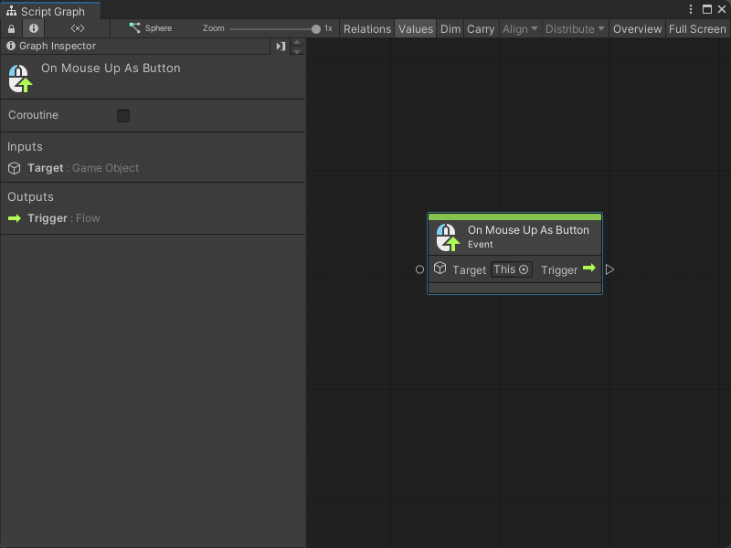
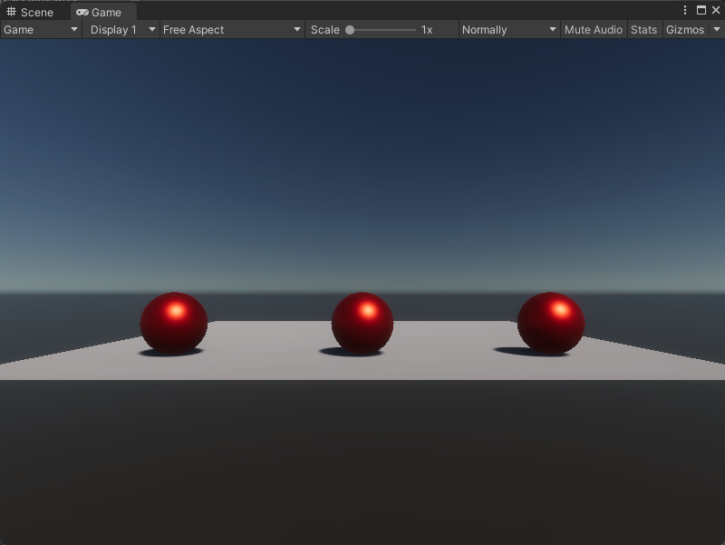
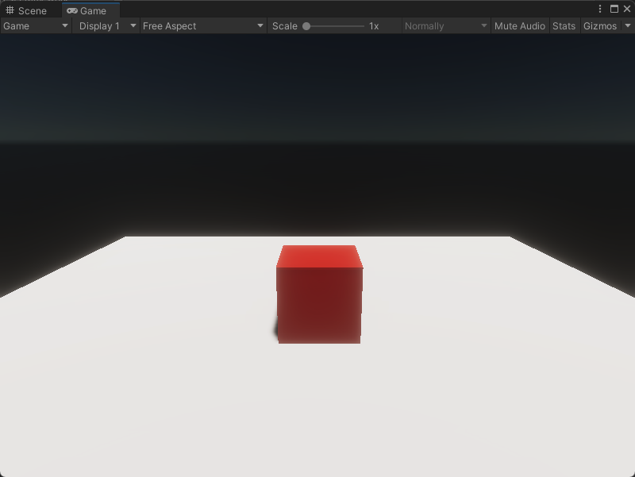

# On Mouse Up As Button node

> [!NOTE]
> The On Mouse Up As Button [!include[nodes-note-manual](./snippets/input-manager/nodes-note-manual.md)]

The On Mouse Up As Button node listens for a user to release their mouse button after they click a Collider in your application. [!include[nodes-desc-end](./snippets/input-manager/nodes-desc-end.md)]

To trigger the On Mouse Up As Button node, the user must release their mouse button over the same Collider they clicked. If you want the user to trigger the node after they release their mouse button at any location in your application, use the [On Mouse Up node](vs-nodes-events-on-mouse-up.md) instead.

## Fuzzy finder category 

The On Mouse Up As Button node is in the **Events** &gt; **Input** category in the fuzzy finder.

## Inputs 

The On Mouse Up As Button [!include[nodes-single-input](./snippets/nodes-single-input.md)] 

| **Name**   | **Type**    | **Description** |
| :------    | :---------- | :-------------  |
| **Target** |  GameObject | The GameObject the user must click and release with their mouse button to trigger the node.  |

## Additional node settings 

The On Mouse Up As Button [!include[nodes-additional-settings](./snippets/nodes-additional-settings.md)]

<table>
<thead>
<tr>
<th><strong>Name</strong></th>
<th><strong>Type</strong></th>
<th><strong>Description</strong></th>
</tr>
</thead>
<tbody>
[!include[nodes-coroutine](./snippets/nodes-coroutine.md)]
</tbody>
</table>

## Outputs

The On Mouse Up As Button [!include[nodes-single-output](./snippets/nodes-single-output.md)] 

<table>
<thead>
<tr>
<th><strong>Name</strong></th>
<th><strong>Type</strong></th>
<th><strong>Description</strong></th>
</tr>
</thead>
<tbody>
[!include[nodes-input-output-trigger](./snippets/input-manager/nodes-input-output-trigger.md)]
</tbody>
</table>

## Example graph usage 

In the following example, the On Mouse Up As Button node runs as a coroutine to load a new scene after the user clicks and releases their mouse button over the **Target** GameObject. The Script Graph loads the scene, makes the graph wait until the scene loads, then sets the loaded scene as the active scene in the application. 

![An image of the Graph window. An On Mouse Up As Button node has its Target set to This and is set to run as a coroutine. Its Trigger output port connects to the Invoke input port on a Scene Manager Load Scene node. The Load Scene node loads the scene from Scene Build Index 1, with an inline value. Its Exit output port connects to the Enter input port on a Wait Until node. The Wait Until node waits until a Scene Is Loaded node returns True as its Condition input. When Is Loaded returns True, the Wait Until node's Exit output port triggers the Invoke input port on a Scene Manager Get Scene At node. The Get Scene At node gets the scene from Index 1 with an inline value. Its Exit output port connects to the Invoke input port on a Scene Manager Set Active Scene node. The Set Active Scene node takes the Result scene output from the Get Scene At node and changes the active scene in the application.](images/vs-nodes-events-on-mouse-up-as-button-example.png)

When the application starts, the active scene contains a plane with three spheres.

After the Script Graph runs, the scene changes to a plane with a single cube. 

## Related nodes 

[!include[nodes-related](./snippets/nodes-related.md)] On Mouse Up As Button node:

- [On Button Input node](vs-nodes-events-on-button-input.md)
- [On Keyboard Input node](vs-nodes-events-on-keyboard-input.md)
- [On Mouse Down node](vs-nodes-events-on-mouse-down.md)
- [On Mouse Drag node](vs-nodes-events-on-mouse-drag.md)
- [On Mouse Enter node](vs-nodes-events-on-mouse-enter.md)
- [On Mouse Exit node](vs-nodes-events-on-mouse-exit.md)
- [On Mouse Input node](vs-nodes-events-on-mouse-input.md)
- [On Mouse Over node](vs-nodes-events-on-mouse-over.md)
- [On Mouse Up node](vs-nodes-events-on-mouse-up.md)