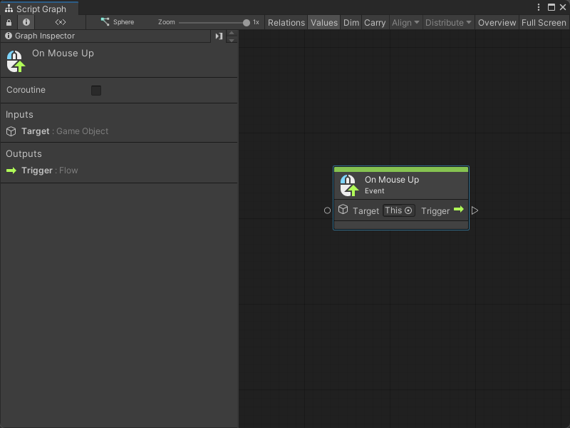
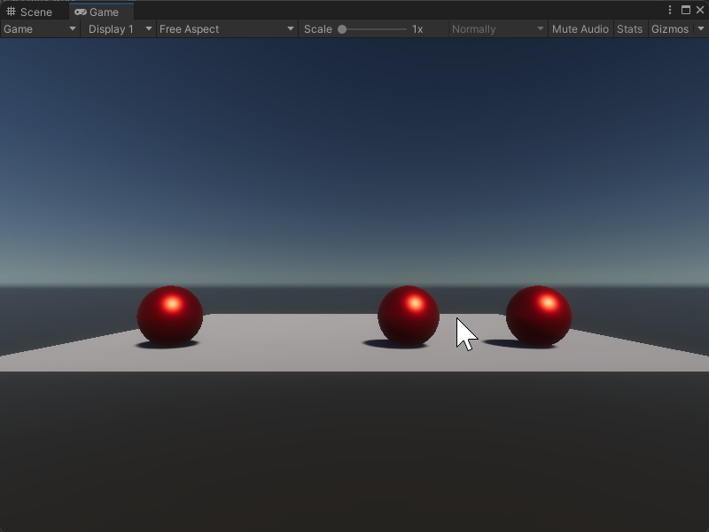

# On Mouse Up node

> [!NOTE]
> The On Mouse Up [!include[nodes-note-manual](./snippets/input-manager/nodes-note-manual.md)]

The On Mouse Up node listens for a user to release their mouse button after they click a Collider in your application. [!include[nodes-desc-end](./snippets/input-manager/nodes-desc-end.md)]

The user can release their mouse button anywhere in your application to trigger the On Mouse Up node. If you want the node to trigger after the user releases the mouse button over the same Collider specified in the node's **Target**, use the [On Mouse Up As Button node](vs-nodes-events-on-mouse-up-button.md) instead.

## Fuzzy finder category 

The On Mouse Up node is in the **Events** &gt; **Input** category in the fuzzy finder.

## Inputs 

The On Mouse Up [!include[nodes-single-input](./snippets/nodes-single-input.md)] 

| **Name**   | **Type**    | **Description** |
| :------    | :---------- | :-------------  |
| **Target** |  GameObject | The GameObject the user needs to click with their mouse button to have the On Mouse Up node listen for a mouse button release action. The user can release their mouse button anywhere to trigger the On Mouse Up node, but they must click the GameObject specified as the **Target**. |

## Additional node settings 

The On Mouse Up [!include[nodes-additional-settings](./snippets/nodes-additional-settings.md)]

<table>
<thead>
<tr>
<th><strong>Name</strong></th>
<th><strong>Type</strong></th>
<th><strong>Description</strong></th>
</tr>
</thead>
<tbody>
[!include[nodes-coroutine](./snippets/nodes-coroutine.md)]
</tbody>
</table>

## Outputs

The On Mouse Up [!include[nodes-single-output](./snippets/nodes-single-output.md)] 

<table>
<thead>
<tr>
<th><strong>Name</strong></th>
<th><strong>Type</strong></th>
<th><strong>Description</strong></th>
</tr>
</thead>
<tbody>
[!include[nodes-input-output-trigger](./snippets/input-manager/nodes-input-output-trigger.md)]
</tbody>
</table>

## Example graph usage 

In the following example, the On Mouse Up node adds a force to a GameObject based on the user's mouse position when they release their mouse button. The On Mouse Up node triggers a Camera Screen To World Point node to get the user's mouse position, before it sends the **X** value of the mouse to a Rigidbody Add Force node to move the GameObject. 

![An image of the Graph window. An On Mouse Up node has its Target set to This. Its Trigger output node connects to the Invoke input port on a Camera Screen To World Point node. The Screen To World Point node gets its Target input from a Get Variable input node, which outputs the value of the MainCamera variable. The Screen To World Point node gets its Position Input from a Vector 3 Create node. The Vector 3 Create node takes its X input from an Input Get Mouse Position node, with a Vector 3 Get X node to get only the X value. It does the same for its Y input, with a Vector 3 Get Y node. The Screen To World Point node's Exit output trigger triggers the Invoke input port on a Rigidbody Add Force node, with its Target set to This and its Force Mode set to Velocity Change. The Rigidbody Add Force node takes an X input from the Screen To World Point Vector 3 Result output port, with a Vector 3 Get X node.](images/vs-nodes-events-on-mouse-up-example.png)

When the user clicks on the sphere in the middle of the scene and releases their mouse button, the sphere moves towards their mouse location. 

## Related nodes 

[!include[nodes-related](./snippets/nodes-related.md)] On Mouse Up node:

- [On Button Input node](vs-nodes-events-on-button-input.md)
- [On Keyboard Input node](vs-nodes-events-on-keyboard-input.md)
- [On Mouse Down node](vs-nodes-events-on-mouse-down.md)
- [On Mouse Drag node](vs-nodes-events-on-mouse-drag.md)
- [On Mouse Enter node](vs-nodes-events-on-mouse-enter.md)
- [On Mouse Exit node](vs-nodes-events-on-mouse-exit.md)
- [On Mouse Input node](vs-nodes-events-on-mouse-input.md)
- [On Mouse Over node](vs-nodes-events-on-mouse-over.md)
- [On Mouse Up As Button node](vs-nodes-events-on-mouse-up-button.md)