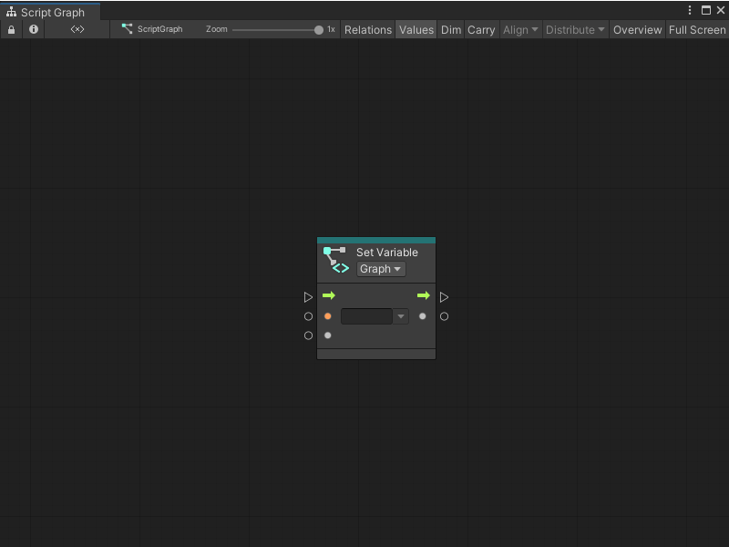
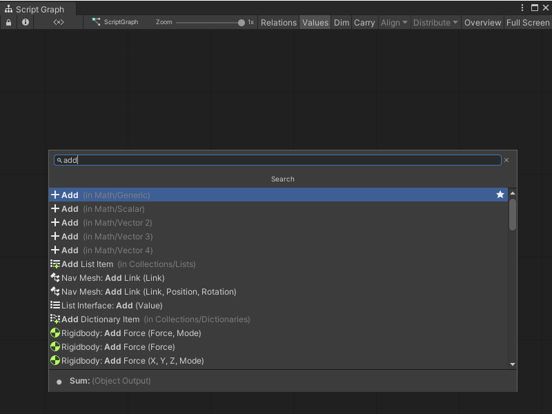
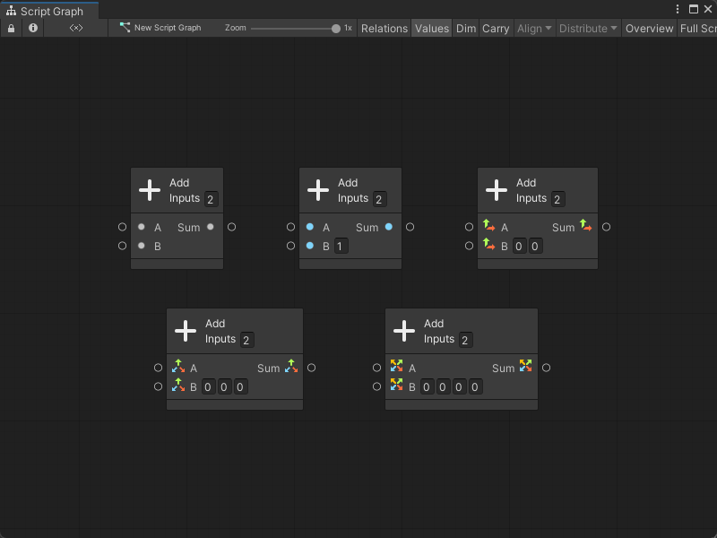

# Nodes 

Nodes are the most basic part of scripts in Visual Scripting. A node can listen for events, get the value of a variable, modify a component on a GameObject, and more.  

Nodes appear as blocks in [the Graph Editor](vs-interface-overview.md#the-graph-editor). 

You can arrange and connect these blocks with edges to create logic for an application. Add nodes with [the fuzzy finder](vs-interface-overview.md#the-fuzzy-finder). Click and drag a node to move it in the Graph Editor. 

## Node anatomy

Visual Scripting highlights nodes in your current selection. All nodes have a header, which displays the node's name. Some node headers might contain additional information or controls.

Select a node in your graph, the Visual Scripting [Graph Inspector](vs-interface-overview.md#the-graph-inspector) displays the following information: 

- The node's name and type icon. 
- A brief description of what the node does, if available. 
- The current warning messages or errors for the node. 
- The additional settings for the node, if available. 
- The required type for each input port and a brief description, if available.
- The type for each output port and a brief description, if available.

### Connections and ports

Connect a port from one node to a compatible port on another node to create an edge. Edges form the logic flow in a Visual Scripting graph. Click any port to create a new edge. 

Edges are color-coded: edges that control the logic flow in your graph are white. Data edges are colored based on their type. For more information about types, see [Object types](vs-types.md).

When you create a new edge, Visual Scripting highlights ports on any other nodes in a graph where you can make a valid connection. If you enable **Dim Incompatible Nodes**, Visual Scripting also dims any nodes or ports without a valid connection. 

Ports on the left side of a node are Input Ports. Ports on the right side of a node are Output Ports. 

An input port or output port can be a Control Port or a Data Port: 

- Control Ports control the logical flow in a graph. They tell Visual Scripting what order to execute the nodes in a graph, from left to right. The icon for a control port is always an arrow. These arrows display the direction of the flow of logic in a graph.
- Data Ports send and receive data, such as number values or GameObjects, between nodes. They have colors that correspond to the specific type they expect to receive as inputs, or send as outputs. Their icons change based on their type.

You can make multiple connections to or from the same port, with some restrictions: 

- You can connect a single Data Output port to multiple Data Input ports. 
- You can't connect multiple Data Output ports to a single Data Input port. Visual Scripting can't choose which value to use. 
- You can connect multiple Control Output ports a single Control Input port.
- You can't connect a single Control Output port to multiple Control Input ports. Visual Scripting can't choose which node to run first. 

![An image of the Graph Editor. An On Update Event node connects its trigger output port to the trigger input port on a Transform Rotate node. A Per Second node, with its Input set to 30, connects its output port to the X Angle, Y Angle, and Z Angle input ports on the Transform Rotate node. An On Keyboard Input Event node with its Key set to Space and its Action set to Down connects its trigger output port to the trigger input port on a Rigidbody Add Force node. An On Mouse Down Event node also connects its trigger output port to the trigger input on the Rigidbody Add Force node.](images\vs-multiple-connections-example.png)

For more information on how to connect nodes, see [Connect nodes in a Script Graph](vs-creating-connections.md).

More complex nodes can have more complex or specialized ports, outside of the ports described here.
### Node controls and inline values

A node might have additional controls that display on its header or in the [Graph Inspector](vs-interface-overview.md#the-graph-inspector). Controls can change the available ports or behavior of a node. Some ports might also use inline values. 

<table>
<thead>
<tr>
<th><strong>Element</strong></th>
<th><strong>Example</strong></th>
<th><strong>Description</strong></th>
</tr>
</thead>
<tbody>
<tr>
<td><strong>Control</strong></td>
<td> </td>
<td>A control appears as a dropdown option on the header of a node. For example, a Container Type control might tell a node to expect to receive a GameObject instead of a Script Machine.</td>
</tr>
<tr>
<td><strong>Inline Value</strong></td>
<td> </td>
<td>An inline value appears as an object picker field next to a port. You can use an inline value instead of a node connection to specify a value for a node. Not all Visual Scripting types support inline values.</td>
</tr>
</tbody>
</table>
 
## Node overloads 

Variations of a Visual Scripting node are called overloads. Overloads change the input and output data that a node can accept, and can change the number of input or output data ports on a node.

For example, the **Add** node has four overloads, as shown in the following image of the fuzzy finder after a search for `Add`. 

You can distinguish each overload through its subcategory in the fuzzy finder. The **Add** node is a part of the **Math** category, but each overload is a part of a different subcategory: **Generic**, **Scalar**, **Vector 2**, **Vector 3**, or **Vector 4**. 

The specific node overload changes what input and output data the **Add** node can accept. While a Generic **Add** node can input and output any object type in Visual Scripting, a Vector 3 **Add** node can only take 3D vectors as an input, and can only output a single 3D vector:

The default type and number of ports on the **Add** node stays consistent across its overloads. For the **Rotate** node, the type and number of ports varies. 

Based on the **Rotate** node you select, you might be able to specify the angle of rotation as a vector, as separate float values, or as an angle relative to each axis. You can also choose whether the node rotates the GameObject relative to itself, or relative to the center of the scene's world space.
