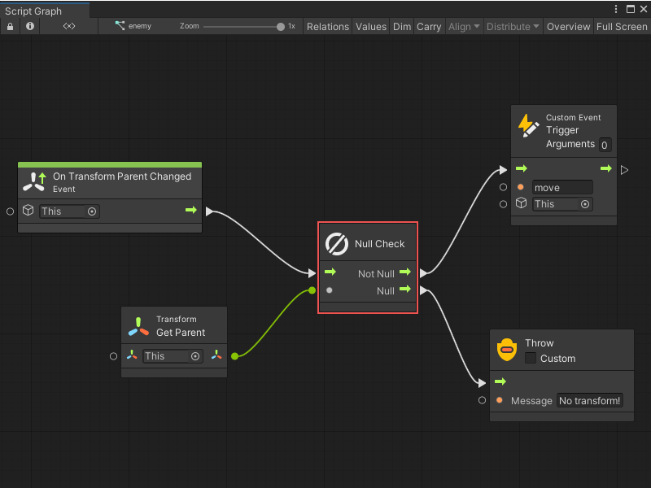
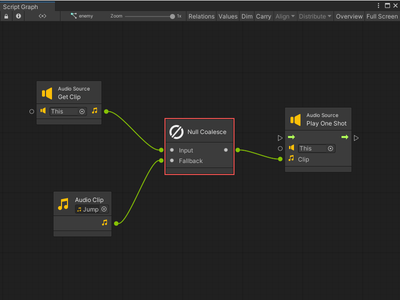

# Nulls node

> [!NOTE]
> For versions 2019/2020 LTS, download the Visual Scripting package from the [Unity Asset Store](https://assetstore.unity.com/packages/tools/visual-bolt-163802).

Null nodes deal with the null value, which is scripting lingo for "nothing".

## The null node

The null node always returns null as a value. Leaving a Unity object reference field empty ("None") automatically means null.

## Null Check

The null check is a shortcut for a branch on an equality comparison with null. It can be useful to direct the flow in different directions depending on whether a value is null.

For example, it can be used to handle a situation differently whether a transform has a parent in the hierarchy or not.

## Null Coalesce

The null coalesce node provides a fallback value in case the original input is null.

For example, the null coalesce node defines a default fallback audio clip in case the one on the audio source is missing.

