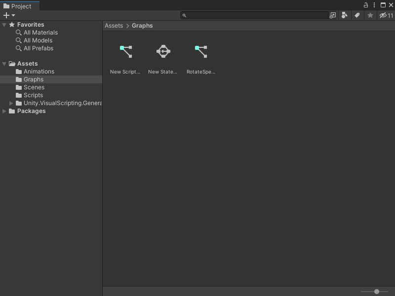
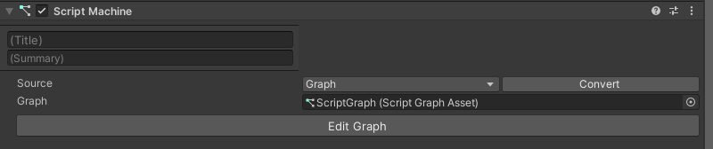

# Open a graph file 

You can open a graph file from multiple locations, based on the graph type and its source type. 

For information on how to create a new graph file, see [Create a new graph file](vs-create-graph.md).

## From the Project window 

To open a graph from the Project window: 

1. [!include[open-project-window](./snippets/vs-open-project-window.md)] 

2. Find the location in your Project window's folders where you saved the graph file you want to edit.

    

3. Double-click the graph file to open it in the Graph window. 

## From the Graph Inspector 

If you have a nested or embedded graph inside another graph file, you can open it from the Graph Inspector.

1. In the Graph window, select the node that represents the graph you want to edit. 
    This node could be a transition, Super State, Subgraph, or State Unit. 

1. Open the [Graph Inspector](vs-interface-overview.md#the-graph-inspector).

2. In the Graph Inspector, select **Edit Graph**. 
    The graph opens in the same Graph window. 

## From a Script Machine or State Machine 

If you've attached or embedded a graph in a Script Machine or State Machine on a GameObject, you can open the graph from the component on the GameObject: 

1. [!include[open-hierarchy-window](./snippets/vs-open-hierarchy-window.md)]

1. In the Hierarchy window, select the GameObject that has the Script Machine or State Machine with the graph you want to edit.   

1. [!include[open-inspector-window](./snippets/vs-open-inspector-window.md)]

2. On the Script Machine or State Machine component, select **Edit Graph**. 

## Next steps 

After you open a graph file, you can add a node to the graph. For more information on how to add a node to a Script Graph, see [Add a node to a Script Graph](vs-add-node-to-graph.md). For more information on how to edit a State Graph, see [Develop logic transitions with State Graphs](vs-state-graphs-intro.md).

You can also add a [Sticky Note](vs-sticky-notes.md) to add comments to a graph.