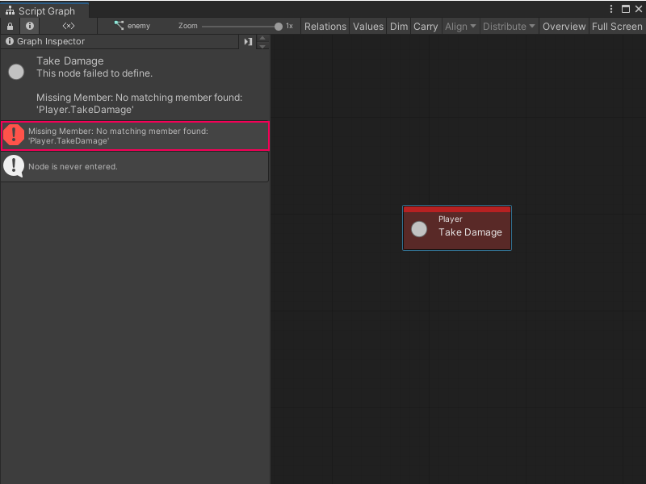

# Refactor a C# script with Visual Scripting

Visual Scripting creates nodes from methods, fields, and properties from C# script in your project. Visual Scripting creates these nodes after you [regenerate your Node Library](vs-configuration.md) and [add any relevant types to your Type Options](vs-add-remove-type-options.md). 

For example, Visual Scripting created the following Take Damage node from a custom C# script that defines the `Player` class.


Visual Scripting generated the node with the following code, which creates a `Player` class with a `TakeDamage` member. 

``` C# 
    using UnityEngine; 

    public class Player : MonoBehaviour
    {
        public void TakeDamage(int damage)
        {
            //...
        }
    }
```

> [!TIP]
> You can [create your own custom node](vs-create-custom-node.md) or [create a custom event](vs-custom-events.md) to customize the ports and information displayed on your nodes.

If you change the name of the `TakeDamage` member in the C# script, Visual Scripting displays an error in Script Graphs that use the Take Damage node. 



To rename a member, type, class, struct, enum, or other API element that a Visual Scripting node uses in a project, add the `[RenamedFrom]` attribute to the relevant API element in the script file. To avoid issues with Unity's serialization, the `[RenamedFrom]` attribute tells Visual Scripting that an API or one of its elements has been renamed. 

For more information on how to add the `[RenamedFrom]` attribute to a C# script, see [Add the RenamedFrom attribute to a C# script](vs-refactor-add-attribute.md).

## Additional resources

- [Add the RenamedFrom attribute to a C# script](vs-refactor-add-attribute.md)
- [Configure project settings](vs-configuration.md)
- [Add or remove types from your Type Options](vs-add-remove-type-options.md)
- [Custom C# nodes](vs-create-custom-node.md)
- [Custom events](vs-custom-events.md)
