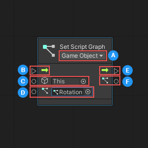
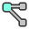
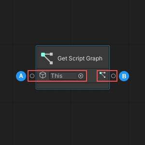
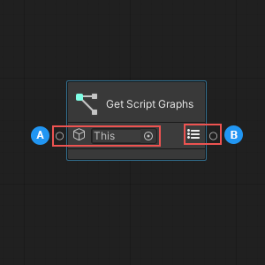

# Script Graph nodes

Visual scripting has four nodes that you can use to identify and manipulate the Script Graphs assigned to a GameObject and its Script Machines: 

- [Set Script Graph](#SetScript)
- [Has Script Graph](#HasScript) 
- [Get Script Graph](#GetScript) 
- [Get Script Graphs](#GetScripts)

## <a name="SetScript">Set Script Graph</a> 

You can use the Set Script Graph node to assign a Script Graph to a specific Script Machine, or to the first Script Machine attached to a specific GameObject. 

<table>
<thead>
<tr>
<th colspan="2"><strong>Item</strong></th>
<th><strong>Description</strong></th>
</tr>
</thead>
<tbody>
<tr>
<td colspan="2"><strong>Node Parameters</strong></td>
<td></td>
</tr>
<tr>
<td></td>
<td><strong>Container Type</strong></td>
<td>Specifies whether the <b>Target</b> is a GameObject or Script Machine.</td>
</tr>
<tr>
<td colspan="2"><strong>Input Ports</strong></td>
<td></td>
</tr>
<tr>
<td></td>
<td><strong>Enter</strong></td>
<td>(Input Trigger) The execution input trigger for the node.</td>
</tr>
<tr>
<td></td>
<td><strong>Target</strong></td>
<td>(GameObject or Script Machine) The GameObject or Script Machine where the node sets the <b>Graph</b>.</td>
</tr>
<tr>
<td></td>
<td><strong>Graph</strong></td>
<td>(Script Graph Asset) The Script Graph the node sets on the <b>Target</b>.</td>
</tr>
<tr>
<td colspan="2"><strong>Output Ports</strong></td>
<td></td>
</tr>
<tr>
<td></td>
<td><strong>Exit</strong></td>
<td>(Output Trigger) The execution output trigger.</td>
</tr>
<tr>
<td></td>
<td><strong>Graph</strong></td>
<td>(Script Graph Asset; Optional) Outputs the <b>Graph</b>.</td>
</tr>
</tbody>
</table>

### Setting the required node parameters and inputs

The Set Script Graph node has one required input parameter, called **Container Type**, which is set using the dropdown in the node's header. The **Container Type** specifies what component type the node should expect as an input for its **Target**:

- If you choose **GameObject**, the node expects to receive a GameObject, and assigns the graph to the first Script Machine attached to that GameObject.

- If you choose **Script Machine**, the node expects to receive a Script Machine, and you can specify the exact Script Machine where you want to set your Script Graph. 

Depending on which **Container Type** you select, the icon displayed next to the **Target** input port on the node changes: 

| **Container Type** | **Target Icon** |
| :--- | :--- |
| __GameObject__ | |
| __Script Machine__ | |

The node has three input ports, located on the left side. The first port, **Enter**, connects to the node that should start the execution of the Set Script Graph node.

The other two ports collect the Set Script Graph node's required input data: 

- The **Target**, or the GameObject or Script Machine where you want to set a Script Graph.
 
- The **Graph**, or the Script Graph to assign to the GameObject or Script Machine.

### Outputs

The Set Script Graph node has two output ports, located on the right side. 

The first port, **Exit**, establishes the connection to the node that should execute after the Set Script Graph node has finished. 

The second port, **Graph**, can output the Script Graph that you assigned using the node. 

## <a name="HasScript">Has Script Graph</a>

The Has Script Graph node allows you to determine whether a GameObject or Script Machine has a specific Script Graph assigned to it. 

<table>
<thead>
<tr>
<th colspan="2"><strong>Item</strong></th>
<th><strong>Description</strong></th>
</tr>
</thead>
<tbody>
<tr>
<td colspan="2"><strong>Node Parameters</strong></td>
<td></td>
</tr>
<tr>
<td></td>
<td><strong>Container Type</strong></td>
<td>Specify whether the <b>Target</b> is a GameObject or Script Machine.</td>
</tr>
<tr>
<td colspan="2"><strong>Input Ports</strong></td>
<td></td>
</tr>
<tr>
<td></td>
<td><strong>Enter</strong></td>
<td>(Input Trigger) The execution input trigger for the node.</td>
</tr>
<tr>
<td></td>
<td><strong>Target</strong></td>
<td>(GameObject or Script Machine) The GameObject or Script Machine where the node should check for the <b>Graph</b>.</td>
</tr>
<tr>
<td></td>
<td><strong>Graph</strong></td>
<td>(Script Graph Asset) The Script Graph to search for on the GameObject or Script Machine.</td>
</tr>
<tr>
<td colspan="2"><strong>Output Ports</strong></td>
<td></td>
</tr>
<tr>
<td></td>
<td><strong>Exit</strong></td>
<td>(Output Trigger) The execution output trigger, which starts execution of the next node in the flow after checking for the specified Script Graph.</td>
</tr>
<tr>
<td></td>
<td><strong>Has Graph</strong></td>
<td>(Boolean) Outputs <code>true</code> if the node found the specified Script Graph, <code>false</code> if not.</td>
</tr>
</tbody>
</table>

### Setting the required node parameters and inputs

The Has Script Graph node has one required input parameter, called **Container Type**, which is set using the dropdown in the node's header. The **Container Type** specifies what component type the node should expect as an input for its **Target**:

- If you choose **GameObject**, the node expects to receive a GameObject, and checks for the graph on the first Script Machine attached to that GameObject.

- If you choose **Script Machine**, the node expects to receive a Script Machine, and you can specify the exact Script Machine where you want to check for the Script Graph. 

Depending on which **Container Type** you select, the icon displayed next to the **Target** input port on the node changes: 

| **Container Type** | **Target Icon** |
| :--- | :--- |
| __GameObject__ | |
| __Script Machine__ | |

The node has three input ports, located on the left side. The first port, **Enter**, connects to the node that should start the execution of the Has Script Graph node.

The other two ports collect the Has Script Graph node's required input data: 

- The **Target**, or the GameObject or Script Machine where you want to check for a Script Graph.
 
- The **Graph**, or the Script Graph to search for on the GameObject or Script Machine.

### Outputs

The Has Script Graph node returns `true` if it finds the specified Script Graph. Otherwise, it returns `false`. 

You can use a control node connected to the Has Script Graph's output port to change what your script does next, based on the result from Has Script Graph. For more information about control nodes, see [Control nodes](vs-control.md). 

## <a name="GetScript">Get Script Graph</a>

The Get Script Graph node returns the first Script Graph set on a GameObject. 

<table>
<thead>
<tr>
<th colspan="2"><strong>Item</strong></th>
<th><strong>Description</strong></th>
</tr>
</thead>
<tbody>
<td colspan="2"><strong>Input Ports</strong></td>
<td></td>
</tr>
<tr>
<td></td>
<td><strong>GameObject</strong></td>
<td>(GameObject) The GameObject where the node should retrieve a set Script Graph.</td>
</tr>
<tr>
<td colspan="2"><strong>Output Ports</strong></td>
<td></td>
</tr>
<tr>
<td></td>
<td><strong>Graph</strong></td>
<td>(Script Graph Asset) Outputs the first or only Script Graph set on the GameObject, or null if there is no set Script Graph.</td>
</tr>
</tbody>
</table>

### Setting the required node parameters and inputs

The Get Script Graph node is a data node. It can't control any logic in your script, and is only used to return data. 

The node has a single input port, located on the left side, which collects the node's required input data: 

- The GameObject where the node should retrieve the Script Graph. You can choose a specific GameObject, or leave the default selection as **This** to use the GameObject where your script is currently running. 

### Outputs 

The Get Script Graph node has a single output port, located on the right side. The output port returns the GameObject's first set Script Graph, or `null`, if there is no set Script Graph. 

> [!NOTE]
> The Get Script Graph node returns only the first Script Graph set on a GameObject. To return all Script Graphs set on a GameObject, use the [Get Script Graphs node](#GetScripts). 

## <a name="GetScripts">Get Script Graphs</a>

The Get Script Graphs node returns a list of all Script Graphs set on a GameObject. 

<table>
<thead>
<tr>
<th colspan="2"><strong>Item</strong></th>
<th><strong>Description</strong></th>
</tr>
</thead>
<tbody>
<td colspan="2"><strong>Input Ports</strong></td>
<td></td>
</tr>
<tr>
<td></td>
<td><strong>GameObject</strong></td>
<td>(GameObject) The GameObject where the node should retrieve a list of set Script Graphs.</td>
</tr>
<tr>
<td colspan="2"><strong>Output Ports</strong></td>
<td></td>
</tr>
<tr>
<td></td>
<td><strong>Graphs</strong></td>
<td>(List of Script Graph Assets) Outputs a list of all Script Graphs set on the GameObject, or an empty list if there are no set Script Graphs.</td>
</tr>
</tbody>
</table>

### Setting the required node parameters and inputs

The Get Script Graphs node is a data node. It can't control any logic in your script, and is only used to return data. 

The node has a single input port, located on the left side, which collects the node's required input data: 

- The GameObject where the node should retrieve a list of Script Graphs. You can choose a specific GameObject, or leave the default selection as **This** to use the GameObject where your script is currently running. 

### Outputs 

The Get Script Graphs node has a single output port, located on the right side. The output port returns a list of all set Script Graphs for the GameObject, or an empty list, if there are no set Script Graphs. 
