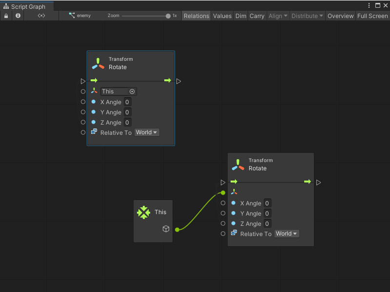
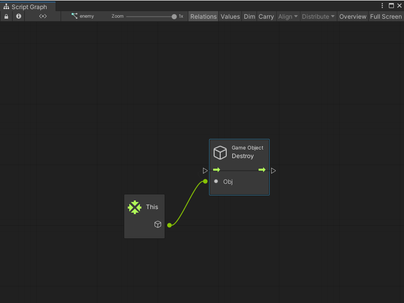

# This node

Use a This node to return a GameObject with a Script Machine component that has the Script Graph. If the Script Machine uses an **Graph** source and multiple GameObjects use the same graph, the returned GameObject can change.  

Many nodes default their target to **This**. For example, the following Transform nodes are the same:

Not all nodes support the **This** inline value. Any node that doesn't support the **This** inline value displays **None** instead of **This** in the default value field. For example, the Destroy node displays **None**. 

In these cases, manually specify the connection if you want to use **This**.

You can use the This node in a graph even if the graph isn't yet assigned to a GameObject. The This node represents the GameObject that owns the graph at runtime.
