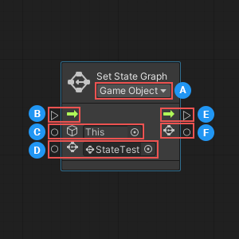
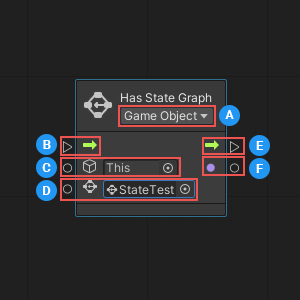
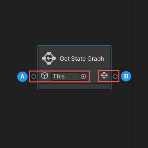
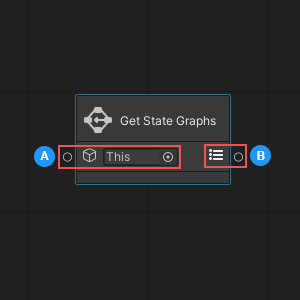

# State Graph nodes

Visual scripting has four nodes that you can use to identify and manipulate the State Graphs assigned to a GameObject and its State Machines: 

- [Set State Graph](#SetState)
- [Has State Graph](#HasState) 
- [Get State Graph](#GetState) 
- [Get State Graphs](#GetStates)

## <a name="SetState">Set State Graph</a> 

You can use the Set State Graph node to assign a State Graph to a specific State Machine, or to the first State Machine attached to a specific GameObject. 

<table>
<thead>
<tr>
<th colspan="2"><strong>Item</strong></th>
<th><strong>Description</strong></th>
</tr>
</thead>
<tbody>
<tr>
<td colspan="2"><strong>Node Parameters</strong></td>
<td></td>
</tr>
<tr>
<td></td>
<td><strong>Container Type</strong></td>
<td>Specifies whether the <b>Target</b> is a GameObject or State Machine.</td>
</tr>
<tr>
<td colspan="2"><strong>Input Ports</strong></td>
<td></td>
</tr>
<tr>
<td></td>
<td><strong>Enter</strong></td>
<td>(Input Trigger) The execution input trigger for the node.</td>
</tr>
<tr>
<td></td>
<td><strong>Target</strong></td>
<td>(GameObject or State Machine) The GameObject or State Machine where the node sets the <b>Graph</b>.</td>
</tr>
<tr>
<td></td>
<td><strong>Graph</strong></td>
<td>(State Graph Asset) The State Graph the node sets on the <b>Target</b>.</td>
</tr>
<tr>
<td colspan="2"><strong>Output Ports</strong></td>
<td></td>
</tr>
<tr>
<td></td>
<td><strong>Exit</strong></td>
<td>(Output Trigger) The execution output trigger.</td>
</tr>
<tr>
<td></td>
<td><strong>Graph</strong></td>
<td>(State Graph Asset; Optional) Outputs the <b>Graph</b>.</td>
</tr>
</tbody>
</table>

### Setting the required node parameters and inputs

The Set State Graph node has one required input parameter, called **Container Type**, which is set using the dropdown in the node's header. The **Container Type** specifies what component type the node should expect as an input for its **Target**:

- If you choose **GameObject**, the node expects to receive a GameObject, and assigns the graph to the first State Machine attached to that GameObject.

- If you choose **State Machine**, the node expects to receive a State Machine, and you can specify the exact State Machine where you want to set your State Graph. 

Depending on which **Container Type** you select, the icon displayed next to the **Target** input port on the node changes: 

| **Container Type** | **Target Icon** |
| :--- | :--- |
| __GameObject__ | |
| __State Machine__ | |

The node has three input ports, located on the left side. The first port, **Enter**, connects to the node that should start the execution of the Set State Graph node.

The other two ports collect the Set State Graph node's required input data: 

- The **Target**, or the GameObject or State Machine where you want to set a State Graph.
 
- The **Graph**, or the State Graph to assign to the GameObject or State Machine.

### Outputs

The Set State Graph node has two output ports, located on the right side. 

The first port, **Exit**, establishes the connection to the node that should execute after the Set State Graph node has finished. 

The second port, **Graph**, can output the State Graph that you assigned using the node. 

## <a name="HasState">Has State Graph</a>

The Has State Graph node allows you to determine whether a GameObject or State Machine has a specific State Graph assigned to it. 

<table>
<thead>
<tr>
<th colspan="2"><strong>Item</strong></th>
<th><strong>Description</strong></th>
</tr>
</thead>
<tbody>
<tr>
<td colspan="2"><strong>Node Parameters</strong></td>
<td></td>
</tr>
<tr>
<td></td>
<td><strong>Container Type</strong></td>
<td>Specify whether the <b>Target</b> is a GameObject or State Machine.</td>
</tr>
<tr>
<td colspan="2"><strong>Input Ports</strong></td>
<td></td>
</tr>
<tr>
<td></td>
<td><strong>Enter</strong></td>
<td>(Input Trigger) The execution input trigger for the node.</td>
</tr>
<tr>
<td></td>
<td><strong>Target</strong></td>
<td>(GameObject or State Machine) The GameObject or State Machine where the node should check for the <b>Graph</b>.</td>
</tr>
<tr>
<td></td>
<td><strong>Graph</strong></td>
<td>(State Graph Asset) The State Graph to search for on the GameObject or State Machine.</td>
</tr>
<tr>
<td colspan="2"><strong>Output Ports</strong></td>
<td></td>
</tr>
<tr>
<td></td>
<td><strong>Exit</strong></td>
<td>(Output Trigger) The execution output trigger, which starts execution of the next node in the flow after checking for the specified State Graph.</td>
</tr>
<tr>
<td></td>
<td><strong>Has Graph</strong></td>
<td>(Boolean) Outputs <code>true</code> if the node found the specified State Graph, <code>false</code> if not.</td>
</tr>
</tbody>
</table>

### Setting the required node parameters and inputs

The Has State Graph node has one required input parameter, called **Container Type**, which is set using the dropdown in the node's header. The **Container Type** specifies what component type the node should expect as an input for its **Target**:

- If you choose **GameObject**, the node expects to receive a GameObject, and checks for the graph on the first State Machine attached to that GameObject.

- If you choose **State Machine**, the node expects to receive a State Machine, and you can specify the exact State Machine where you want to check for the State Graph. 

Depending on which **Container Type** you select, the icon displayed next to the **Target** input port on the node changes: 

| **Container Type** | **Target Icon** |
| :--- | :--- |
| __GameObject__ | |
| __State Machine__ | |

The node has three input ports, located on the left side. The first port, **Enter**, connects to the node that should start the execution of the Has State Graph node.

The other two ports collect the Has State Graph node's required input data: 

- The **Target**, or the GameObject or State Machine where you want to check for a State Graph.
 
- The **Graph**, or the State Graph to search for on the GameObject or State Machine.

### Outputs

The Has State Graph node returns `true` if it finds the specified State Graph. Otherwise, it returns `false`. 

You can use a control node connected to the Has State Graph's output port to change what your script does next, based on the result from Has State Graph. For more information about control nodes, see [Control nodes](vs-control.md). 

## <a name="GetState">Get State Graph</a>

The Get State Graph node returns the first State Graph set on a GameObject. 

<table>
<thead>
<tr>
<th colspan="2"><strong>Item</strong></th>
<th><strong>Description</strong></th>
</tr>
</thead>
<tbody>
<td colspan="2"><strong>Input Ports</strong></td>
<td></td>
</tr>
<tr>
<td></td>
<td><strong>GameObject</strong></td>
<td>(GameObject) The GameObject where the node should retrieve a set State Graph.</td>
</tr>
<tr>
<td colspan="2"><strong>Output Ports</strong></td>
<td></td>
</tr>
<tr>
<td></td>
<td><strong>Graph</strong></td>
<td>(State Graph Asset) Outputs the first or only State Graph set on the GameObject, or null if there is no set State Graph.</td>
</tr>
</tbody>
</table>

### Setting the required node parameters and inputs

The Get State Graph node is a data node. It can't control any logic in your script, and is only used to return data. 

The node has a single input port, located on the left side, which collects the node's required input data: 

- The GameObject where the node should retrieve the State Graph. You can choose a specific GameObject, or leave the default selection as **This** to use the GameObject where your script is currently running. 

### Outputs 

The Get State Graph node has a single output port, located on the right side. The output port returns the GameObject's first set State Graph, or `null`, if there is no set State Graph. 

> [!NOTE]
> The Get State Graph node returns only the first State Graph set on a GameObject. To return all State Graphs set on a GameObject, use the [Get State Graphs node](#GetStates). 

## <a name="GetStates">Get State Graphs</a>

The Get State Graphs node returns a list of all State Graphs set on a GameObject. 

<table>
<thead>
<tr>
<th colspan="2"><strong>Item</strong></th>
<th><strong>Description</strong></th>
</tr>
</thead>
<tbody>
<td colspan="2"><strong>Input Ports</strong></td>
<td></td>
</tr>
<tr>
<td></td>
<td><strong>GameObject</strong></td>
<td>(GameObject) The GameObject where the node should retrieve a list of set State Graphs.</td>
</tr>
<tr>
<td colspan="2"><strong>Output Ports</strong></td>
<td></td>
</tr>
<tr>
<td></td>
<td><strong>Graphs</strong></td>
<td>(List of State Graph Assets) Outputs a list of all State Graphs set on the GameObject, or an empty list if there are no set State Graphs.</td>
</tr>
</tbody>
</table>

### Setting the required node parameters and inputs

The Get State Graphs node is a data node. It can't control any logic in your script, and is only used to return data. 

The node has a single input port, located on the left side, which collects the node's required input data: 

- The GameObject where the node should retrieve a list of State Graphs. You can choose a specific GameObject, or leave the default selection as **This** to use the GameObject where your script is currently running. 

### Outputs 

The Get State Graphs node has a single output port, located on the right side. The output port returns a list of all set State Graphs for the GameObject, or an empty list, if there are no set State Graphs. 
