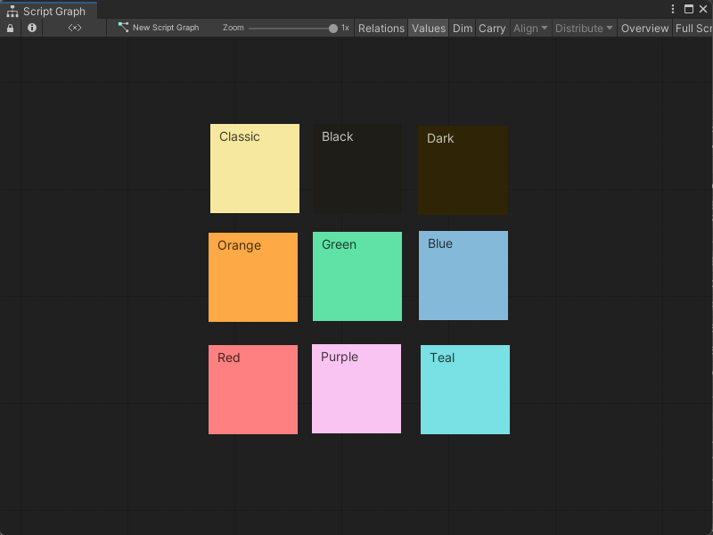

# Add comments to a graph

Use Sticky Notes to add comments to a graph. Sticky Notes can: 

- Describe how a section of your graph works.
- Leave a note for yourself or others who might work on your Unity project.

You can add text to the title and body of a Sticky Note. You can use Sticky Notes in Script Graphs and State Graphs. 

## Add a Sticky Note to a graph 

To add a Sticky Note to a graph: 

1. [!include[open-graph](./snippets/vs-open-graph.md)]
1. Do one of the following: 
    - [!include[open-fuzzy-finder](./snippets/vs-open-fuzzy-finder.md)] Select **Sticky Note**. 
    - With no items selected in the graph, right-click an empty space in the Graph Editor. Select **Create Sticky Note**. 

## Edit a Sticky Note 

To edit text in the title or body of a Sticky Note: 

1. [!include[open-graph](./snippets/vs-open-graph.md)]
1. Do one of the following: 
    - To edit the title of the Sticky Note, double-click the title. 
    - To edit the body of the Sticky Note, double-click the body. 
1. Enter the new text for the Sticky Note. 
1. Click anywhere in the Graph Editor to close the Sticky Note text editor.

> [!TIP]
> You can also edit the text in a Sticky Note with the [Graph Inspector](vs-interface-overview.md#the-graph-inspector):
> 1. Select the Sticky Note you want to edit. 
> 1. [!include[open-graph-inspector](./snippets/vs-open-graph-inspector.md)]
> 1. Do one of the following: 
>    - To edit the title of the Sticky Note, select the title. 
>    - To edit the body of the Sticky Note, select **(Body)**. 
> 1. Enter the new text for the Sticky Note. 

## Move a Sticky Note 

To move a Sticky Note to a new location in a graph: 

1. [!include[open-graph](./snippets/vs-open-graph.md)]
1. Click and drag the Sticky Note to a new location. 

## Delete a Sticky Note 

To delete a Sticky Note from a graph: 

1. [!include[open-graph](./snippets/vs-open-graph.md)]
1. Do one of the following: 
    - Right-click a Sticky Note and select **Delete**. 
    - Select a Sticky Note and press Delete (Del).

## Resize a Sticky Note 

To change the size of a Sticky Note in a graph: 

1. [!include[open-graph](./snippets/vs-open-graph.md)]
1. Click and drag a corner of a Sticky Note. 

## Change the color of a Sticky Note 

To change the color theme for a Sticky Note: 

1. [!include[open-graph](./snippets/vs-open-graph.md)]
1. Select the Sticky Note you want to edit.
1. [!include[open-graph-inspector](./snippets/vs-open-graph-inspector.md)]
1. Select a **Color Theme**: 
    - **Classic**
    - **Black**
    - **Dark**
    - **Orange**
    - **Green**
    - **Blue**
    - **Red**
    - **Purple**
    - **Teal** 

