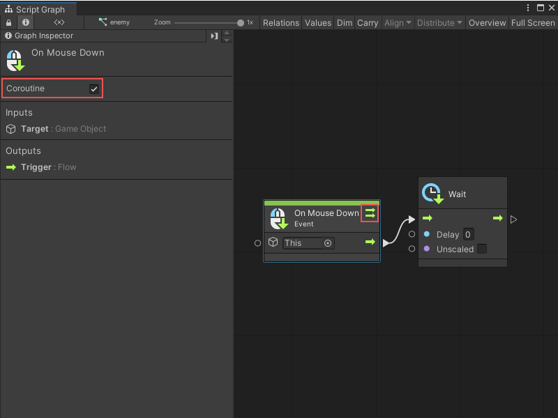
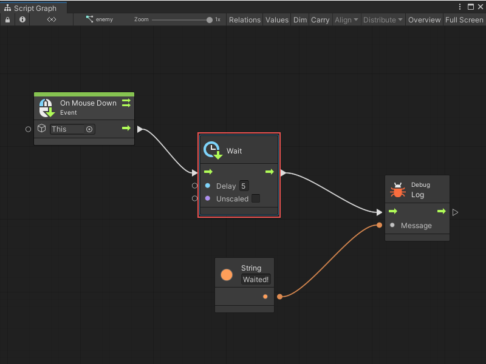
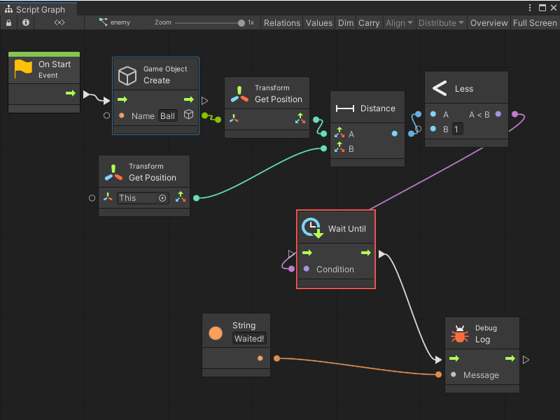
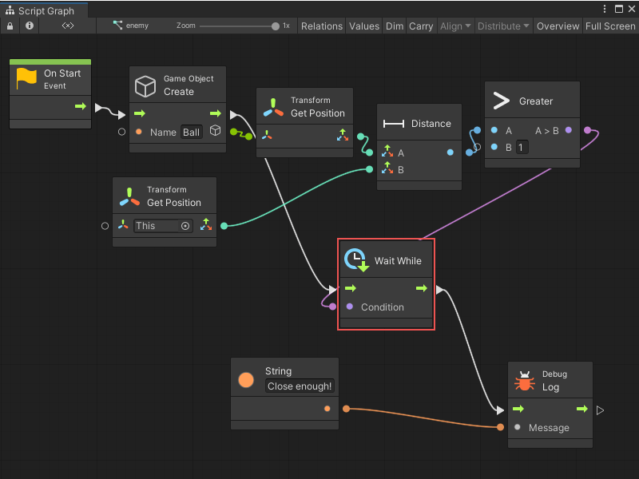
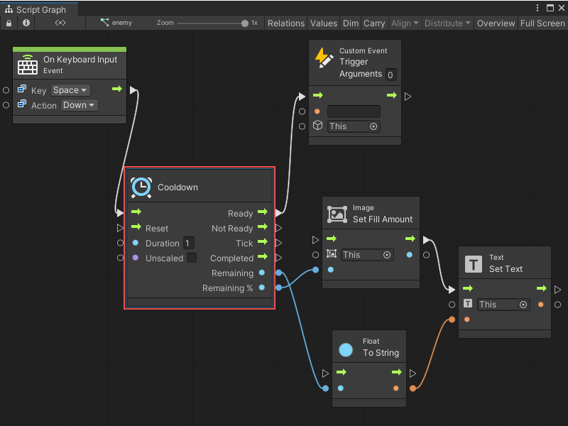
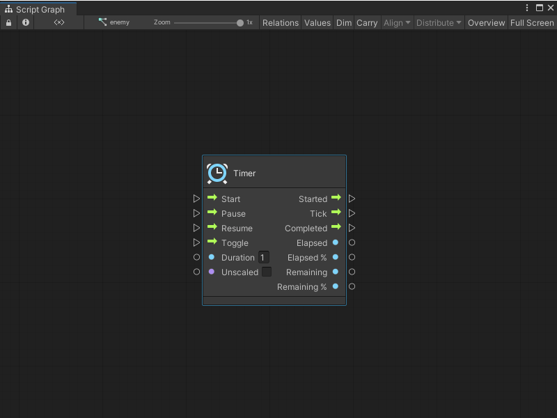
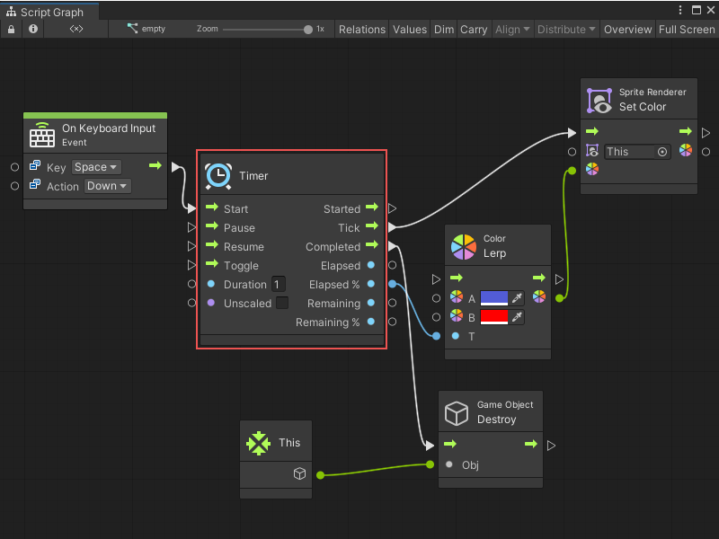

# Time nodes

> [!NOTE]
> For versions 2019/2020 LTS, download the Visual Scripting package from the [Unity Asset Store](https://assetstore.unity.com/packages/tools/visual-bolt-163802).

Time nodes include timer, cooldown and wait nodes.

## Wait

Wait nodes delay the execution of the rest of the script. The delay can be a set amount of seconds or a condition that must be fulfilled before moving on.

Asynchronicity (delayed execution) in Unity is handled by [coroutines](https://docs.unity3d.com/Manual/Coroutines.html) (not multithreading). You need to inform visual scripting to run the script as a coroutine in order to support wait nodes. To do this enable the **Coroutine checkbox** on the initial event that starts the script. Do this in the graph inspector.

A small dual-arrow icon appears on the event, indicating that it runs as a coroutine.

If the coroutine checkbox is not enabled, an error at runtime indicates a port 'can only be triggered in a coroutine' when reaching a wait node.

All wait nodes are also used inside loops and sequences.

### Wait For Seconds

The Wait For Seconds node is the simplest and most common wait node. It delays the execution by a certain number of seconds.

### Wait Until

The Wait Until node stops execution until a given condition is met. For example, you could wait until an object is close enough.

### Wait While

The Wait While node is the opposite of the Wait Until node: it stops execution as long as a given condition is met. For example, you can wait while an object is out of range.

### Wait For Frame

As the name implies, Wait For End Of Frame and Wait For Next Frame nodes delays execution until a specific point in Unity's update loop is met. For more information, see: [Execution Order of Events](https://docs.unity3d.com/Manual/ExecutionOrder.html).

### Wait For Script

The Wait For Script node delays execution until all input scripts have been entered at least once. It's a useful way of grouping conditions that occur over multiple events or frames. In other languages, this concept is sometimes called "promises".

## Cooldown

The Cooldown node implements a time restriction when the input script can only be triggered a limited number of times.

When the cooldown is available, the input script gets transferred to the Ready port. When it is not, it gets transferred to the Not Ready port.

The Duration port determines how long it takes for the cooldown to become available again. Checking **Unscaled** makes it ignore the [time scale](https://docs.unity3d.com/ScriptReference/Time-timeScale.html).

The Tick port gets called at every frame while a cooldown is active. It is a good place to update any GUI code that show an indicator of the remaining duration until the action can be called again. In order to get that value, you have two options: 

- Remaining, which returns the number of seconds until ready, and 
- Remaining %, which returns a value between 0 and 1, respectively from ready to not ready.

As soon as the cooldown is ready, the Completed port is triggered. There is no need to constantly pass input script for this port to get triggered.

Finally, you can force the cooldown to become ready and reset its internal timer by triggering the Reset port.

For example, a simple cooldown firing mechanic with a masked sprite and text that indicates how much time is remaining until it can fire again.

## Timer

The Timer node implements and monitors a time pausable progression.  

The Duration port determines how long it takes for the cooldown to become available again. Checking Unscaled makes it ignore the [time scale](https://docs.unity3d.com/ScriptReference/Time-timeScale.html).  

A timer is started by triggering the Start input, which in turn triggers the Started output.

It can be paused and resumed with the Pause and Resume inputs, or it can alternate between these states with the Toggle input.

The Tick port gets called at every frame while a timer is active. In order to get the time measurements, you have two options: 

- Elapsed, which returns the time since the timer was started, or 
- Remaining, which returns the time until the timer completes.

You can get each of these measurements in absolute number of seconds, or in %, which returns a value between 0 and 1. This is useful for lerping.

As soon as the timer finishes, the Completed port is triggered.

For example, a simple autodestroy mechanic on a sprite that is progressively colored red before being destroyed.

