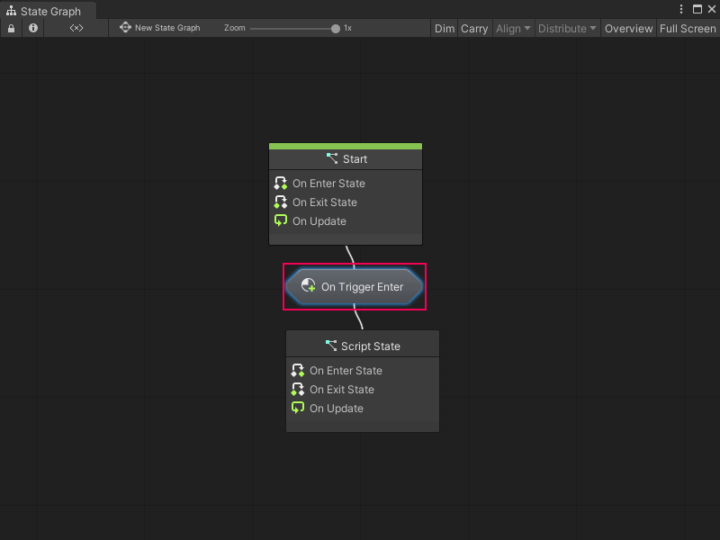

# Transitions

A transition is a connection between State nodes in a State Graph. A transition has a Script Graph that tells Visual Scripting when to switch states in a State Graph. A special transition type, called a self transition, can make a state transition to itself.

You can embed the Script Graph for a transition in the Transition node itself, or link to an external graph asset file. 

Use Event nodes and a Trigger Transition node in the Script Graph you attach to a transition. These nodes specify which event or events must occur to trigger a change of state in your parent State Graph. 

For example, the following transition Script Graph switches states after a GameObject with the Player tag enters a trigger Collider. 

Any transition nodes with a transition Script Graph display the name of the event in the graph that triggers the state change. For example, the following parent State Graph displays the graph from the previous example as an **On Trigger Enter** Transition node. 

If you've assigned a name to a transition Script Graph, the assigned name appears on the Transition node. 

> [!TIP]
> To reduce the space taken up by transition nodes in a State Graph, you can hide their name labels. For more information, see [Configure your preferences](vs-set-preferences.md#state-graphs-preferences).

You can create any number of transitions between states in a State Graph. For more information on how to create transitions, see [Create a transition between states](vs-creating-transition.md).
