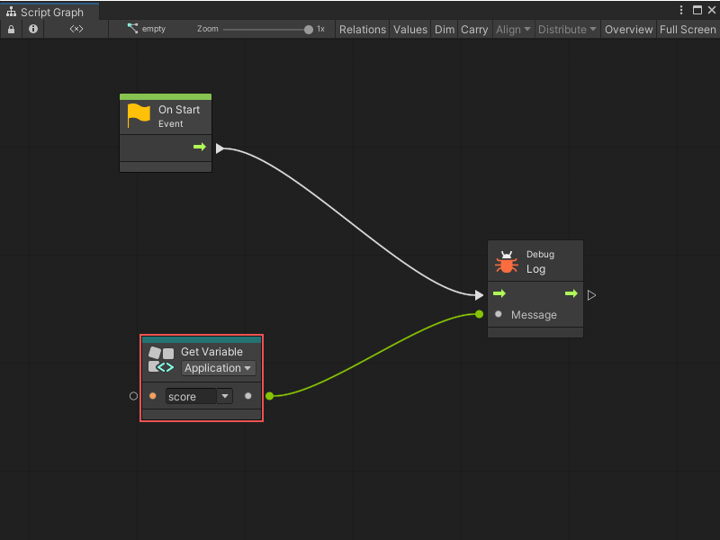
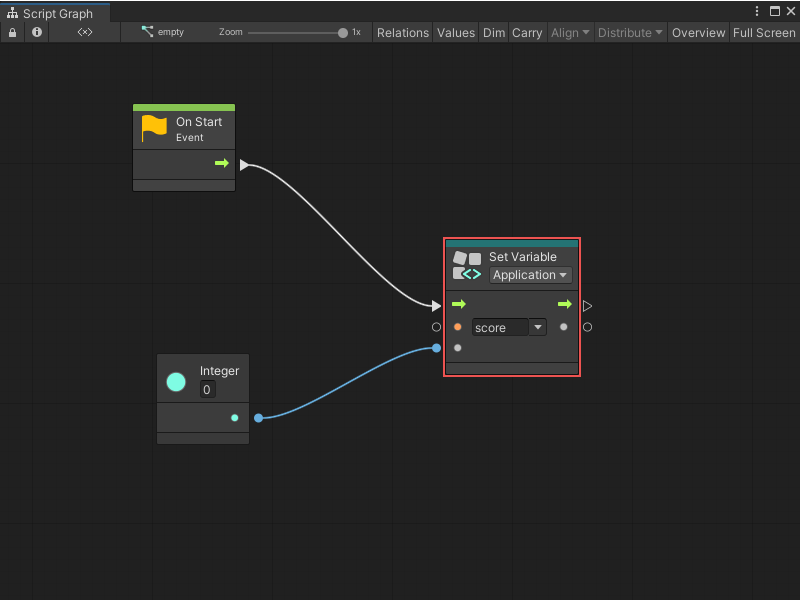
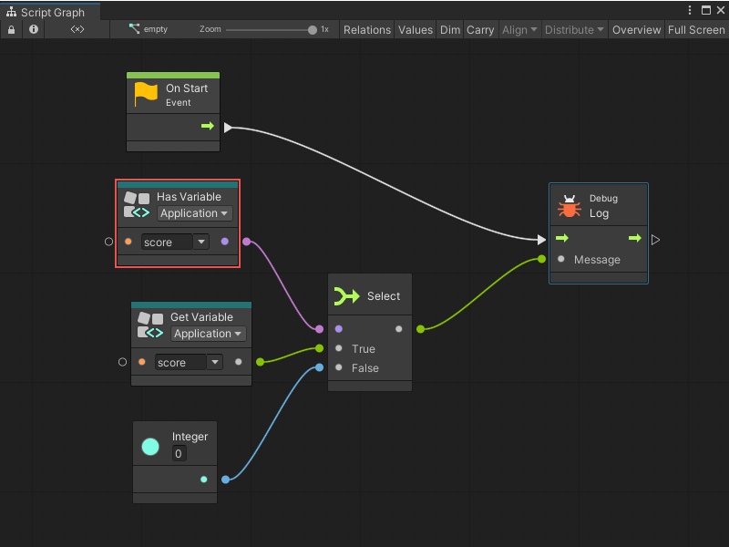
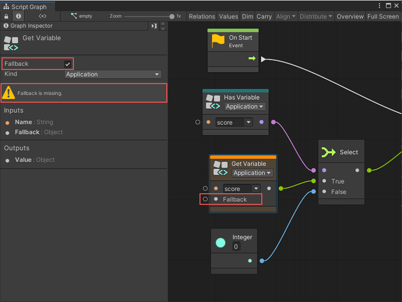
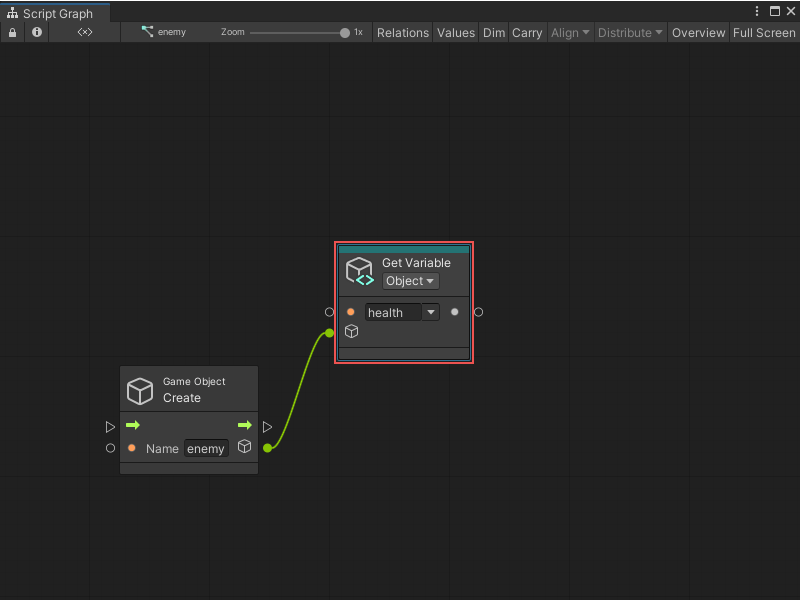
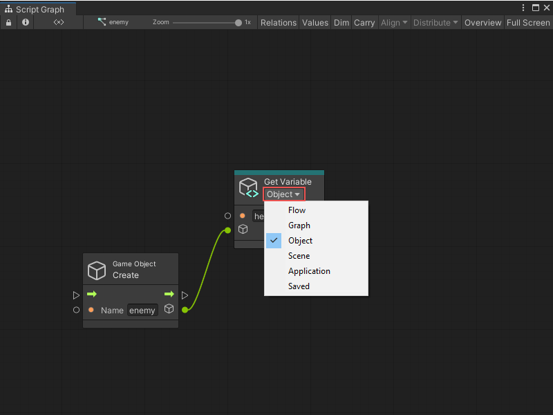

# Variables node

> [!NOTE]
> For versions 2019/2020 LTS, download the Visual Scripting package from the [Unity Asset Store](https://assetstore.unity.com/packages/tools/visual-bolt-163802).

There are six kinds of [variable](vs-variables.md) nodes. Each of these variable nodes has three object nodes:

* Get, to retrieve the value of the variable
* Set, to assign a new value to the variable
* Is Defined, to check whether the variable is defined

They are located under the Variables category in the fuzzy finder.


Variable nodes are teal colored.

## Dynamic Typing

For get / set nodes, variables are not statically typed, meaning their type can change at runtime. Their type displays as an object when defined from the blackboard window.

### Get Variable


The get variable node requires the name of the variable as an input and returns the **Value** as an output.

### Set Variable



The set variable nodes require the name of the variable and the new value assigned to it as inputs. For convenience in layouting, it returns this same value as an output. 

Connect the control input port to indicate when the variable should be assigned and, optionally, the control output port to indicate what to do after.

Using a set node with a variable name that doesn't yet exist creates the variable.

### Has Variable

The Has Variable nodes require the name of the variable as an input and returns an Is Defined boolean as an output. They're useful to check if a variable has been created, and often, provide a fallback value if it hasn't. 




Do the same thing more easily by checking the Fallback box in the graph inspector for a Get Variable node. This adds a Fallback input to the node that is returned if the variable hasn't been defined:




## Dynamic Variables

As the name of the variable is a standard value input port, connect it to any other port that returns a string. Refer to "dynamic variables", that is, variables whose reference might change during play mode.

## Object Variables

Object variable nodes require an additional input for the Source. That port indicates which game object the variable you're referring to is defined. When left to its default value, they look on the current object (self).

For example, the Get Variable node gets the value of the health variable on the player2 object.



## Dropdowns

The kind and the name dropdowns can quickly configure the variable nodes. The name suggestions are contextual and are based on the existing variables of this kind and on the other variable nodes in the current graph.



## Drag and Drop

Drag and drop items from the blackboard window directly into the graph to create matching nodes.

* By default, a Get node is created.
* If the Alt key is held, a Set node is created.
* If the Shiftkey is held, an Is Defined node is created.

## Variables API

Visual scripting provides an easy API to handle variables, to get or set their value and verify if they are defined. All these operations are available from the Variables class.

For example:

```
Variables.Application.Set("score", 100);
```

***

### Usings

Add the following usings to your C# script to access the API:

```
using Unity.VisualScripting;
```

***

## Scope

### Graph

To access variables on a graph, create a graph reference. This is basically a path to the nested graph from its root machine.

To get the root graph on a machine:

```
var graphReference = GraphReference.New(flowMachine, true);
```

To access nested graphs, pass their parent nodes as additional parameters:

```
var graphReference = GraphReference.New(flowMachine, new IGraphParentElement[] { superUnit }, true);
```

To pass a graph reference:

```
Variables.Graph(graphReference)
```

### Object

To access variables on an object:

```
Variables.Object(gameObject)
```

### Scene

To access scene variables, do one of the following:

```
Variables.Scene(scene)
```

Or:

```
Variables.Scene(gameObjectInScene)
```

Or:

```
Variables.ActiveScene
```

### Application

To access application variables:

```
Variables.Application
```

### Saved

To access saved variables:

```
Variables.Saved
```

***

## Operations

In these examples, the lowercase scope refers to one of the previous scopes.

### Get

To get the value of a variable, use the Get method with a name parameter:

```
scope.Get("name");
```

Note that variables are not strongly typed; they need to be cast manually. For example:

```
int health = (int)Variables.Object(player).Get("health")
```

### Set

To set the value of a variable, use the Set method with the name and value parameters:

```
scope.Set("name", value);
```

For example:

```
Variables.Object(player).Set("health", 100);
```

Because variables are not strongly typed, pass any value to the second parameter, even if the variable currently is of a different type.

> [!NOTE]
> Using the set method with a variable name that does not yet exist defines a new variable.

### Is Defined

To check if a variable is defined, use the IsDefined method with a name parameter:

```
scope.IsDefined("name");
```

For example:

```
if (Variables.Application.IsDefined("score"))
{
    // ...
}
```

